**Code Authors**: Mark E. Pepin, MD, PhD, MS **Contact**:
[pepinme\@gmail.com](mailto:mepepin@bwh.harvard.edu){.email}\
**Institution**: Brigham and Women's Hospital | Broad Institute of Harvard and MIT\
**Location**: Boston, MA

# Data Pre-Processing


```
## Modularity Optimizer version 1.3.0 by Ludo Waltman and Nees Jan van Eck
## 
## Number of nodes: 9278
## Number of edges: 381125
## 
## Running Louvain algorithm...
## Maximum modularity in 10 random starts: 0.8951
## Number of communities: 11
## Elapsed time: 0 seconds
```

```
## quartz_off_screen 
##                 2
```

# Figure 1
## Clustering


```
## quartz_off_screen 
##                 2
```

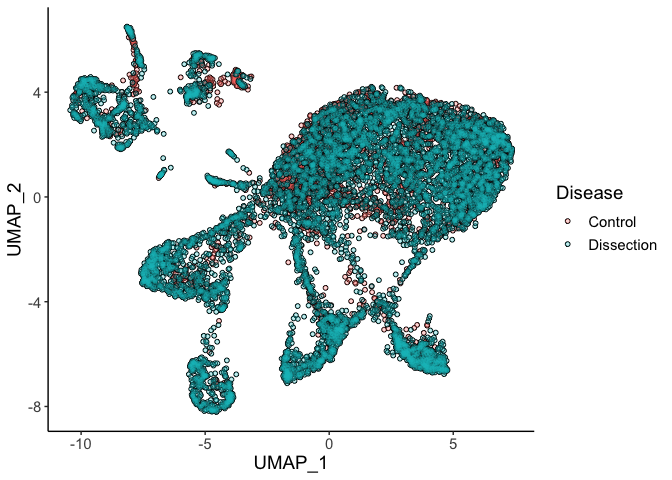<!-- -->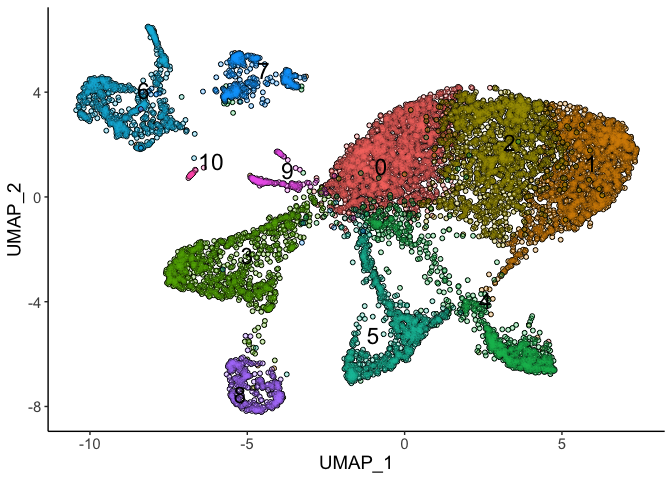<!-- -->

```
## quartz_off_screen 
##                 2
```

<!-- -->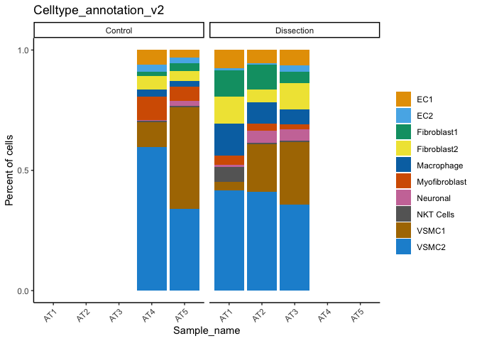<!-- -->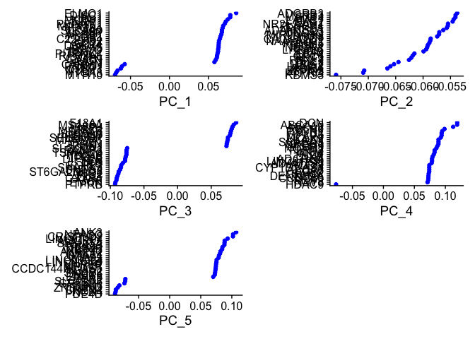<!-- -->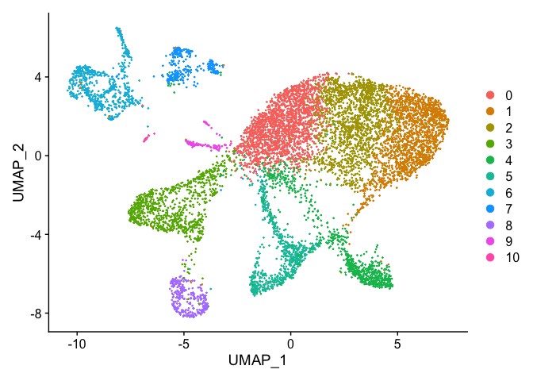<!-- -->

```
## quartz_off_screen 
##                 2
```

```
## quartz_off_screen 
##                 2
```

```
## quartz_off_screen 
##                 2
```

```
## quartz_off_screen 
##                 2
```

```
## quartz_off_screen 
##                 2
```

```
## [[1]]
```

```
## 
## [[2]]
```

```
## quartz_off_screen 
##                 2
```

## Cell-type Annotation


```
## $PKD1
```

```
## 
## $COL6A2
```

```
## 
## $PDLIM7
```

```
## 
## $FLNA
```

```
## 
## $SMTN
```

```
## 
## $`PKD1+ COL6A2+ PDLIM7+ FLNA+ SMTN+`
```

```
## $MYH11
```

```
## 
## $ACTA2
```

```
## 
## $ITGA8
```

```
## 
## $PRKG1
```

```
## 
## $CRISPLD1
```

```
## 
## $`MYH11+ ACTA2+ ITGA8+ PRKG1+ CRISPLD1+`
```

```
## $ABCA10
```

```
## 
## $C3
```

```
## 
## $ADGRD1
```

```
## 
## $FBLN1
```

```
## 
## $DCN
```

```
## 
## $`ABCA10+ C3+ ADGRD1+ FBLN1+ DCN+`
```

```
## $NFASC
```

```
## 
## $SAMD5
```

```
## 
## $PRSS23
```

```
## 
## $`NFASC+ SAMD5+ PRSS23+`
```

```
## $DIPK2B
```

```
## 
## $ARHGEF15
```

```
## 
## $STC1
```

```
## 
## $FLT1
```

```
## 
## $`DIPK2B+ ARHGEF15+ STC1+ FLT1+`
```

```
## $VWF
```

```
## 
## $BMPER
```

```
## 
## $BMX
```

```
## 
## $NOS1
```

```
## 
## $`VWF+ BMPER+ BMX+ NOS1+`
```

```
## $MRC1
```

```
## 
## $LGMN
```

```
## 
## $F13A1
```

```
## 
## $RBM47
```

```
## 
## $`MRC1+ LGMN+ F13A1+ RBM47+`
```

```
## $SKAP1
```

```
## 
## $RIPOR2
```

```
## 
## $ITGAL
```

```
## 
## $CD96
```

```
## 
## $`SKAP1+ RIPOR2+ ITGAL+ CD96+`
```

```
## $ADAMTS1
```

```
## 
## $RGS6
```

```
## 
## $TNC
```

```
## 
## $`ADAMTS1+ RGS6+ TNC+`
```

```
## quartz_off_screen 
##                 2
```

```
## quartz_off_screen 
##                 2
```

```
## $ACTA2
```

```
## 
## $FBLN1
```

```
## 
## $F13A1
```

```
## 
## $VWF
```

```
## 
## $STC1
```

```
## 
## $NFASC
```

```
## 
## $ITGAL
```

```
## 
## $ITGAX
```

```
## 
## $`ACTA2+ FBLN1+ F13A1+ VWF+ STC1+ NFASC+ ITGAL+ ITGAX+`
```

```
## quartz_off_screen 
##                 2
```

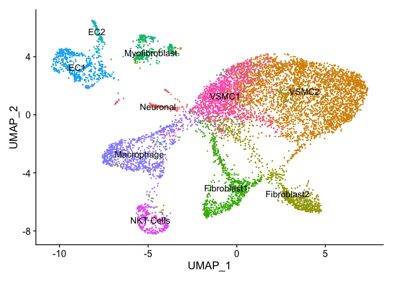<!-- -->

```
## quartz_off_screen 
##                 2
```

```
## quartz_off_screen 
##                 2
```

```
## quartz_off_screen 
##                 2
```

```
## [[1]]
```

```
## 
## [[2]]
```

```
## quartz_off_screen 
##                 2
```

```
## quartz_off_screen 
##                 2
```

<!-- -->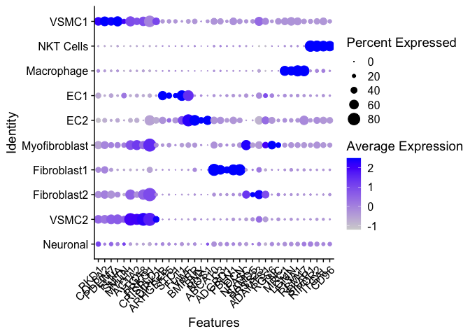<!-- -->


# Figure 2: VSMC-Specific Analysis

### VSMC Phenotypic Comparison


```
## quartz_off_screen 
##                 2
```

```
## $PKD1
```

```
## 
## $COL6A2
```

```
## 
## $PDLIM7
```

```
## 
## $FLNA
```

```
## 
## $SMTN
```

```
## 
## $`PKD1+ COL6A2+ PDLIM7+ FLNA+ SMTN+`
```

```
## $MYH11
```

```
## 
## $ACTA2
```

```
## 
## $ITGA8
```

```
## 
## $PRKG1
```

```
## 
## $CRISPLD1
```

```
## 
## $`MYH11+ ACTA2+ ITGA8+ PRKG1+ CRISPLD1+`
```

```
## quartz_off_screen 
##                 2
```

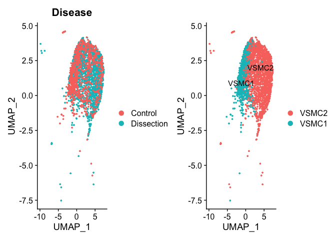<!-- -->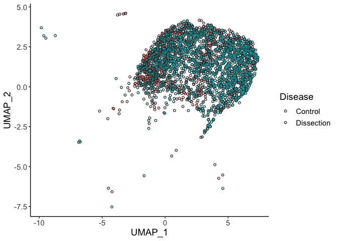<!-- -->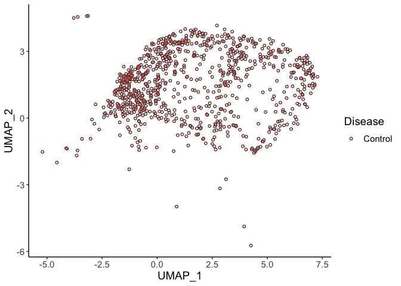<!-- -->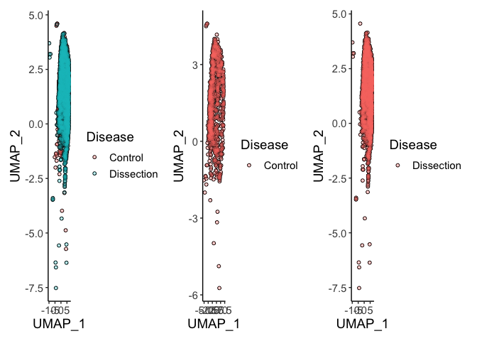<!-- -->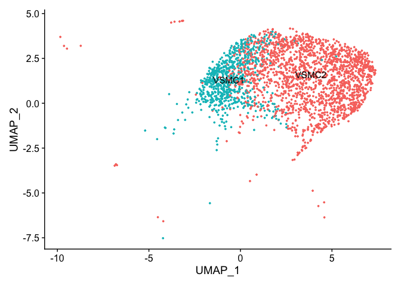<!-- -->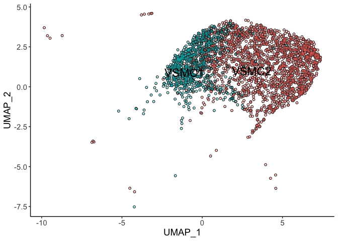<!-- -->

```
## quartz_off_screen 
##                 2
```

```
## [1] 376.5639
```

```
## [1] 2.104613
```

```
## [1] -2.133374
```

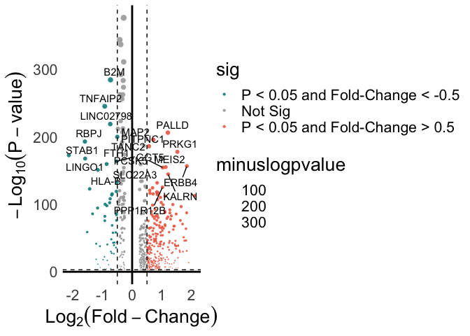<!-- -->

```
## quartz_off_screen 
##                 2
```

```
## quartz_off_screen 
##                 2
```

```
## quartz_off_screen 
##                 2
```

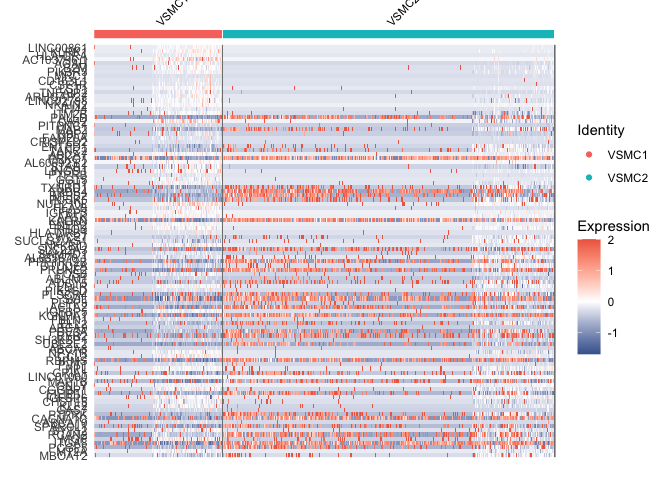<!-- -->

```
## [[1]]
```

```
## 
## [[2]]
```

```
## quartz_off_screen 
##                 2
```

### VSMC Trajectory Analysis (Monocle 3)

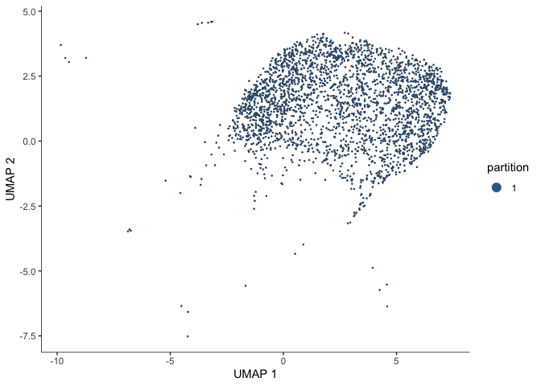<!-- -->

```
## 
  |                                                                            
  |                                                                      |   0%
  |                                                                            
  |======================================================================| 100%
```

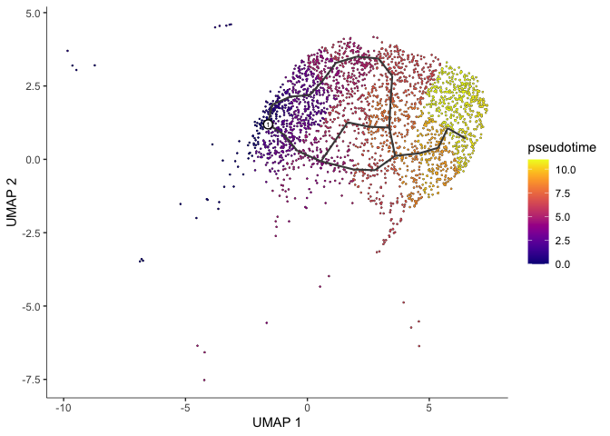<!-- -->

```
## quartz_off_screen 
##                 2
```

```
## quartz_off_screen 
##                 2
```

```
## 
  |                                                              |   0%, ETA NA
  |                                                           |   0%, ETA 02:40
  |                                                           |   0%, ETA 01:25
  |                                                           |   0%, ETA 01:00
  |                                                           |   0%, ETA 00:45
  |                                                           |   0%, ETA 00:36
  |                                                           |   0%, ETA 00:33
  |                                                           |   0%, ETA 00:30
  |                                                           |   0%, ETA 00:27
  |                                                           |   0%, ETA 00:24
  |                                                           |   0%, ETA 00:22
  |                                                           |   0%, ETA 00:20
  |                                                           |   0%, ETA 00:19
  |                                                           |   0%, ETA 00:15
  |                                                           |   0%, ETA 00:15
  |                                                           |   0%, ETA 00:14
  |                                                           |   0%, ETA 00:14
  |                                                           |   0%, ETA 00:11
  |                                                           |   0%, ETA 00:11
  |                                                           |   0%, ETA 00:11
  |                                                           |   0%, ETA 00:11
  |                                                           |   0%, ETA 00:10
  |                                                           |   0%, ETA 00:10
  |                                                           |   0%, ETA 00:10
  |                                                           |   0%, ETA 00:10
  |                                                           |   0%, ETA 00:09
  |                                                           |   0%, ETA 00:09
  |                                                           |   0%, ETA 00:09
  |                                                           |   0%, ETA 00:09
  |                                                           |   0%, ETA 00:09
  |                                                           |   1%, ETA 00:09
  |                                                           |   1%, ETA 00:08
  |                                                           |   1%, ETA 00:08
  |                                                           |   1%, ETA 00:08
  |                                                           |   1%, ETA 00:08
  |                                                           |   1%, ETA 00:08
  |                                                           |   1%, ETA 00:08
  |                                                           |   1%, ETA 00:08
  |                                                           |   1%, ETA 00:08
  |                                                           |   1%, ETA 00:08
  |                                                           |   1%, ETA 00:07
  |                                                           |   1%, ETA 00:07
  |                                                           |   1%, ETA 00:07
  |                                                           |   1%, ETA 00:07
  |=                                                          |   1%, ETA 00:07
  |=                                                          |   1%, ETA 00:07
  |=                                                          |   1%, ETA 00:07
  |=                                                          |   1%, ETA 00:07
  |=                                                          |   1%, ETA 00:07
  |=                                                          |   1%, ETA 00:07
  |=                                                          |   1%, ETA 00:07
  |=                                                          |   1%, ETA 00:07
  |=                                                          |   1%, ETA 00:07
  |=                                                          |   1%, ETA 00:07
  |=                                                          |   1%, ETA 00:07
  |=                                                          |   1%, ETA 00:07
  |=                                                          |   1%, ETA 00:07
  |=                                                          |   1%, ETA 00:07
  |=                                                          |   1%, ETA 00:07
  |=                                                          |   1%, ETA 00:07
  |=                                                          |   1%, ETA 00:07
  |=                                                          |   1%, ETA 00:07
  |=                                                          |   1%, ETA 00:07
  |=                                                          |   1%, ETA 00:07
  |=                                                          |   1%, ETA 00:07
  |=                                                          |   1%, ETA 00:07
  |=                                                          |   1%, ETA 00:07
  |=                                                          |   1%, ETA 00:07
  |=                                                          |   1%, ETA 00:07
  |=                                                          |   1%, ETA 00:07
  |=                                                          |   1%, ETA 00:07
  |=                                                          |   1%, ETA 00:07
  |=                                                          |   1%, ETA 00:07
  |=                                                          |   1%, ETA 00:06
  |=                                                          |   2%, ETA 00:06
  |=                                                          |   2%, ETA 00:06
  |=                                                          |   2%, ETA 00:06
  |=                                                          |   2%, ETA 00:06
  |=                                                          |   2%, ETA 00:07
  |=                                                          |   2%, ETA 00:06
  |=                                                          |   2%, ETA 00:06
  |=                                                          |   2%, ETA 00:06
  |=                                                          |   2%, ETA 00:06
  |=                                                          |   2%, ETA 00:06
  |=                                                          |   2%, ETA 00:06
  |=                                                          |   2%, ETA 00:06
  |=                                                          |   2%, ETA 00:06
  |=                                                          |   2%, ETA 00:06
  |=                                                          |   2%, ETA 00:06
  |=                                                          |   2%, ETA 00:06
  |=                                                          |   3%, ETA 00:06
  |==                                                         |   3%, ETA 00:06
  |==                                                         |   3%, ETA 00:06
  |==                                                         |   3%, ETA 00:06
  |==                                                         |   3%, ETA 00:06
  |==                                                         |   3%, ETA 00:06
  |==                                                         |   3%, ETA 00:06
  |==                                                         |   3%, ETA 00:06
  |==                                                         |   3%, ETA 00:06
  |==                                                         |   3%, ETA 00:06
  |==                                                         |   3%, ETA 00:06
  |==                                                         |   3%, ETA 00:06
  |==                                                         |   3%, ETA 00:06
  |==                                                         |   3%, ETA 00:06
  |==                                                         |   3%, ETA 00:06
  |==                                                         |   3%, ETA 00:06
  |==                                                         |   3%, ETA 00:06
  |==                                                         |   3%, ETA 00:06
  |==                                                         |   3%, ETA 00:06
  |==                                                         |   3%, ETA 00:06
  |==                                                         |   3%, ETA 00:06
  |==                                                         |   3%, ETA 00:06
  |==                                                         |   3%, ETA 00:06
  |==                                                         |   3%, ETA 00:06
  |==                                                         |   3%, ETA 00:06
  |==                                                         |   3%, ETA 00:06
  |==                                                         |   3%, ETA 00:06
  |==                                                         |   3%, ETA 00:06
  |==                                                         |   4%, ETA 00:06
  |==                                                         |   4%, ETA 00:06
  |==                                                         |   4%, ETA 00:06
  |==                                                         |   4%, ETA 00:06
  |==                                                         |   4%, ETA 00:06
  |==                                                         |   4%, ETA 00:06
  |==                                                         |   4%, ETA 00:06
  |==                                                         |   4%, ETA 00:06
  |==                                                         |   4%, ETA 00:06
  |==                                                         |   4%, ETA 00:06
  |==                                                         |   4%, ETA 00:06
  |==                                                         |   4%, ETA 00:06
  |==                                                         |   4%, ETA 00:06
  |==                                                         |   4%, ETA 00:06
  |==                                                         |   4%, ETA 00:06
  |==                                                         |   4%, ETA 00:06
  |==                                                         |   4%, ETA 00:06
  |==                                                         |   4%, ETA 00:06
  |==                                                         |   4%, ETA 00:06
  |==                                                         |   4%, ETA 00:06
  |==                                                         |   4%, ETA 00:06
  |==                                                         |   4%, ETA 00:06
  |==                                                         |   4%, ETA 00:06
  |==                                                         |   4%, ETA 00:06
  |==                                                         |   4%, ETA 00:06
  |==                                                         |   4%, ETA 00:06
  |==                                                         |   4%, ETA 00:06
  |==                                                         |   4%, ETA 00:06
  |==                                                         |   4%, ETA 00:06
  |===                                                        |   4%, ETA 00:05
  |===                                                        |   4%, ETA 00:05
  |===                                                        |   4%, ETA 00:05
  |===                                                        |   4%, ETA 00:05
  |===                                                        |   4%, ETA 00:05
  |===                                                        |   4%, ETA 00:05
  |===                                                        |   4%, ETA 00:05
  |===                                                        |   4%, ETA 00:05
  |===                                                        |   4%, ETA 00:05
  |===                                                        |   4%, ETA 00:05
  |===                                                        |   4%, ETA 00:05
  |===                                                        |   4%, ETA 00:05
  |===                                                        |   5%, ETA 00:05
  |===                                                        |   5%, ETA 00:05
  |===                                                        |   5%, ETA 00:05
  |===                                                        |   5%, ETA 00:05
  |===                                                        |   5%, ETA 00:05
  |===                                                        |   5%, ETA 00:05
  |===                                                        |   5%, ETA 00:05
  |===                                                        |   5%, ETA 00:05
  |===                                                        |   5%, ETA 00:05
  |===                                                        |   5%, ETA 00:05
  |===                                                        |   5%, ETA 00:05
  |===                                                        |   5%, ETA 00:05
  |===                                                        |   5%, ETA 00:05
  |===                                                        |   5%, ETA 00:05
  |===                                                        |   5%, ETA 00:05
  |===                                                        |   5%, ETA 00:05
  |===                                                        |   5%, ETA 00:05
  |===                                                        |   5%, ETA 00:05
  |===                                                        |   5%, ETA 00:05
  |===                                                        |   5%, ETA 00:05
  |===                                                        |   5%, ETA 00:05
  |===                                                        |   6%, ETA 00:05
  |===                                                        |   6%, ETA 00:05
  |===                                                        |   6%, ETA 00:05
  |===                                                        |   6%, ETA 00:05
  |===                                                        |   6%, ETA 00:05
  |===                                                        |   6%, ETA 00:05
  |===                                                        |   6%, ETA 00:05
  |===                                                        |   6%, ETA 00:05
  |===                                                        |   6%, ETA 00:05
  |===                                                        |   6%, ETA 00:05
  |===                                                        |   6%, ETA 00:05
  |===                                                        |   6%, ETA 00:05
  |===                                                        |   6%, ETA 00:05
  |====                                                       |   6%, ETA 00:05
  |====                                                       |   6%, ETA 00:05
  |====                                                       |   6%, ETA 00:05
  |====                                                       |   6%, ETA 00:05
  |====                                                       |   6%, ETA 00:05
  |====                                                       |   6%, ETA 00:05
  |====                                                       |   6%, ETA 00:05
  |====                                                       |   6%, ETA 00:05
  |====                                                       |   6%, ETA 00:05
  |====                                                       |   6%, ETA 00:05
  |====                                                       |   6%, ETA 00:05
  |====                                                       |   6%, ETA 00:05
  |====                                                       |   6%, ETA 00:05
  |====                                                       |   6%, ETA 00:05
  |====                                                       |   6%, ETA 00:05
  |====                                                       |   6%, ETA 00:05
  |====                                                       |   6%, ETA 00:05
  |====                                                       |   6%, ETA 00:05
  |====                                                       |   7%, ETA 00:05
  |====                                                       |   7%, ETA 00:05
  |====                                                       |   7%, ETA 00:05
  |====                                                       |   7%, ETA 00:05
  |====                                                       |   7%, ETA 00:05
  |====                                                       |   7%, ETA 00:05
  |====                                                       |   7%, ETA 00:05
  |====                                                       |   7%, ETA 00:05
  |====                                                       |   7%, ETA 00:05
  |====                                                       |   7%, ETA 00:05
  |====                                                       |   7%, ETA 00:05
  |====                                                       |   7%, ETA 00:05
  |====                                                       |   7%, ETA 00:05
  |====                                                       |   7%, ETA 00:05
  |====                                                       |   7%, ETA 00:05
  |====                                                       |   7%, ETA 00:05
  |====                                                       |   7%, ETA 00:05
  |====                                                       |   7%, ETA 00:05
  |====                                                       |   7%, ETA 00:05
  |====                                                       |   7%, ETA 00:05
  |====                                                       |   7%, ETA 00:05
  |====                                                       |   7%, ETA 00:05
  |====                                                       |   7%, ETA 00:05
  |====                                                       |   7%, ETA 00:05
  |====                                                       |   7%, ETA 00:05
  |====                                                       |   8%, ETA 00:05
  |====                                                       |   8%, ETA 00:05
  |====                                                       |   8%, ETA 00:05
  |====                                                       |   8%, ETA 00:05
  |====                                                       |   8%, ETA 00:05
  |====                                                       |   8%, ETA 00:05
  |=====                                                      |   8%, ETA 00:05
  |=====                                                      |   8%, ETA 00:05
  |=====                                                      |   8%, ETA 00:05
  |=====                                                      |   8%, ETA 00:05
  |=====                                                      |   8%, ETA 00:05
  |=====                                                      |   8%, ETA 00:05
  |=====                                                      |   8%, ETA 00:05
  |=====                                                      |   8%, ETA 00:05
  |=====                                                      |   8%, ETA 00:05
  |=====                                                      |   9%, ETA 00:05
  |=====                                                      |   9%, ETA 00:05
  |=====                                                      |   9%, ETA 00:05
  |=====                                                      |   9%, ETA 00:05
  |=====                                                      |   9%, ETA 00:05
  |=====                                                      |   9%, ETA 00:05
  |=====                                                      |   9%, ETA 00:05
  |=====                                                      |   9%, ETA 00:05
  |=====                                                      |   9%, ETA 00:05
  |=====                                                      |   9%, ETA 00:05
  |=====                                                      |   9%, ETA 00:05
  |=====                                                      |   9%, ETA 00:05
  |=====                                                      |   9%, ETA 00:05
  |=====                                                      |   9%, ETA 00:05
  |=====                                                      |   9%, ETA 00:05
  |=====                                                      |   9%, ETA 00:05
  |=====                                                      |   9%, ETA 00:05
  |=====                                                      |   9%, ETA 00:05
  |=====                                                      |   9%, ETA 00:05
  |=====                                                      |   9%, ETA 00:05
  |=====                                                      |   9%, ETA 00:05
  |=====                                                      |   9%, ETA 00:05
  |=====                                                      |   9%, ETA 00:05
  |=====                                                      |   9%, ETA 00:05
  |=====                                                      |   9%, ETA 00:05
  |=====                                                      |   9%, ETA 00:05
  |=====                                                      |   9%, ETA 00:05
  |=====                                                      |   9%, ETA 00:05
  |=====                                                      |   9%, ETA 00:05
  |=====                                                      |   9%, ETA 00:05
  |=====                                                      |   9%, ETA 00:05
  |=====                                                      |   9%, ETA 00:05
  |=====                                                      |   9%, ETA 00:05
  |=====                                                      |   9%, ETA 00:05
  |=====                                                      |   9%, ETA 00:05
  |=====                                                      |   9%, ETA 00:05
  |=====                                                      |   9%, ETA 00:05
  |=====                                                      |   9%, ETA 00:05
  |=====                                                      |   9%, ETA 00:05
  |=====                                                      |   9%, ETA 00:05
  |=====                                                      |   9%, ETA 00:05
  |=====                                                      |   9%, ETA 00:05
  |=====                                                      |   9%, ETA 00:05
  |=====                                                      |   9%, ETA 00:05
  |======                                                     |   9%, ETA 00:05
  |======                                                     |   9%, ETA 00:05
  |======                                                     |   9%, ETA 00:05
  |======                                                     |   9%, ETA 00:05
  |======                                                     |  10%, ETA 00:05
  |======                                                     |  10%, ETA 00:05
  |======                                                     |  10%, ETA 00:05
  |======                                                     |  10%, ETA 00:05
  |======                                                     |  10%, ETA 00:05
  |======                                                     |  10%, ETA 00:05
  |======                                                     |  10%, ETA 00:05
  |======                                                     |  10%, ETA 00:05
  |======                                                     |  10%, ETA 00:05
  |======                                                     |  10%, ETA 00:05
  |======                                                     |  10%, ETA 00:05
  |======                                                     |  10%, ETA 00:05
  |======                                                     |  10%, ETA 00:05
  |======                                                     |  10%, ETA 00:05
  |======                                                     |  10%, ETA 00:05
  |======                                                     |  10%, ETA 00:05
  |======                                                     |  10%, ETA 00:05
  |======                                                     |  10%, ETA 00:05
  |======                                                     |  10%, ETA 00:05
  |======                                                     |  10%, ETA 00:05
  |======                                                     |  10%, ETA 00:05
  |======                                                     |  10%, ETA 00:05
  |======                                                     |  10%, ETA 00:05
  |======                                                     |  10%, ETA 00:05
  |======                                                     |  10%, ETA 00:05
  |======                                                     |  10%, ETA 00:05
  |======                                                     |  10%, ETA 00:05
  |======                                                     |  10%, ETA 00:05
  |======                                                     |  10%, ETA 00:05
  |======                                                     |  10%, ETA 00:05
  |======                                                     |  10%, ETA 00:05
  |======                                                     |  10%, ETA 00:05
  |======                                                     |  10%, ETA 00:05
  |======                                                     |  10%, ETA 00:05
  |======                                                     |  10%, ETA 00:05
  |======                                                     |  10%, ETA 00:05
  |======                                                     |  10%, ETA 00:05
  |======                                                     |  10%, ETA 00:05
  |======                                                     |  11%, ETA 00:05
  |======                                                     |  11%, ETA 00:05
  |======                                                     |  11%, ETA 00:05
  |======                                                     |  11%, ETA 00:05
  |======                                                     |  11%, ETA 00:05
  |======                                                     |  11%, ETA 00:05
  |======                                                     |  11%, ETA 00:05
  |======                                                     |  11%, ETA 00:05
  |=======                                                    |  11%, ETA 00:05
  |=======                                                    |  11%, ETA 00:05
  |=======                                                    |  11%, ETA 00:05
  |=======                                                    |  11%, ETA 00:05
  |=======                                                    |  11%, ETA 00:05
  |=======                                                    |  11%, ETA 00:05
  |=======                                                    |  11%, ETA 00:05
  |=======                                                    |  11%, ETA 00:05
  |=======                                                    |  11%, ETA 00:05
  |=======                                                    |  11%, ETA 00:05
  |=======                                                    |  11%, ETA 00:05
  |=======                                                    |  11%, ETA 00:05
  |=======                                                    |  11%, ETA 00:05
  |=======                                                    |  11%, ETA 00:05
  |=======                                                    |  11%, ETA 00:05
  |=======                                                    |  11%, ETA 00:05
  |=======                                                    |  11%, ETA 00:05
  |=======                                                    |  11%, ETA 00:05
  |=======                                                    |  11%, ETA 00:05
  |=======                                                    |  11%, ETA 00:05
  |=======                                                    |  11%, ETA 00:05
  |=======                                                    |  12%, ETA 00:05
  |=======                                                    |  12%, ETA 00:05
  |=======                                                    |  12%, ETA 00:05
  |=======                                                    |  12%, ETA 00:05
  |=======                                                    |  12%, ETA 00:05
  |=======                                                    |  12%, ETA 00:05
  |=======                                                    |  12%, ETA 00:05
  |=======                                                    |  12%, ETA 00:05
  |=======                                                    |  12%, ETA 00:05
  |=======                                                    |  12%, ETA 00:05
  |=======                                                    |  12%, ETA 00:05
  |=======                                                    |  12%, ETA 00:05
  |=======                                                    |  12%, ETA 00:05
  |=======                                                    |  12%, ETA 00:05
  |=======                                                    |  12%, ETA 00:05
  |=======                                                    |  12%, ETA 00:05
  |=======                                                    |  12%, ETA 00:05
  |=======                                                    |  12%, ETA 00:05
  |=======                                                    |  12%, ETA 00:05
  |=======                                                    |  12%, ETA 00:05
  |=======                                                    |  12%, ETA 00:05
  |=======                                                    |  12%, ETA 00:05
  |=======                                                    |  12%, ETA 00:05
  |=======                                                    |  12%, ETA 00:05
  |=======                                                    |  12%, ETA 00:05
  |=======                                                    |  12%, ETA 00:05
  |=======                                                    |  12%, ETA 00:05
  |=======                                                    |  12%, ETA 00:05
  |=======                                                    |  12%, ETA 00:05
  |=======                                                    |  12%, ETA 00:05
  |=======                                                    |  12%, ETA 00:05
  |=======                                                    |  12%, ETA 00:05
  |=======                                                    |  12%, ETA 00:05
  |=======                                                    |  12%, ETA 00:05
  |=======                                                    |  13%, ETA 00:05
  |=======                                                    |  13%, ETA 00:05
  |=======                                                    |  13%, ETA 00:05
  |=======                                                    |  13%, ETA 00:05
  |=======                                                    |  13%, ETA 00:05
  |========                                                   |  13%, ETA 00:05
  |========                                                   |  13%, ETA 00:05
  |========                                                   |  13%, ETA 00:05
  |========                                                   |  13%, ETA 00:05
  |========                                                   |  13%, ETA 00:05
  |========                                                   |  13%, ETA 00:05
  |========                                                   |  13%, ETA 00:05
  |========                                                   |  13%, ETA 00:05
  |========                                                   |  13%, ETA 00:05
  |========                                                   |  13%, ETA 00:05
  |========                                                   |  13%, ETA 00:05
  |========                                                   |  13%, ETA 00:05
  |========                                                   |  13%, ETA 00:05
  |========                                                   |  13%, ETA 00:05
  |========                                                   |  13%, ETA 00:05
  |========                                                   |  13%, ETA 00:05
  |========                                                   |  13%, ETA 00:05
  |========                                                   |  13%, ETA 00:05
  |========                                                   |  13%, ETA 00:05
  |========                                                   |  14%, ETA 00:05
  |========                                                   |  14%, ETA 00:05
  |========                                                   |  14%, ETA 00:05
  |========                                                   |  14%, ETA 00:05
  |========                                                   |  14%, ETA 00:05
  |========                                                   |  14%, ETA 00:05
  |========                                                   |  14%, ETA 00:05
  |========                                                   |  14%, ETA 00:05
  |========                                                   |  14%, ETA 00:05
  |========                                                   |  14%, ETA 00:05
  |========                                                   |  14%, ETA 00:05
  |========                                                   |  14%, ETA 00:05
  |========                                                   |  14%, ETA 00:05
  |========                                                   |  14%, ETA 00:05
  |========                                                   |  14%, ETA 00:05
  |========                                                   |  14%, ETA 00:05
  |========                                                   |  14%, ETA 00:05
  |========                                                   |  14%, ETA 00:05
  |========                                                   |  14%, ETA 00:05
  |========                                                   |  14%, ETA 00:05
  |========                                                   |  14%, ETA 00:05
  |========                                                   |  14%, ETA 00:05
  |========                                                   |  14%, ETA 00:05
  |========                                                   |  14%, ETA 00:05
  |========                                                   |  14%, ETA 00:05
  |========                                                   |  14%, ETA 00:05
  |========                                                   |  14%, ETA 00:05
  |========                                                   |  14%, ETA 00:05
  |========                                                   |  14%, ETA 00:05
  |=========                                                  |  14%, ETA 00:05
  |=========                                                  |  14%, ETA 00:05
  |=========                                                  |  15%, ETA 00:05
  |=========                                                  |  15%, ETA 00:05
  |=========                                                  |  15%, ETA 00:05
  |=========                                                  |  15%, ETA 00:05
  |=========                                                  |  15%, ETA 00:05
  |=========                                                  |  15%, ETA 00:05
  |=========                                                  |  15%, ETA 00:05
  |=========                                                  |  15%, ETA 00:05
  |=========                                                  |  15%, ETA 00:05
  |=========                                                  |  15%, ETA 00:05
  |=========                                                  |  15%, ETA 00:05
  |=========                                                  |  15%, ETA 00:05
  |=========                                                  |  15%, ETA 00:05
  |=========                                                  |  15%, ETA 00:05
  |=========                                                  |  15%, ETA 00:05
  |=========                                                  |  15%, ETA 00:05
  |=========                                                  |  15%, ETA 00:05
  |=========                                                  |  15%, ETA 00:05
  |=========                                                  |  15%, ETA 00:05
  |=========                                                  |  15%, ETA 00:05
  |=========                                                  |  15%, ETA 00:05
  |=========                                                  |  15%, ETA 00:05
  |=========                                                  |  15%, ETA 00:05
  |=========                                                  |  15%, ETA 00:05
  |=========                                                  |  15%, ETA 00:05
  |=========                                                  |  15%, ETA 00:05
  |=========                                                  |  15%, ETA 00:05
  |=========                                                  |  15%, ETA 00:05
  |=========                                                  |  15%, ETA 00:05
  |=========                                                  |  15%, ETA 00:05
  |=========                                                  |  15%, ETA 00:05
  |=========                                                  |  15%, ETA 00:05
  |=========                                                  |  15%, ETA 00:05
  |=========                                                  |  15%, ETA 00:05
  |=========                                                  |  15%, ETA 00:05
  |=========                                                  |  15%, ETA 00:05
  |=========                                                  |  15%, ETA 00:05
  |=========                                                  |  15%, ETA 00:05
  |=========                                                  |  16%, ETA 00:05
  |=========                                                  |  16%, ETA 00:05
  |=========                                                  |  16%, ETA 00:05
  |=========                                                  |  16%, ETA 00:05
  |=========                                                  |  16%, ETA 00:05
  |=========                                                  |  16%, ETA 00:05
  |=========                                                  |  16%, ETA 00:05
  |=========                                                  |  16%, ETA 00:05
  |=========                                                  |  16%, ETA 00:05
  |=========                                                  |  16%, ETA 00:05
  |=========                                                  |  16%, ETA 00:05
  |=========                                                  |  16%, ETA 00:05
  |=========                                                  |  16%, ETA 00:05
  |=========                                                  |  16%, ETA 00:05
  |=========                                                  |  16%, ETA 00:05
  |=========                                                  |  16%, ETA 00:05
  |=========                                                  |  16%, ETA 00:05
  |=========                                                  |  16%, ETA 00:05
  |=========                                                  |  16%, ETA 00:05
  |=========                                                  |  16%, ETA 00:05
  |=========                                                  |  16%, ETA 00:05
  |=========                                                  |  16%, ETA 00:05
  |=========                                                  |  16%, ETA 00:05
  |=========                                                  |  16%, ETA 00:05
  |=========                                                  |  16%, ETA 00:05
  |=========                                                  |  16%, ETA 00:05
  |=========                                                  |  16%, ETA 00:05
  |=========                                                  |  16%, ETA 00:05
  |=========                                                  |  16%, ETA 00:05
  |=========                                                  |  16%, ETA 00:05
  |=========                                                  |  16%, ETA 00:05
  |=========                                                  |  16%, ETA 00:05
  |=========                                                  |  16%, ETA 00:05
  |=========                                                  |  16%, ETA 00:05
  |=========                                                  |  16%, ETA 00:05
  |=========                                                  |  16%, ETA 00:05
  |=========                                                  |  16%, ETA 00:05
  |==========                                                 |  16%, ETA 00:05
  |==========                                                 |  16%, ETA 00:05
  |==========                                                 |  16%, ETA 00:05
  |==========                                                 |  16%, ETA 00:05
  |==========                                                 |  16%, ETA 00:05
  |==========                                                 |  16%, ETA 00:05
  |==========                                                 |  16%, ETA 00:05
  |==========                                                 |  16%, ETA 00:05
  |==========                                                 |  16%, ETA 00:05
  |==========                                                 |  16%, ETA 00:05
  |==========                                                 |  16%, ETA 00:05
  |==========                                                 |  16%, ETA 00:05
  |==========                                                 |  16%, ETA 00:05
  |==========                                                 |  16%, ETA 00:05
  |==========                                                 |  16%, ETA 00:05
  |==========                                                 |  16%, ETA 00:05
  |==========                                                 |  16%, ETA 00:05
  |==========                                                 |  16%, ETA 00:05
  |==========                                                 |  16%, ETA 00:05
  |==========                                                 |  17%, ETA 00:05
  |==========                                                 |  17%, ETA 00:05
  |==========                                                 |  17%, ETA 00:05
  |==========                                                 |  17%, ETA 00:05
  |==========                                                 |  17%, ETA 00:05
  |==========                                                 |  17%, ETA 00:05
  |==========                                                 |  17%, ETA 00:05
  |==========                                                 |  17%, ETA 00:05
  |==========                                                 |  17%, ETA 00:05
  |==========                                                 |  17%, ETA 00:05
  |==========                                                 |  17%, ETA 00:05
  |==========                                                 |  17%, ETA 00:05
  |==========                                                 |  17%, ETA 00:05
  |==========                                                 |  17%, ETA 00:05
  |==========                                                 |  17%, ETA 00:05
  |==========                                                 |  17%, ETA 00:05
  |==========                                                 |  17%, ETA 00:05
  |==========                                                 |  17%, ETA 00:05
  |==========                                                 |  17%, ETA 00:05
  |==========                                                 |  17%, ETA 00:05
  |==========                                                 |  17%, ETA 00:05
  |==========                                                 |  17%, ETA 00:05
  |==========                                                 |  17%, ETA 00:05
  |==========                                                 |  17%, ETA 00:05
  |==========                                                 |  17%, ETA 00:05
  |==========                                                 |  17%, ETA 00:05
  |==========                                                 |  17%, ETA 00:05
  |==========                                                 |  17%, ETA 00:05
  |==========                                                 |  17%, ETA 00:05
  |==========                                                 |  17%, ETA 00:05
  |==========                                                 |  17%, ETA 00:05
  |==========                                                 |  17%, ETA 00:05
  |==========                                                 |  17%, ETA 00:05
  |==========                                                 |  17%, ETA 00:05
  |==========                                                 |  17%, ETA 00:05
  |==========                                                 |  18%, ETA 00:05
  |==========                                                 |  18%, ETA 00:05
  |==========                                                 |  18%, ETA 00:05
  |==========                                                 |  18%, ETA 00:05
  |==========                                                 |  18%, ETA 00:05
  |==========                                                 |  18%, ETA 00:05
  |==========                                                 |  18%, ETA 00:05
  |==========                                                 |  18%, ETA 00:05
  |==========                                                 |  18%, ETA 00:05
  |==========                                                 |  18%, ETA 00:05
  |==========                                                 |  18%, ETA 00:05
  |==========                                                 |  18%, ETA 00:05
  |==========                                                 |  18%, ETA 00:05
  |===========                                                |  18%, ETA 00:05
  |===========                                                |  18%, ETA 00:05
  |===========                                                |  18%, ETA 00:05
  |===========                                                |  18%, ETA 00:05
  |===========                                                |  18%, ETA 00:05
  |===========                                                |  18%, ETA 00:05
  |===========                                                |  18%, ETA 00:05
  |===========                                                |  18%, ETA 00:05
  |===========                                                |  18%, ETA 00:05
  |===========                                                |  18%, ETA 00:05
  |===========                                                |  18%, ETA 00:05
  |===========                                                |  18%, ETA 00:05
  |===========                                                |  18%, ETA 00:05
  |===========                                                |  18%, ETA 00:05
  |===========                                                |  18%, ETA 00:05
  |===========                                                |  18%, ETA 00:05
  |===========                                                |  18%, ETA 00:05
  |===========                                                |  18%, ETA 00:05
  |===========                                                |  18%, ETA 00:05
  |===========                                                |  18%, ETA 00:05
  |===========                                                |  18%, ETA 00:05
  |===========                                                |  18%, ETA 00:05
  |===========                                                |  18%, ETA 00:05
  |===========                                                |  18%, ETA 00:05
  |===========                                                |  18%, ETA 00:05
  |===========                                                |  18%, ETA 00:05
  |===========                                                |  18%, ETA 00:05
  |===========                                                |  18%, ETA 00:05
  |===========                                                |  19%, ETA 00:05
  |===========                                                |  19%, ETA 00:05
  |===========                                                |  19%, ETA 00:05
  |===========                                                |  19%, ETA 00:05
  |===========                                                |  19%, ETA 00:05
  |===========                                                |  19%, ETA 00:05
  |===========                                                |  19%, ETA 00:05
  |===========                                                |  19%, ETA 00:05
  |===========                                                |  19%, ETA 00:05
  |===========                                                |  19%, ETA 00:04
  |===========                                                |  19%, ETA 00:05
  |===========                                                |  19%, ETA 00:05
  |===========                                                |  19%, ETA 00:04
  |===========                                                |  19%, ETA 00:05
  |===========                                                |  19%, ETA 00:05
  |===========                                                |  19%, ETA 00:04
  |===========                                                |  19%, ETA 00:04
  |===========                                                |  19%, ETA 00:04
  |===========                                                |  19%, ETA 00:04
  |===========                                                |  19%, ETA 00:04
  |===========                                                |  19%, ETA 00:04
  |===========                                                |  19%, ETA 00:04
  |===========                                                |  19%, ETA 00:04
  |===========                                                |  19%, ETA 00:04
  |===========                                                |  19%, ETA 00:04
  |===========                                                |  19%, ETA 00:04
  |===========                                                |  19%, ETA 00:04
  |===========                                                |  19%, ETA 00:04
  |===========                                                |  19%, ETA 00:04
  |===========                                                |  19%, ETA 00:04
  |===========                                                |  19%, ETA 00:04
  |===========                                                |  19%, ETA 00:04
  |===========                                                |  19%, ETA 00:04
  |===========                                                |  19%, ETA 00:04
  |===========                                                |  19%, ETA 00:04
  |===========                                                |  19%, ETA 00:04
  |===========                                                |  19%, ETA 00:04
  |============                                               |  20%, ETA 00:04
  |============                                               |  20%, ETA 00:04
  |============                                               |  20%, ETA 00:04
  |============                                               |  20%, ETA 00:04
  |============                                               |  20%, ETA 00:04
  |============                                               |  20%, ETA 00:04
  |============                                               |  20%, ETA 00:04
  |============                                               |  20%, ETA 00:04
  |============                                               |  20%, ETA 00:04
  |============                                               |  20%, ETA 00:04
  |============                                               |  20%, ETA 00:04
  |============                                               |  20%, ETA 00:04
  |============                                               |  20%, ETA 00:04
  |============                                               |  20%, ETA 00:04
  |============                                               |  20%, ETA 00:04
  |============                                               |  20%, ETA 00:04
  |============                                               |  20%, ETA 00:04
  |============                                               |  20%, ETA 00:04
  |============                                               |  20%, ETA 00:04
  |============                                               |  20%, ETA 00:04
  |============                                               |  20%, ETA 00:04
  |============                                               |  20%, ETA 00:04
  |============                                               |  20%, ETA 00:04
  |============                                               |  20%, ETA 00:04
  |============                                               |  20%, ETA 00:04
  |============                                               |  20%, ETA 00:04
  |============                                               |  20%, ETA 00:04
  |============                                               |  20%, ETA 00:04
  |============                                               |  20%, ETA 00:04
  |============                                               |  20%, ETA 00:04
  |============                                               |  20%, ETA 00:04
  |============                                               |  20%, ETA 00:04
  |============                                               |  20%, ETA 00:04
  |============                                               |  20%, ETA 00:04
  |============                                               |  20%, ETA 00:04
  |============                                               |  20%, ETA 00:04
  |============                                               |  20%, ETA 00:04
  |============                                               |  20%, ETA 00:04
  |============                                               |  20%, ETA 00:04
  |============                                               |  20%, ETA 00:04
  |============                                               |  20%, ETA 00:04
  |============                                               |  20%, ETA 00:04
  |============                                               |  20%, ETA 00:04
  |============                                               |  21%, ETA 00:04
  |============                                               |  21%, ETA 00:04
  |============                                               |  21%, ETA 00:04
  |============                                               |  21%, ETA 00:04
  |============                                               |  21%, ETA 00:04
  |============                                               |  21%, ETA 00:04
  |============                                               |  21%, ETA 00:04
  |============                                               |  21%, ETA 00:04
  |============                                               |  21%, ETA 00:04
  |============                                               |  21%, ETA 00:04
  |============                                               |  21%, ETA 00:04
  |============                                               |  21%, ETA 00:04
  |============                                               |  21%, ETA 00:04
  |============                                               |  21%, ETA 00:04
  |============                                               |  21%, ETA 00:04
  |============                                               |  21%, ETA 00:04
  |============                                               |  21%, ETA 00:04
  |============                                               |  21%, ETA 00:04
  |============                                               |  21%, ETA 00:04
  |============                                               |  21%, ETA 00:04
  |============                                               |  21%, ETA 00:04
  |============                                               |  21%, ETA 00:04
  |============                                               |  21%, ETA 00:04
  |============                                               |  21%, ETA 00:04
  |============                                               |  21%, ETA 00:04
  |============                                               |  21%, ETA 00:04
  |============                                               |  21%, ETA 00:04
  |============                                               |  21%, ETA 00:04
  |============                                               |  21%, ETA 00:04
  |=============                                              |  21%, ETA 00:04
  |=============                                              |  21%, ETA 00:04
  |=============                                              |  21%, ETA 00:04
  |=============                                              |  21%, ETA 00:04
  |=============                                              |  21%, ETA 00:04
  |=============                                              |  21%, ETA 00:04
  |=============                                              |  21%, ETA 00:04
  |=============                                              |  21%, ETA 00:04
  |=============                                              |  21%, ETA 00:04
  |=============                                              |  21%, ETA 00:04
  |=============                                              |  22%, ETA 00:04
  |=============                                              |  22%, ETA 00:04
  |=============                                              |  22%, ETA 00:04
  |=============                                              |  22%, ETA 00:04
  |=============                                              |  22%, ETA 00:04
  |=============                                              |  22%, ETA 00:04
  |=============                                              |  22%, ETA 00:04
  |=============                                              |  22%, ETA 00:04
  |=============                                              |  22%, ETA 00:04
  |=============                                              |  22%, ETA 00:04
  |=============                                              |  22%, ETA 00:04
  |=============                                              |  22%, ETA 00:04
  |=============                                              |  22%, ETA 00:04
  |=============                                              |  22%, ETA 00:04
  |=============                                              |  22%, ETA 00:04
  |=============                                              |  22%, ETA 00:04
  |=============                                              |  22%, ETA 00:04
  |=============                                              |  22%, ETA 00:04
  |=============                                              |  22%, ETA 00:04
  |=============                                              |  22%, ETA 00:04
  |=============                                              |  22%, ETA 00:04
  |=============                                              |  22%, ETA 00:04
  |=============                                              |  22%, ETA 00:04
  |=============                                              |  22%, ETA 00:04
  |=============                                              |  22%, ETA 00:04
  |=============                                              |  22%, ETA 00:04
  |=============                                              |  22%, ETA 00:04
  |=============                                              |  22%, ETA 00:04
  |=============                                              |  22%, ETA 00:04
  |=============                                              |  22%, ETA 00:04
  |=============                                              |  22%, ETA 00:04
  |=============                                              |  22%, ETA 00:04
  |=============                                              |  22%, ETA 00:04
  |=============                                              |  22%, ETA 00:04
  |=============                                              |  22%, ETA 00:04
  |=============                                              |  22%, ETA 00:04
  |=============                                              |  22%, ETA 00:04
  |=============                                              |  22%, ETA 00:04
  |=============                                              |  22%, ETA 00:04
  |=============                                              |  22%, ETA 00:04
  |=============                                              |  22%, ETA 00:04
  |=============                                              |  22%, ETA 00:04
  |=============                                              |  22%, ETA 00:04
  |=============                                              |  22%, ETA 00:04
  |=============                                              |  22%, ETA 00:04
  |=============                                              |  22%, ETA 00:04
  |=============                                              |  22%, ETA 00:04
  |=============                                              |  22%, ETA 00:04
  |=============                                              |  22%, ETA 00:04
  |=============                                              |  22%, ETA 00:04
  |=============                                              |  22%, ETA 00:04
  |=============                                              |  23%, ETA 00:04
  |=============                                              |  23%, ETA 00:04
  |=============                                              |  23%, ETA 00:04
  |=============                                              |  23%, ETA 00:04
  |=============                                              |  23%, ETA 00:04
  |=============                                              |  23%, ETA 00:04
  |=============                                              |  23%, ETA 00:04
  |=============                                              |  23%, ETA 00:04
  |=============                                              |  23%, ETA 00:04
  |=============                                              |  23%, ETA 00:04
  |=============                                              |  23%, ETA 00:04
  |=============                                              |  23%, ETA 00:04
  |=============                                              |  23%, ETA 00:04
  |=============                                              |  23%, ETA 00:04
  |=============                                              |  23%, ETA 00:04
  |=============                                              |  23%, ETA 00:04
  |=============                                              |  23%, ETA 00:04
  |=============                                              |  23%, ETA 00:04
  |=============                                              |  23%, ETA 00:04
  |=============                                              |  23%, ETA 00:04
  |=============                                              |  23%, ETA 00:04
  |=============                                              |  23%, ETA 00:04
  |=============                                              |  23%, ETA 00:04
  |=============                                              |  23%, ETA 00:04
  |=============                                              |  23%, ETA 00:04
  |=============                                              |  23%, ETA 00:04
  |=============                                              |  23%, ETA 00:04
  |=============                                              |  23%, ETA 00:04
  |=============                                              |  23%, ETA 00:04
  |=============                                              |  23%, ETA 00:04
  |=============                                              |  23%, ETA 00:04
  |=============                                              |  23%, ETA 00:04
  |==============                                             |  23%, ETA 00:04
  |==============                                             |  23%, ETA 00:04
  |==============                                             |  23%, ETA 00:04
  |==============                                             |  23%, ETA 00:04
  |==============                                             |  23%, ETA 00:04
  |==============                                             |  23%, ETA 00:04
  |==============                                             |  23%, ETA 00:04
  |==============                                             |  23%, ETA 00:04
  |==============                                             |  23%, ETA 00:04
  |==============                                             |  23%, ETA 00:04
  |==============                                             |  23%, ETA 00:04
  |==============                                             |  23%, ETA 00:04
  |==============                                             |  23%, ETA 00:04
  |==============                                             |  23%, ETA 00:04
  |==============                                             |  23%, ETA 00:04
  |==============                                             |  23%, ETA 00:04
  |==============                                             |  23%, ETA 00:04
  |==============                                             |  23%, ETA 00:04
  |==============                                             |  23%, ETA 00:04
  |==============                                             |  23%, ETA 00:04
  |==============                                             |  23%, ETA 00:04
  |==============                                             |  23%, ETA 00:04
  |==============                                             |  23%, ETA 00:04
  |==============                                             |  23%, ETA 00:04
  |==============                                             |  23%, ETA 00:04
  |==============                                             |  23%, ETA 00:04
  |==============                                             |  23%, ETA 00:04
  |==============                                             |  23%, ETA 00:04
  |==============                                             |  23%, ETA 00:04
  |==============                                             |  23%, ETA 00:04
  |==============                                             |  23%, ETA 00:04
  |==============                                             |  23%, ETA 00:04
  |==============                                             |  23%, ETA 00:04
  |==============                                             |  23%, ETA 00:04
  |==============                                             |  23%, ETA 00:04
  |==============                                             |  23%, ETA 00:04
  |==============                                             |  23%, ETA 00:04
  |==============                                             |  23%, ETA 00:04
  |==============                                             |  23%, ETA 00:04
  |==============                                             |  23%, ETA 00:04
  |==============                                             |  23%, ETA 00:04
  |==============                                             |  23%, ETA 00:04
  |==============                                             |  23%, ETA 00:04
  |==============                                             |  23%, ETA 00:04
  |==============                                             |  23%, ETA 00:04
  |==============                                             |  23%, ETA 00:04
  |==============                                             |  23%, ETA 00:04
  |==============                                             |  23%, ETA 00:04
  |==============                                             |  24%, ETA 00:04
  |==============                                             |  24%, ETA 00:04
  |==============                                             |  24%, ETA 00:04
  |==============                                             |  24%, ETA 00:04
  |==============                                             |  24%, ETA 00:04
  |==============                                             |  24%, ETA 00:04
  |==============                                             |  24%, ETA 00:04
  |==============                                             |  24%, ETA 00:04
  |==============                                             |  24%, ETA 00:04
  |==============                                             |  24%, ETA 00:04
  |==============                                             |  24%, ETA 00:04
  |==============                                             |  24%, ETA 00:04
  |==============                                             |  24%, ETA 00:04
  |==============                                             |  24%, ETA 00:04
  |==============                                             |  24%, ETA 00:04
  |==============                                             |  24%, ETA 00:04
  |==============                                             |  24%, ETA 00:04
  |==============                                             |  24%, ETA 00:04
  |==============                                             |  24%, ETA 00:04
  |==============                                             |  24%, ETA 00:04
  |==============                                             |  24%, ETA 00:04
  |==============                                             |  24%, ETA 00:04
  |==============                                             |  24%, ETA 00:04
  |==============                                             |  24%, ETA 00:04
  |==============                                             |  24%, ETA 00:04
  |==============                                             |  24%, ETA 00:04
  |==============                                             |  24%, ETA 00:04
  |==============                                             |  24%, ETA 00:04
  |==============                                             |  24%, ETA 00:04
  |==============                                             |  24%, ETA 00:04
  |==============                                             |  24%, ETA 00:04
  |==============                                             |  24%, ETA 00:04
  |==============                                             |  24%, ETA 00:04
  |==============                                             |  24%, ETA 00:04
  |==============                                             |  24%, ETA 00:04
  |==============                                             |  24%, ETA 00:04
  |==============                                             |  24%, ETA 00:04
  |==============                                             |  24%, ETA 00:04
  |==============                                             |  24%, ETA 00:04
  |==============                                             |  24%, ETA 00:04
  |==============                                             |  24%, ETA 00:04
  |==============                                             |  24%, ETA 00:04
  |==============                                             |  24%, ETA 00:04
  |==============                                             |  24%, ETA 00:04
  |==============                                             |  24%, ETA 00:04
  |==============                                             |  24%, ETA 00:04
  |==============                                             |  24%, ETA 00:04
  |==============                                             |  24%, ETA 00:04
  |==============                                             |  24%, ETA 00:04
  |==============                                             |  25%, ETA 00:04
  |==============                                             |  25%, ETA 00:04
  |==============                                             |  25%, ETA 00:04
  |==============                                             |  25%, ETA 00:04
  |==============                                             |  25%, ETA 00:04
  |==============                                             |  25%, ETA 00:04
  |==============                                             |  25%, ETA 00:04
  |===============                                            |  25%, ETA 00:04
  |===============                                            |  25%, ETA 00:04
  |===============                                            |  25%, ETA 00:04
  |===============                                            |  25%, ETA 00:04
  |===============                                            |  25%, ETA 00:04
  |===============                                            |  25%, ETA 00:04
  |===============                                            |  25%, ETA 00:04
  |===============                                            |  25%, ETA 00:04
  |===============                                            |  25%, ETA 00:04
  |===============                                            |  25%, ETA 00:04
  |===============                                            |  25%, ETA 00:04
  |===============                                            |  25%, ETA 00:04
  |===============                                            |  25%, ETA 00:04
  |===============                                            |  25%, ETA 00:04
  |===============                                            |  25%, ETA 00:04
  |===============                                            |  25%, ETA 00:04
  |===============                                            |  25%, ETA 00:04
  |===============                                            |  25%, ETA 00:04
  |===============                                            |  25%, ETA 00:04
  |===============                                            |  25%, ETA 00:04
  |===============                                            |  25%, ETA 00:04
  |===============                                            |  25%, ETA 00:04
  |===============                                            |  25%, ETA 00:04
  |===============                                            |  25%, ETA 00:04
  |===============                                            |  25%, ETA 00:04
  |===============                                            |  26%, ETA 00:04
  |===============                                            |  26%, ETA 00:04
  |===============                                            |  26%, ETA 00:04
  |===============                                            |  26%, ETA 00:04
  |===============                                            |  26%, ETA 00:04
  |===============                                            |  26%, ETA 00:04
  |===============                                            |  26%, ETA 00:04
  |===============                                            |  26%, ETA 00:04
  |===============                                            |  26%, ETA 00:04
  |===============                                            |  26%, ETA 00:04
  |===============                                            |  26%, ETA 00:04
  |===============                                            |  26%, ETA 00:04
  |===============                                            |  26%, ETA 00:04
  |===============                                            |  26%, ETA 00:04
  |===============                                            |  26%, ETA 00:04
  |===============                                            |  26%, ETA 00:04
  |===============                                            |  26%, ETA 00:04
  |===============                                            |  26%, ETA 00:04
  |===============                                            |  26%, ETA 00:04
  |===============                                            |  26%, ETA 00:04
  |===============                                            |  26%, ETA 00:04
  |===============                                            |  26%, ETA 00:04
  |===============                                            |  26%, ETA 00:04
  |===============                                            |  26%, ETA 00:04
  |===============                                            |  26%, ETA 00:04
  |===============                                            |  26%, ETA 00:04
  |===============                                            |  26%, ETA 00:04
  |===============                                            |  26%, ETA 00:04
  |===============                                            |  26%, ETA 00:04
  |===============                                            |  26%, ETA 00:04
  |================                                           |  26%, ETA 00:04
  |================                                           |  26%, ETA 00:04
  |================                                           |  26%, ETA 00:04
  |================                                           |  26%, ETA 00:04
  |================                                           |  26%, ETA 00:04
  |================                                           |  26%, ETA 00:04
  |================                                           |  26%, ETA 00:04
  |================                                           |  26%, ETA 00:04
  |================                                           |  26%, ETA 00:04
  |================                                           |  26%, ETA 00:04
  |================                                           |  27%, ETA 00:04
  |================                                           |  27%, ETA 00:04
  |================                                           |  27%, ETA 00:04
  |================                                           |  27%, ETA 00:04
  |================                                           |  27%, ETA 00:04
  |================                                           |  27%, ETA 00:04
  |================                                           |  27%, ETA 00:04
  |================                                           |  27%, ETA 00:04
  |================                                           |  27%, ETA 00:04
  |================                                           |  27%, ETA 00:04
  |================                                           |  27%, ETA 00:04
  |================                                           |  27%, ETA 00:04
  |================                                           |  27%, ETA 00:04
  |================                                           |  27%, ETA 00:04
  |================                                           |  27%, ETA 00:04
  |================                                           |  27%, ETA 00:04
  |================                                           |  27%, ETA 00:04
  |================                                           |  27%, ETA 00:04
  |================                                           |  27%, ETA 00:04
  |================                                           |  27%, ETA 00:04
  |================                                           |  27%, ETA 00:04
  |================                                           |  27%, ETA 00:04
  |================                                           |  27%, ETA 00:04
  |================                                           |  27%, ETA 00:04
  |================                                           |  27%, ETA 00:04
  |================                                           |  27%, ETA 00:04
  |================                                           |  27%, ETA 00:04
  |================                                           |  27%, ETA 00:04
  |================                                           |  27%, ETA 00:04
  |================                                           |  27%, ETA 00:04
  |================                                           |  27%, ETA 00:04
  |================                                           |  27%, ETA 00:04
  |================                                           |  27%, ETA 00:04
  |================                                           |  27%, ETA 00:04
  |================                                           |  28%, ETA 00:04
  |================                                           |  28%, ETA 00:04
  |================                                           |  28%, ETA 00:04
  |================                                           |  28%, ETA 00:04
  |================                                           |  28%, ETA 00:04
  |================                                           |  28%, ETA 00:04
  |================                                           |  28%, ETA 00:04
  |================                                           |  28%, ETA 00:04
  |================                                           |  28%, ETA 00:04
  |================                                           |  28%, ETA 00:04
  |================                                           |  28%, ETA 00:04
  |================                                           |  28%, ETA 00:04
  |================                                           |  28%, ETA 00:04
  |=================                                          |  28%, ETA 00:04
  |=================                                          |  28%, ETA 00:04
  |=================                                          |  28%, ETA 00:04
  |=================                                          |  28%, ETA 00:04
  |=================                                          |  28%, ETA 00:04
  |=================                                          |  28%, ETA 00:04
  |=================                                          |  28%, ETA 00:04
  |=================                                          |  28%, ETA 00:04
  |=================                                          |  28%, ETA 00:04
  |=================                                          |  28%, ETA 00:04
  |=================                                          |  28%, ETA 00:04
  |=================                                          |  28%, ETA 00:04
  |=================                                          |  28%, ETA 00:04
  |=================                                          |  28%, ETA 00:04
  |=================                                          |  28%, ETA 00:04
  |=================                                          |  28%, ETA 00:04
  |=================                                          |  28%, ETA 00:04
  |=================                                          |  28%, ETA 00:04
  |=================                                          |  28%, ETA 00:04
  |=================                                          |  28%, ETA 00:04
  |=================                                          |  28%, ETA 00:04
  |=================                                          |  28%, ETA 00:04
  |=================                                          |  28%, ETA 00:04
  |=================                                          |  28%, ETA 00:04
  |=================                                          |  28%, ETA 00:04
  |=================                                          |  28%, ETA 00:04
  |=================                                          |  28%, ETA 00:04
  |=================                                          |  28%, ETA 00:04
  |=================                                          |  28%, ETA 00:04
  |=================                                          |  28%, ETA 00:04
  |=================                                          |  28%, ETA 00:04
  |=================                                          |  28%, ETA 00:04
  |=================                                          |  28%, ETA 00:04
  |=================                                          |  28%, ETA 00:04
  |=================                                          |  28%, ETA 00:04
  |=================                                          |  28%, ETA 00:04
  |=================                                          |  29%, ETA 00:04
  |=================                                          |  29%, ETA 00:04
  |=================                                          |  29%, ETA 00:04
  |=================                                          |  29%, ETA 00:04
  |=================                                          |  29%, ETA 00:04
  |=================                                          |  29%, ETA 00:04
  |=================                                          |  29%, ETA 00:04
  |=================                                          |  29%, ETA 00:04
  |=================                                          |  29%, ETA 00:04
  |=================                                          |  29%, ETA 00:04
  |=================                                          |  29%, ETA 00:04
  |=================                                          |  29%, ETA 00:04
  |=================                                          |  29%, ETA 00:04
  |=================                                          |  29%, ETA 00:04
  |=================                                          |  29%, ETA 00:04
  |=================                                          |  29%, ETA 00:04
  |=================                                          |  29%, ETA 00:04
  |=================                                          |  29%, ETA 00:04
  |=================                                          |  29%, ETA 00:04
  |=================                                          |  29%, ETA 00:04
  |=================                                          |  29%, ETA 00:04
  |=================                                          |  29%, ETA 00:04
  |=================                                          |  29%, ETA 00:04
  |=================                                          |  29%, ETA 00:04
  |=================                                          |  29%, ETA 00:04
  |=================                                          |  29%, ETA 00:04
  |=================                                          |  29%, ETA 00:04
  |=================                                          |  29%, ETA 00:04
  |=================                                          |  29%, ETA 00:04
  |=================                                          |  29%, ETA 00:04
  |=================                                          |  29%, ETA 00:04
  |=================                                          |  29%, ETA 00:04
  |=================                                          |  29%, ETA 00:04
  |=================                                          |  29%, ETA 00:04
  |=================                                          |  29%, ETA 00:04
  |=================                                          |  29%, ETA 00:04
  |=================                                          |  29%, ETA 00:04
  |=================                                          |  29%, ETA 00:04
  |=================                                          |  29%, ETA 00:04
  |=================                                          |  29%, ETA 00:04
  |=================                                          |  29%, ETA 00:04
  |=================                                          |  29%, ETA 00:04
  |=================                                          |  29%, ETA 00:04
  |=================                                          |  29%, ETA 00:04
  |=================                                          |  29%, ETA 00:04
  |=================                                          |  29%, ETA 00:04
  |=================                                          |  29%, ETA 00:04
  |=================                                          |  29%, ETA 00:04
  |=================                                          |  29%, ETA 00:04
  |=================                                          |  29%, ETA 00:04
  |=================                                          |  29%, ETA 00:04
  |=================                                          |  29%, ETA 00:04
  |=================                                          |  29%, ETA 00:04
  |=================                                          |  29%, ETA 00:04
  |=================                                          |  29%, ETA 00:04
  |=================                                          |  29%, ETA 00:04
  |=================                                          |  29%, ETA 00:04
  |=================                                          |  29%, ETA 00:04
  |=================                                          |  29%, ETA 00:04
  |=================                                          |  29%, ETA 00:04
  |=================                                          |  29%, ETA 00:04
  |=================                                          |  29%, ETA 00:04
  |=================                                          |  29%, ETA 00:04
  |=================                                          |  29%, ETA 00:04
  |=================                                          |  29%, ETA 00:04
  |=================                                          |  29%, ETA 00:04
  |=================                                          |  29%, ETA 00:04
  |=================                                          |  29%, ETA 00:04
  |=================                                          |  29%, ETA 00:04
  |=================                                          |  29%, ETA 00:04
  |=================                                          |  29%, ETA 00:04
  |=================                                          |  29%, ETA 00:04
  |=================                                          |  29%, ETA 00:04
  |=================                                          |  29%, ETA 00:04
  |=================                                          |  29%, ETA 00:04
  |=================                                          |  29%, ETA 00:04
  |=================                                          |  29%, ETA 00:04
  |=================                                          |  29%, ETA 00:04
  |=================                                          |  29%, ETA 00:04
  |=================                                          |  30%, ETA 00:04
  |=================                                          |  30%, ETA 00:04
  |=================                                          |  30%, ETA 00:04
  |=================                                          |  30%, ETA 00:04
  |=================                                          |  30%, ETA 00:04
  |=================                                          |  30%, ETA 00:04
  |=================                                          |  30%, ETA 00:04
  |=================                                          |  30%, ETA 00:04
  |=================                                          |  30%, ETA 00:04
  |=================                                          |  30%, ETA 00:04
  |=================                                          |  30%, ETA 00:04
  |=================                                          |  30%, ETA 00:04
  |=================                                          |  30%, ETA 00:04
  |=================                                          |  30%, ETA 00:04
  |==================                                         |  30%, ETA 00:04
  |==================                                         |  30%, ETA 00:04
  |==================                                         |  30%, ETA 00:04
  |==================                                         |  30%, ETA 00:04
  |==================                                         |  30%, ETA 00:04
  |==================                                         |  30%, ETA 00:04
  |==================                                         |  30%, ETA 00:04
  |==================                                         |  30%, ETA 00:04
  |==================                                         |  30%, ETA 00:04
  |==================                                         |  30%, ETA 00:04
  |==================                                         |  30%, ETA 00:04
  |==================                                         |  30%, ETA 00:04
  |==================                                         |  30%, ETA 00:04
  |==================                                         |  30%, ETA 00:04
  |==================                                         |  30%, ETA 00:04
  |==================                                         |  30%, ETA 00:04
  |==================                                         |  30%, ETA 00:04
  |==================                                         |  30%, ETA 00:04
  |==================                                         |  30%, ETA 00:04
  |==================                                         |  30%, ETA 00:04
  |==================                                         |  30%, ETA 00:04
  |==================                                         |  30%, ETA 00:04
  |==================                                         |  30%, ETA 00:04
  |==================                                         |  30%, ETA 00:04
  |==================                                         |  30%, ETA 00:04
  |==================                                         |  30%, ETA 00:04
  |==================                                         |  30%, ETA 00:04
  |==================                                         |  30%, ETA 00:04
  |==================                                         |  30%, ETA 00:04
  |==================                                         |  30%, ETA 00:04
  |==================                                         |  30%, ETA 00:04
  |==================                                         |  30%, ETA 00:04
  |==================                                         |  30%, ETA 00:04
  |==================                                         |  30%, ETA 00:04
  |==================                                         |  30%, ETA 00:04
  |==================                                         |  30%, ETA 00:04
  |==================                                         |  30%, ETA 00:04
  |==================                                         |  30%, ETA 00:04
  |==================                                         |  30%, ETA 00:04
  |==================                                         |  30%, ETA 00:04
  |==================                                         |  30%, ETA 00:04
  |==================                                         |  30%, ETA 00:04
  |==================                                         |  30%, ETA 00:04
  |==================                                         |  30%, ETA 00:04
  |==================                                         |  31%, ETA 00:04
  |==================                                         |  31%, ETA 00:04
  |==================                                         |  31%, ETA 00:04
  |==================                                         |  31%, ETA 00:04
  |==================                                         |  31%, ETA 00:04
  |==================                                         |  31%, ETA 00:04
  |==================                                         |  31%, ETA 00:04
  |==================                                         |  31%, ETA 00:04
  |==================                                         |  31%, ETA 00:04
  |==================                                         |  31%, ETA 00:04
  |==================                                         |  31%, ETA 00:04
  |==================                                         |  31%, ETA 00:04
  |==================                                         |  31%, ETA 00:04
  |==================                                         |  31%, ETA 00:04
  |==================                                         |  31%, ETA 00:04
  |==================                                         |  31%, ETA 00:04
  |==================                                         |  31%, ETA 00:04
  |==================                                         |  31%, ETA 00:04
  |==================                                         |  31%, ETA 00:04
  |==================                                         |  31%, ETA 00:04
  |==================                                         |  31%, ETA 00:04
  |==================                                         |  31%, ETA 00:04
  |==================                                         |  31%, ETA 00:04
  |==================                                         |  31%, ETA 00:04
  |==================                                         |  31%, ETA 00:04
  |==================                                         |  31%, ETA 00:04
  |==================                                         |  31%, ETA 00:04
  |==================                                         |  31%, ETA 00:04
  |==================                                         |  31%, ETA 00:04
  |==================                                         |  31%, ETA 00:04
  |===================                                        |  31%, ETA 00:04
  |===================                                        |  31%, ETA 00:04
  |===================                                        |  31%, ETA 00:04
  |===================                                        |  31%, ETA 00:04
  |===================                                        |  32%, ETA 00:04
  |===================                                        |  32%, ETA 00:04
  |===================                                        |  32%, ETA 00:04
  |===================                                        |  32%, ETA 00:04
  |===================                                        |  32%, ETA 00:04
  |===================                                        |  32%, ETA 00:04
  |===================                                        |  32%, ETA 00:04
  |===================                                        |  32%, ETA 00:04
  |===================                                        |  32%, ETA 00:04
  |===================                                        |  32%, ETA 00:04
  |===================                                        |  32%, ETA 00:04
  |===================                                        |  32%, ETA 00:04
  |===================                                        |  32%, ETA 00:04
  |===================                                        |  32%, ETA 00:04
  |===================                                        |  32%, ETA 00:04
  |===================                                        |  32%, ETA 00:04
  |===================                                        |  32%, ETA 00:04
  |===================                                        |  32%, ETA 00:04
  |===================                                        |  32%, ETA 00:04
  |===================                                        |  32%, ETA 00:04
  |===================                                        |  32%, ETA 00:04
  |===================                                        |  32%, ETA 00:04
  |===================                                        |  32%, ETA 00:04
  |===================                                        |  32%, ETA 00:04
  |===================                                        |  32%, ETA 00:04
  |===================                                        |  32%, ETA 00:04
  |===================                                        |  32%, ETA 00:04
  |===================                                        |  32%, ETA 00:04
  |===================                                        |  32%, ETA 00:04
  |===================                                        |  32%, ETA 00:04
  |===================                                        |  32%, ETA 00:04
  |===================                                        |  32%, ETA 00:04
  |===================                                        |  32%, ETA 00:04
  |===================                                        |  32%, ETA 00:04
  |===================                                        |  32%, ETA 00:04
  |===================                                        |  32%, ETA 00:04
  |===================                                        |  32%, ETA 00:04
  |===================                                        |  32%, ETA 00:04
  |===================                                        |  32%, ETA 00:04
  |===================                                        |  32%, ETA 00:04
  |===================                                        |  32%, ETA 00:04
  |===================                                        |  32%, ETA 00:04
  |===================                                        |  32%, ETA 00:04
  |===================                                        |  32%, ETA 00:04
  |===================                                        |  33%, ETA 00:04
  |===================                                        |  33%, ETA 00:04
  |===================                                        |  33%, ETA 00:04
  |===================                                        |  33%, ETA 00:04
  |===================                                        |  33%, ETA 00:04
  |===================                                        |  33%, ETA 00:04
  |===================                                        |  33%, ETA 00:04
  |===================                                        |  33%, ETA 00:04
  |===================                                        |  33%, ETA 00:04
  |===================                                        |  33%, ETA 00:04
  |===================                                        |  33%, ETA 00:04
  |===================                                        |  33%, ETA 00:04
  |===================                                        |  33%, ETA 00:04
  |===================                                        |  33%, ETA 00:04
  |===================                                        |  33%, ETA 00:04
  |===================                                        |  33%, ETA 00:04
  |===================                                        |  33%, ETA 00:04
  |===================                                        |  33%, ETA 00:04
  |===================                                        |  33%, ETA 00:04
  |===================                                        |  33%, ETA 00:04
  |===================                                        |  33%, ETA 00:04
  |====================                                       |  33%, ETA 00:04
  |====================                                       |  33%, ETA 00:04
  |====================                                       |  33%, ETA 00:04
  |====================                                       |  33%, ETA 00:04
  |====================                                       |  33%, ETA 00:04
  |====================                                       |  33%, ETA 00:04
  |====================                                       |  33%, ETA 00:04
  |====================                                       |  33%, ETA 00:04
  |====================                                       |  33%, ETA 00:04
  |====================                                       |  33%, ETA 00:04
  |====================                                       |  33%, ETA 00:04
  |====================                                       |  33%, ETA 00:04
  |====================                                       |  33%, ETA 00:04
  |====================                                       |  33%, ETA 00:04
  |====================                                       |  33%, ETA 00:04
  |====================                                       |  33%, ETA 00:04
  |====================                                       |  33%, ETA 00:04
  |====================                                       |  33%, ETA 00:04
  |====================                                       |  33%, ETA 00:04
  |====================                                       |  33%, ETA 00:04
  |====================                                       |  33%, ETA 00:04
  |====================                                       |  33%, ETA 00:04
  |====================                                       |  33%, ETA 00:04
  |====================                                       |  33%, ETA 00:04
  |====================                                       |  33%, ETA 00:04
  |====================                                       |  34%, ETA 00:04
  |====================                                       |  34%, ETA 00:04
  |====================                                       |  34%, ETA 00:04
  |====================                                       |  34%, ETA 00:04
  |====================                                       |  34%, ETA 00:04
  |====================                                       |  34%, ETA 00:04
  |====================                                       |  34%, ETA 00:04
  |====================                                       |  34%, ETA 00:04
  |====================                                       |  34%, ETA 00:04
  |====================                                       |  34%, ETA 00:04
  |====================                                       |  34%, ETA 00:04
  |====================                                       |  34%, ETA 00:04
  |====================                                       |  34%, ETA 00:04
  |====================                                       |  34%, ETA 00:04
  |====================                                       |  34%, ETA 00:04
  |====================                                       |  34%, ETA 00:04
  |====================                                       |  34%, ETA 00:04
  |====================                                       |  34%, ETA 00:04
  |====================                                       |  34%, ETA 00:04
  |====================                                       |  34%, ETA 00:04
  |====================                                       |  34%, ETA 00:04
  |====================                                       |  34%, ETA 00:04
  |====================                                       |  34%, ETA 00:04
  |====================                                       |  34%, ETA 00:04
  |====================                                       |  34%, ETA 00:04
  |====================                                       |  34%, ETA 00:04
  |====================                                       |  34%, ETA 00:04
  |====================                                       |  34%, ETA 00:04
  |====================                                       |  34%, ETA 00:04
  |====================                                       |  34%, ETA 00:04
  |====================                                       |  34%, ETA 00:04
  |====================                                       |  34%, ETA 00:04
  |====================                                       |  34%, ETA 00:04
  |====================                                       |  34%, ETA 00:04
  |====================                                       |  34%, ETA 00:04
  |====================                                       |  34%, ETA 00:04
  |====================                                       |  34%, ETA 00:04
  |====================                                       |  34%, ETA 00:04
  |====================                                       |  34%, ETA 00:04
  |====================                                       |  34%, ETA 00:04
  |====================                                       |  34%, ETA 00:04
  |====================                                       |  34%, ETA 00:04
  |====================                                       |  34%, ETA 00:04
  |====================                                       |  34%, ETA 00:04
  |====================                                       |  34%, ETA 00:04
  |====================                                       |  34%, ETA 00:04
  |====================                                       |  34%, ETA 00:04
  |====================                                       |  34%, ETA 00:04
  |====================                                       |  34%, ETA 00:04
  |====================                                       |  34%, ETA 00:04
  |====================                                       |  34%, ETA 00:04
  |====================                                       |  34%, ETA 00:04
  |====================                                       |  34%, ETA 00:04
  |====================                                       |  34%, ETA 00:04
  |====================                                       |  34%, ETA 00:04
  |====================                                       |  34%, ETA 00:04
  |====================                                       |  34%, ETA 00:04
  |====================                                       |  34%, ETA 00:04
  |====================                                       |  34%, ETA 00:04
  |====================                                       |  34%, ETA 00:04
  |====================                                       |  34%, ETA 00:04
  |====================                                       |  34%, ETA 00:04
  |====================                                       |  34%, ETA 00:04
  |====================                                       |  34%, ETA 00:04
  |====================                                       |  34%, ETA 00:04
  |====================                                       |  34%, ETA 00:04
  |====================                                       |  34%, ETA 00:04
  |====================                                       |  35%, ETA 00:04
  |====================                                       |  35%, ETA 00:04
  |====================                                       |  35%, ETA 00:04
  |====================                                       |  35%, ETA 00:04
  |====================                                       |  35%, ETA 00:04
  |====================                                       |  35%, ETA 00:04
  |====================                                       |  35%, ETA 00:04
  |====================                                       |  35%, ETA 00:04
  |====================                                       |  35%, ETA 00:04
  |====================                                       |  35%, ETA 00:04
  |====================                                       |  35%, ETA 00:04
  |====================                                       |  35%, ETA 00:04
  |====================                                       |  35%, ETA 00:04
  |====================                                       |  35%, ETA 00:04
  |====================                                       |  35%, ETA 00:04
  |====================                                       |  35%, ETA 00:04
  |====================                                       |  35%, ETA 00:04
  |=====================                                      |  35%, ETA 00:04
  |=====================                                      |  35%, ETA 00:04
  |=====================                                      |  35%, ETA 00:04
  |=====================                                      |  35%, ETA 00:04
  |=====================                                      |  35%, ETA 00:04
  |=====================                                      |  35%, ETA 00:04
  |=====================                                      |  35%, ETA 00:04
  |=====================                                      |  35%, ETA 00:04
  |=====================                                      |  35%, ETA 00:04
  |=====================                                      |  35%, ETA 00:04
  |=====================                                      |  35%, ETA 00:04
  |=====================                                      |  35%, ETA 00:04
  |=====================                                      |  35%, ETA 00:04
  |=====================                                      |  35%, ETA 00:04
  |=====================                                      |  35%, ETA 00:04
  |=====================                                      |  35%, ETA 00:04
  |=====================                                      |  35%, ETA 00:04
  |=====================                                      |  35%, ETA 00:04
  |=====================                                      |  35%, ETA 00:04
  |=====================                                      |  35%, ETA 00:04
  |=====================                                      |  35%, ETA 00:04
  |=====================                                      |  35%, ETA 00:04
  |=====================                                      |  35%, ETA 00:04
  |=====================                                      |  35%, ETA 00:04
  |=====================                                      |  35%, ETA 00:04
  |=====================                                      |  35%, ETA 00:04
  |=====================                                      |  35%, ETA 00:04
  |=====================                                      |  35%, ETA 00:04
  |=====================                                      |  35%, ETA 00:04
  |=====================                                      |  35%, ETA 00:04
  |=====================                                      |  35%, ETA 00:04
  |=====================                                      |  35%, ETA 00:04
  |=====================                                      |  36%, ETA 00:04
  |=====================                                      |  36%, ETA 00:04
  |=====================                                      |  36%, ETA 00:04
  |=====================                                      |  36%, ETA 00:04
  |=====================                                      |  36%, ETA 00:04
  |=====================                                      |  36%, ETA 00:04
  |=====================                                      |  36%, ETA 00:04
  |=====================                                      |  36%, ETA 00:04
  |=====================                                      |  36%, ETA 00:04
  |=====================                                      |  36%, ETA 00:04
  |=====================                                      |  36%, ETA 00:04
  |=====================                                      |  36%, ETA 00:04
  |=====================                                      |  36%, ETA 00:04
  |=====================                                      |  36%, ETA 00:04
  |=====================                                      |  36%, ETA 00:04
  |=====================                                      |  36%, ETA 00:04
  |=====================                                      |  36%, ETA 00:04
  |=====================                                      |  36%, ETA 00:04
  |=====================                                      |  36%, ETA 00:04
  |=====================                                      |  36%, ETA 00:04
  |=====================                                      |  36%, ETA 00:04
  |=====================                                      |  36%, ETA 00:04
  |=====================                                      |  36%, ETA 00:04
  |=====================                                      |  36%, ETA 00:04
  |=====================                                      |  36%, ETA 00:04
  |=====================                                      |  36%, ETA 00:04
  |======================                                     |  36%, ETA 00:04
  |======================                                     |  37%, ETA 00:04
  |======================                                     |  37%, ETA 00:04
  |======================                                     |  37%, ETA 00:04
  |======================                                     |  37%, ETA 00:04
  |======================                                     |  37%, ETA 00:04
  |======================                                     |  37%, ETA 00:04
  |======================                                     |  37%, ETA 00:04
  |======================                                     |  37%, ETA 00:04
  |======================                                     |  37%, ETA 00:04
  |======================                                     |  37%, ETA 00:04
  |======================                                     |  37%, ETA 00:04
  |======================                                     |  37%, ETA 00:04
  |======================                                     |  37%, ETA 00:04
  |======================                                     |  37%, ETA 00:04
  |======================                                     |  37%, ETA 00:04
  |======================                                     |  37%, ETA 00:04
  |======================                                     |  37%, ETA 00:04
  |======================                                     |  37%, ETA 00:04
  |======================                                     |  37%, ETA 00:04
  |======================                                     |  37%, ETA 00:04
  |======================                                     |  37%, ETA 00:04
  |======================                                     |  37%, ETA 00:04
  |======================                                     |  37%, ETA 00:04
  |======================                                     |  37%, ETA 00:04
  |======================                                     |  37%, ETA 00:04
  |======================                                     |  37%, ETA 00:04
  |======================                                     |  37%, ETA 00:04
  |======================                                     |  37%, ETA 00:04
  |======================                                     |  37%, ETA 00:04
  |======================                                     |  37%, ETA 00:04
  |======================                                     |  37%, ETA 00:04
  |======================                                     |  37%, ETA 00:04
  |======================                                     |  37%, ETA 00:04
  |======================                                     |  37%, ETA 00:04
  |======================                                     |  37%, ETA 00:04
  |======================                                     |  37%, ETA 00:04
  |======================                                     |  37%, ETA 00:04
  |======================                                     |  37%, ETA 00:04
  |======================                                     |  37%, ETA 00:04
  |======================                                     |  37%, ETA 00:04
  |======================                                     |  37%, ETA 00:04
  |======================                                     |  37%, ETA 00:04
  |======================                                     |  37%, ETA 00:04
  |======================                                     |  37%, ETA 00:04
  |======================                                     |  37%, ETA 00:04
  |======================                                     |  37%, ETA 00:04
  |======================                                     |  37%, ETA 00:04
  |======================                                     |  37%, ETA 00:04
  |======================                                     |  37%, ETA 00:04
  |======================                                     |  37%, ETA 00:04
  |======================                                     |  37%, ETA 00:04
  |======================                                     |  37%, ETA 00:04
  |======================                                     |  38%, ETA 00:04
  |======================                                     |  38%, ETA 00:04
  |======================                                     |  38%, ETA 00:04
  |======================                                     |  38%, ETA 00:04
  |======================                                     |  38%, ETA 00:04
  |======================                                     |  38%, ETA 00:04
  |======================                                     |  38%, ETA 00:04
  |======================                                     |  38%, ETA 00:04
  |======================                                     |  38%, ETA 00:04
  |======================                                     |  38%, ETA 00:04
  |======================                                     |  38%, ETA 00:04
  |======================                                     |  38%, ETA 00:04
  |======================                                     |  38%, ETA 00:04
  |======================                                     |  38%, ETA 00:04
  |======================                                     |  38%, ETA 00:04
  |======================                                     |  38%, ETA 00:04
  |======================                                     |  38%, ETA 00:04
  |======================                                     |  38%, ETA 00:04
  |======================                                     |  38%, ETA 00:04
  |======================                                     |  38%, ETA 00:04
  |======================                                     |  38%, ETA 00:04
  |======================                                     |  38%, ETA 00:04
  |=======================                                    |  38%, ETA 00:04
  |=======================                                    |  38%, ETA 00:04
  |=======================                                    |  38%, ETA 00:04
  |=======================                                    |  38%, ETA 00:04
  |=======================                                    |  38%, ETA 00:04
  |=======================                                    |  38%, ETA 00:04
  |=======================                                    |  38%, ETA 00:04
  |=======================                                    |  38%, ETA 00:04
  |=======================                                    |  38%, ETA 00:04
  |=======================                                    |  38%, ETA 00:04
  |=======================                                    |  38%, ETA 00:04
  |=======================                                    |  38%, ETA 00:04
  |=======================                                    |  38%, ETA 00:04
  |=======================                                    |  38%, ETA 00:04
  |=======================                                    |  38%, ETA 00:04
  |=======================                                    |  39%, ETA 00:04
  |=======================                                    |  39%, ETA 00:04
  |=======================                                    |  39%, ETA 00:04
  |=======================                                    |  39%, ETA 00:04
  |=======================                                    |  39%, ETA 00:04
  |=======================                                    |  39%, ETA 00:04
  |=======================                                    |  39%, ETA 00:04
  |=======================                                    |  39%, ETA 00:04
  |=======================                                    |  39%, ETA 00:04
  |=======================                                    |  39%, ETA 00:04
  |=======================                                    |  39%, ETA 00:04
  |=======================                                    |  39%, ETA 00:04
  |=======================                                    |  39%, ETA 00:04
  |=======================                                    |  39%, ETA 00:03
  |=======================                                    |  39%, ETA 00:03
  |=======================                                    |  39%, ETA 00:03
  |=======================                                    |  39%, ETA 00:03
  |=======================                                    |  39%, ETA 00:03
  |=======================                                    |  39%, ETA 00:03
  |=======================                                    |  39%, ETA 00:03
  |=======================                                    |  40%, ETA 00:03
  |=======================                                    |  40%, ETA 00:03
  |=======================                                    |  40%, ETA 00:03
  |=======================                                    |  40%, ETA 00:03
  |=======================                                    |  40%, ETA 00:03
  |=======================                                    |  40%, ETA 00:03
  |=======================                                    |  40%, ETA 00:03
  |========================                                   |  40%, ETA 00:03
  |========================                                   |  40%, ETA 00:03
  |========================                                   |  40%, ETA 00:03
  |========================                                   |  40%, ETA 00:03
  |========================                                   |  40%, ETA 00:03
  |========================                                   |  40%, ETA 00:03
  |========================                                   |  40%, ETA 00:03
  |========================                                   |  40%, ETA 00:03
  |========================                                   |  40%, ETA 00:03
  |========================                                   |  40%, ETA 00:03
  |========================                                   |  40%, ETA 00:03
  |========================                                   |  40%, ETA 00:03
  |========================                                   |  40%, ETA 00:03
  |========================                                   |  41%, ETA 00:03
  |========================                                   |  41%, ETA 00:03
  |========================                                   |  41%, ETA 00:03
  |========================                                   |  41%, ETA 00:03
  |========================                                   |  41%, ETA 00:03
  |========================                                   |  41%, ETA 00:03
  |========================                                   |  41%, ETA 00:03
  |========================                                   |  41%, ETA 00:03
  |========================                                   |  41%, ETA 00:03
  |========================                                   |  41%, ETA 00:03
  |========================                                   |  41%, ETA 00:03
  |========================                                   |  41%, ETA 00:03
  |========================                                   |  41%, ETA 00:03
  |========================                                   |  41%, ETA 00:03
  |========================                                   |  41%, ETA 00:03
  |========================                                   |  41%, ETA 00:03
  |========================                                   |  41%, ETA 00:03
  |========================                                   |  41%, ETA 00:03
  |========================                                   |  41%, ETA 00:03
  |========================                                   |  41%, ETA 00:03
  |========================                                   |  41%, ETA 00:03
  |========================                                   |  41%, ETA 00:03
  |========================                                   |  41%, ETA 00:03
  |========================                                   |  41%, ETA 00:03
  |========================                                   |  41%, ETA 00:03
  |========================                                   |  41%, ETA 00:03
  |========================                                   |  41%, ETA 00:03
  |========================                                   |  41%, ETA 00:03
  |========================                                   |  41%, ETA 00:03
  |========================                                   |  41%, ETA 00:03
  |========================                                   |  41%, ETA 00:03
  |========================                                   |  41%, ETA 00:03
  |========================                                   |  41%, ETA 00:03
  |========================                                   |  41%, ETA 00:03
  |========================                                   |  41%, ETA 00:03
  |========================                                   |  41%, ETA 00:03
  |========================                                   |  41%, ETA 00:03
  |========================                                   |  41%, ETA 00:03
  |========================                                   |  41%, ETA 00:03
  |========================                                   |  41%, ETA 00:03
  |========================                                   |  41%, ETA 00:03
  |========================                                   |  41%, ETA 00:03
  |========================                                   |  41%, ETA 00:03
  |========================                                   |  41%, ETA 00:03
  |========================                                   |  41%, ETA 00:03
  |========================                                   |  42%, ETA 00:03
  |=========================                                  |  42%, ETA 00:03
  |=========================                                  |  42%, ETA 00:03
  |=========================                                  |  42%, ETA 00:03
  |=========================                                  |  42%, ETA 00:03
  |=========================                                  |  42%, ETA 00:03
  |=========================                                  |  42%, ETA 00:03
  |=========================                                  |  42%, ETA 00:03
  |=========================                                  |  42%, ETA 00:03
  |=========================                                  |  42%, ETA 00:03
  |=========================                                  |  42%, ETA 00:03
  |=========================                                  |  42%, ETA 00:03
  |=========================                                  |  42%, ETA 00:03
  |=========================                                  |  42%, ETA 00:03
  |=========================                                  |  42%, ETA 00:03
  |=========================                                  |  42%, ETA 00:03
  |=========================                                  |  42%, ETA 00:03
  |=========================                                  |  42%, ETA 00:03
  |=========================                                  |  42%, ETA 00:03
  |=========================                                  |  42%, ETA 00:03
  |=========================                                  |  42%, ETA 00:03
  |=========================                                  |  42%, ETA 00:03
  |=========================                                  |  42%, ETA 00:03
  |=========================                                  |  42%, ETA 00:03
  |=========================                                  |  42%, ETA 00:03
  |=========================                                  |  42%, ETA 00:03
  |=========================                                  |  42%, ETA 00:03
  |=========================                                  |  42%, ETA 00:03
  |=========================                                  |  42%, ETA 00:03
  |=========================                                  |  42%, ETA 00:03
  |=========================                                  |  42%, ETA 00:03
  |=========================                                  |  42%, ETA 00:03
  |=========================                                  |  42%, ETA 00:03
  |=========================                                  |  42%, ETA 00:03
  |=========================                                  |  42%, ETA 00:03
  |=========================                                  |  42%, ETA 00:03
  |=========================                                  |  42%, ETA 00:03
  |=========================                                  |  42%, ETA 00:03
  |=========================                                  |  42%, ETA 00:03
  |=========================                                  |  42%, ETA 00:03
  |=========================                                  |  42%, ETA 00:03
  |=========================                                  |  42%, ETA 00:03
  |=========================                                  |  42%, ETA 00:03
  |=========================                                  |  42%, ETA 00:03
  |=========================                                  |  42%, ETA 00:03
  |=========================                                  |  42%, ETA 00:03
  |=========================                                  |  42%, ETA 00:03
  |=========================                                  |  42%, ETA 00:03
  |=========================                                  |  42%, ETA 00:03
  |=========================                                  |  42%, ETA 00:03
  |=========================                                  |  42%, ETA 00:03
  |=========================                                  |  42%, ETA 00:03
  |=========================                                  |  42%, ETA 00:03
  |=========================                                  |  42%, ETA 00:03
  |=========================                                  |  42%, ETA 00:03
  |=========================                                  |  42%, ETA 00:03
  |=========================                                  |  42%, ETA 00:03
  |=========================                                  |  42%, ETA 00:03
  |=========================                                  |  42%, ETA 00:03
  |=========================                                  |  42%, ETA 00:03
  |=========================                                  |  42%, ETA 00:03
  |=========================                                  |  42%, ETA 00:03
  |=========================                                  |  43%, ETA 00:03
  |=========================                                  |  43%, ETA 00:03
  |=========================                                  |  43%, ETA 00:03
  |=========================                                  |  43%, ETA 00:03
  |=========================                                  |  43%, ETA 00:03
  |=========================                                  |  43%, ETA 00:03
  |=========================                                  |  43%, ETA 00:03
  |=========================                                  |  43%, ETA 00:03
  |=========================                                  |  43%, ETA 00:03
  |=========================                                  |  43%, ETA 00:03
  |=========================                                  |  43%, ETA 00:03
  |=========================                                  |  43%, ETA 00:03
  |=========================                                  |  43%, ETA 00:03
  |=========================                                  |  43%, ETA 00:03
  |=========================                                  |  43%, ETA 00:03
  |=========================                                  |  43%, ETA 00:03
  |=========================                                  |  43%, ETA 00:03
  |=========================                                  |  43%, ETA 00:03
  |=========================                                  |  43%, ETA 00:03
  |=========================                                  |  43%, ETA 00:03
  |=========================                                  |  43%, ETA 00:03
  |=========================                                  |  43%, ETA 00:03
  |=========================                                  |  43%, ETA 00:03
  |=========================                                  |  43%, ETA 00:03
  |=========================                                  |  43%, ETA 00:03
  |=========================                                  |  43%, ETA 00:03
  |=========================                                  |  43%, ETA 00:03
  |=========================                                  |  43%, ETA 00:03
  |=========================                                  |  43%, ETA 00:03
  |=========================                                  |  43%, ETA 00:03
  |=========================                                  |  43%, ETA 00:03
  |=========================                                  |  43%, ETA 00:03
  |=========================                                  |  43%, ETA 00:03
  |=========================                                  |  43%, ETA 00:03
  |=========================                                  |  43%, ETA 00:03
  |=========================                                  |  43%, ETA 00:03
  |=========================                                  |  43%, ETA 00:03
  |=========================                                  |  43%, ETA 00:03
  |=========================                                  |  43%, ETA 00:03
  |=========================                                  |  43%, ETA 00:03
  |=========================                                  |  43%, ETA 00:03
  |=========================                                  |  43%, ETA 00:03
  |=========================                                  |  43%, ETA 00:03
  |=========================                                  |  43%, ETA 00:03
  |=========================                                  |  43%, ETA 00:03
  |=========================                                  |  43%, ETA 00:03
  |=========================                                  |  43%, ETA 00:03
  |=========================                                  |  43%, ETA 00:03
  |=========================                                  |  43%, ETA 00:03
  |=========================                                  |  43%, ETA 00:03
  |=========================                                  |  43%, ETA 00:03
  |=========================                                  |  43%, ETA 00:03
  |=========================                                  |  43%, ETA 00:03
  |=========================                                  |  43%, ETA 00:03
  |=========================                                  |  43%, ETA 00:03
  |=========================                                  |  43%, ETA 00:03
  |=========================                                  |  43%, ETA 00:03
  |==========================                                 |  43%, ETA 00:03
  |==========================                                 |  43%, ETA 00:03
  |==========================                                 |  43%, ETA 00:03
  |==========================                                 |  43%, ETA 00:03
  |==========================                                 |  43%, ETA 00:03
  |==========================                                 |  43%, ETA 00:03
  |==========================                                 |  44%, ETA 00:03
  |==========================                                 |  44%, ETA 00:03
  |==========================                                 |  44%, ETA 00:03
  |==========================                                 |  44%, ETA 00:03
  |==========================                                 |  44%, ETA 00:03
  |==========================                                 |  44%, ETA 00:03
  |==========================                                 |  44%, ETA 00:03
  |==========================                                 |  44%, ETA 00:03
  |==========================                                 |  44%, ETA 00:03
  |==========================                                 |  44%, ETA 00:03
  |==========================                                 |  44%, ETA 00:03
  |==========================                                 |  44%, ETA 00:03
  |==========================                                 |  44%, ETA 00:03
  |==========================                                 |  44%, ETA 00:03
  |==========================                                 |  44%, ETA 00:03
  |==========================                                 |  44%, ETA 00:03
  |==========================                                 |  44%, ETA 00:03
  |==========================                                 |  44%, ETA 00:03
  |==========================                                 |  44%, ETA 00:03
  |==========================                                 |  44%, ETA 00:03
  |==========================                                 |  44%, ETA 00:03
  |==========================                                 |  44%, ETA 00:03
  |==========================                                 |  44%, ETA 00:03
  |==========================                                 |  44%, ETA 00:03
  |==========================                                 |  44%, ETA 00:03
  |==========================                                 |  44%, ETA 00:03
  |==========================                                 |  44%, ETA 00:03
  |==========================                                 |  44%, ETA 00:03
  |==========================                                 |  44%, ETA 00:03
  |==========================                                 |  44%, ETA 00:03
  |==========================                                 |  44%, ETA 00:03
  |==========================                                 |  44%, ETA 00:03
  |==========================                                 |  45%, ETA 00:03
  |==========================                                 |  45%, ETA 00:03
  |==========================                                 |  45%, ETA 00:03
  |==========================                                 |  45%, ETA 00:03
  |==========================                                 |  45%, ETA 00:03
  |==========================                                 |  45%, ETA 00:03
  |==========================                                 |  45%, ETA 00:03
  |==========================                                 |  45%, ETA 00:03
  |==========================                                 |  45%, ETA 00:03
  |==========================                                 |  45%, ETA 00:03
  |===========================                                |  45%, ETA 00:03
  |===========================                                |  45%, ETA 00:03
  |===========================                                |  45%, ETA 00:03
  |===========================                                |  45%, ETA 00:03
  |===========================                                |  45%, ETA 00:03
  |===========================                                |  45%, ETA 00:03
  |===========================                                |  45%, ETA 00:03
  |===========================                                |  45%, ETA 00:03
  |===========================                                |  45%, ETA 00:03
  |===========================                                |  45%, ETA 00:03
  |===========================                                |  45%, ETA 00:03
  |===========================                                |  45%, ETA 00:03
  |===========================                                |  45%, ETA 00:03
  |===========================                                |  45%, ETA 00:03
  |===========================                                |  45%, ETA 00:03
  |===========================                                |  45%, ETA 00:03
  |===========================                                |  45%, ETA 00:03
  |===========================                                |  46%, ETA 00:03
  |===========================                                |  46%, ETA 00:03
  |===========================                                |  46%, ETA 00:03
  |===========================                                |  46%, ETA 00:03
  |===========================                                |  46%, ETA 00:03
  |===========================                                |  46%, ETA 00:03
  |===========================                                |  46%, ETA 00:03
  |===========================                                |  46%, ETA 00:03
  |===========================                                |  46%, ETA 00:03
  |===========================                                |  46%, ETA 00:03
  |===========================                                |  46%, ETA 00:03
  |===========================                                |  46%, ETA 00:03
  |===========================                                |  46%, ETA 00:03
  |===========================                                |  46%, ETA 00:03
  |===========================                                |  46%, ETA 00:03
  |===========================                                |  46%, ETA 00:03
  |===========================                                |  46%, ETA 00:03
  |===========================                                |  46%, ETA 00:03
  |===========================                                |  46%, ETA 00:03
  |===========================                                |  46%, ETA 00:03
  |===========================                                |  46%, ETA 00:03
  |===========================                                |  46%, ETA 00:03
  |===========================                                |  46%, ETA 00:03
  |===========================                                |  46%, ETA 00:03
  |===========================                                |  47%, ETA 00:03
  |===========================                                |  47%, ETA 00:03
  |===========================                                |  47%, ETA 00:03
  |===========================                                |  47%, ETA 00:03
  |===========================                                |  47%, ETA 00:03
  |===========================                                |  47%, ETA 00:03
  |============================                               |  47%, ETA 00:03
  |============================                               |  47%, ETA 00:03
  |============================                               |  47%, ETA 00:03
  |============================                               |  47%, ETA 00:03
  |============================                               |  47%, ETA 00:03
  |============================                               |  47%, ETA 00:03
  |============================                               |  47%, ETA 00:03
  |============================                               |  47%, ETA 00:03
  |============================                               |  47%, ETA 00:03
  |============================                               |  47%, ETA 00:03
  |============================                               |  47%, ETA 00:03
  |============================                               |  47%, ETA 00:03
  |============================                               |  47%, ETA 00:03
  |============================                               |  47%, ETA 00:03
  |============================                               |  47%, ETA 00:03
  |============================                               |  47%, ETA 00:03
  |============================                               |  47%, ETA 00:03
  |============================                               |  47%, ETA 00:03
  |============================                               |  47%, ETA 00:03
  |============================                               |  47%, ETA 00:03
  |============================                               |  47%, ETA 00:03
  |============================                               |  47%, ETA 00:03
  |============================                               |  47%, ETA 00:03
  |============================                               |  47%, ETA 00:03
  |============================                               |  47%, ETA 00:03
  |============================                               |  47%, ETA 00:03
  |============================                               |  47%, ETA 00:03
  |============================                               |  47%, ETA 00:03
  |============================                               |  47%, ETA 00:03
  |============================                               |  47%, ETA 00:03
  |============================                               |  47%, ETA 00:03
  |============================                               |  47%, ETA 00:03
  |============================                               |  47%, ETA 00:03
  |============================                               |  47%, ETA 00:03
  |============================                               |  47%, ETA 00:03
  |============================                               |  47%, ETA 00:03
  |============================                               |  47%, ETA 00:03
  |============================                               |  47%, ETA 00:03
  |============================                               |  47%, ETA 00:03
  |============================                               |  47%, ETA 00:03
  |============================                               |  47%, ETA 00:03
  |============================                               |  47%, ETA 00:03
  |============================                               |  47%, ETA 00:03
  |============================                               |  47%, ETA 00:03
  |============================                               |  47%, ETA 00:03
  |============================                               |  48%, ETA 00:03
  |============================                               |  48%, ETA 00:03
  |============================                               |  48%, ETA 00:03
  |============================                               |  48%, ETA 00:03
  |============================                               |  48%, ETA 00:03
  |============================                               |  48%, ETA 00:03
  |============================                               |  48%, ETA 00:03
  |============================                               |  48%, ETA 00:03
  |============================                               |  48%, ETA 00:03
  |============================                               |  48%, ETA 00:03
  |============================                               |  48%, ETA 00:03
  |============================                               |  48%, ETA 00:03
  |============================                               |  48%, ETA 00:03
  |============================                               |  48%, ETA 00:03
  |============================                               |  48%, ETA 00:03
  |============================                               |  48%, ETA 00:03
  |============================                               |  48%, ETA 00:03
  |============================                               |  48%, ETA 00:03
  |============================                               |  48%, ETA 00:03
  |============================                               |  48%, ETA 00:03
  |============================                               |  48%, ETA 00:03
  |============================                               |  48%, ETA 00:03
  |============================                               |  48%, ETA 00:03
  |============================                               |  48%, ETA 00:03
  |============================                               |  48%, ETA 00:03
  |=============================                              |  48%, ETA 00:03
  |=============================                              |  48%, ETA 00:03
  |=============================                              |  48%, ETA 00:03
  |=============================                              |  48%, ETA 00:03
  |=============================                              |  48%, ETA 00:03
  |=============================                              |  48%, ETA 00:03
  |=============================                              |  48%, ETA 00:03
  |=============================                              |  48%, ETA 00:03
  |=============================                              |  48%, ETA 00:03
  |=============================                              |  49%, ETA 00:03
  |=============================                              |  49%, ETA 00:03
  |=============================                              |  49%, ETA 00:03
  |=============================                              |  49%, ETA 00:03
  |=============================                              |  49%, ETA 00:03
  |=============================                              |  49%, ETA 00:03
  |=============================                              |  49%, ETA 00:03
  |=============================                              |  49%, ETA 00:03
  |=============================                              |  49%, ETA 00:03
  |=============================                              |  49%, ETA 00:03
  |=============================                              |  49%, ETA 00:03
  |=============================                              |  49%, ETA 00:03
  |=============================                              |  49%, ETA 00:03
  |=============================                              |  49%, ETA 00:03
  |=============================                              |  49%, ETA 00:03
  |=============================                              |  49%, ETA 00:03
  |=============================                              |  49%, ETA 00:03
  |=============================                              |  49%, ETA 00:03
  |=============================                              |  49%, ETA 00:03
  |=============================                              |  49%, ETA 00:03
  |=============================                              |  49%, ETA 00:03
  |=============================                              |  49%, ETA 00:03
  |=============================                              |  49%, ETA 00:03
  |=============================                              |  49%, ETA 00:03
  |=============================                              |  49%, ETA 00:03
  |=============================                              |  49%, ETA 00:03
  |=============================                              |  49%, ETA 00:03
  |=============================                              |  49%, ETA 00:03
  |=============================                              |  49%, ETA 00:03
  |=============================                              |  50%, ETA 00:03
  |=============================                              |  50%, ETA 00:03
  |=============================                              |  50%, ETA 00:03
  |=============================                              |  50%, ETA 00:03
  |=============================                              |  50%, ETA 00:03
  |=============================                              |  50%, ETA 00:03
  |=============================                              |  50%, ETA 00:03
  |=============================                              |  50%, ETA 00:03
  |=============================                              |  50%, ETA 00:03
  |=============================                              |  50%, ETA 00:03
  |=============================                              |  50%, ETA 00:03
  |=============================                              |  50%, ETA 00:03
  |=============================                              |  50%, ETA 00:03
  |=============================                              |  50%, ETA 00:03
  |=============================                              |  50%, ETA 00:03
  |==============================                             |  50%, ETA 00:03
  |==============================                             |  50%, ETA 00:03
  |==============================                             |  50%, ETA 00:03
  |==============================                             |  50%, ETA 00:03
  |==============================                             |  50%, ETA 00:03
  |==============================                             |  50%, ETA 00:03
  |==============================                             |  50%, ETA 00:03
  |==============================                             |  50%, ETA 00:03
  |==============================                             |  50%, ETA 00:03
  |==============================                             |  50%, ETA 00:03
  |==============================                             |  50%, ETA 00:03
  |==============================                             |  50%, ETA 00:03
  |==============================                             |  50%, ETA 00:03
  |==============================                             |  51%, ETA 00:03
  |==============================                             |  51%, ETA 00:03
  |==============================                             |  51%, ETA 00:03
  |==============================                             |  51%, ETA 00:03
  |==============================                             |  51%, ETA 00:03
  |==============================                             |  51%, ETA 00:03
  |==============================                             |  51%, ETA 00:03
  |==============================                             |  51%, ETA 00:03
  |==============================                             |  51%, ETA 00:03
  |==============================                             |  51%, ETA 00:03
  |==============================                             |  51%, ETA 00:03
  |==============================                             |  51%, ETA 00:03
  |==============================                             |  51%, ETA 00:03
  |==============================                             |  51%, ETA 00:03
  |==============================                             |  51%, ETA 00:03
  |==============================                             |  51%, ETA 00:03
  |==============================                             |  51%, ETA 00:03
  |==============================                             |  51%, ETA 00:03
  |==============================                             |  51%, ETA 00:03
  |==============================                             |  51%, ETA 00:03
  |==============================                             |  51%, ETA 00:03
  |==============================                             |  51%, ETA 00:03
  |==============================                             |  51%, ETA 00:03
  |==============================                             |  51%, ETA 00:03
  |==============================                             |  51%, ETA 00:03
  |==============================                             |  51%, ETA 00:03
  |==============================                             |  51%, ETA 00:03
  |==============================                             |  51%, ETA 00:03
  |==============================                             |  51%, ETA 00:03
  |==============================                             |  51%, ETA 00:03
  |==============================                             |  51%, ETA 00:03
  |==============================                             |  51%, ETA 00:03
  |==============================                             |  51%, ETA 00:03
  |==============================                             |  51%, ETA 00:03
  |==============================                             |  51%, ETA 00:03
  |==============================                             |  51%, ETA 00:03
  |==============================                             |  51%, ETA 00:03
  |==============================                             |  51%, ETA 00:03
  |==============================                             |  51%, ETA 00:03
  |==============================                             |  51%, ETA 00:03
  |==============================                             |  51%, ETA 00:03
  |==============================                             |  51%, ETA 00:03
  |==============================                             |  51%, ETA 00:03
  |==============================                             |  52%, ETA 00:03
  |==============================                             |  52%, ETA 00:03
  |==============================                             |  52%, ETA 00:03
  |==============================                             |  52%, ETA 00:03
  |==============================                             |  52%, ETA 00:03
  |==============================                             |  52%, ETA 00:03
  |==============================                             |  52%, ETA 00:03
  |===============================                            |  52%, ETA 00:03
  |===============================                            |  52%, ETA 00:03
  |===============================                            |  52%, ETA 00:03
  |===============================                            |  52%, ETA 00:03
  |===============================                            |  52%, ETA 00:03
  |===============================                            |  52%, ETA 00:03
  |===============================                            |  52%, ETA 00:03
  |===============================                            |  52%, ETA 00:03
  |===============================                            |  52%, ETA 00:03
  |===============================                            |  52%, ETA 00:03
  |===============================                            |  52%, ETA 00:03
  |===============================                            |  52%, ETA 00:03
  |===============================                            |  52%, ETA 00:03
  |===============================                            |  52%, ETA 00:03
  |===============================                            |  52%, ETA 00:03
  |===============================                            |  52%, ETA 00:03
  |===============================                            |  52%, ETA 00:03
  |===============================                            |  52%, ETA 00:03
  |===============================                            |  52%, ETA 00:03
  |===============================                            |  53%, ETA 00:03
  |===============================                            |  53%, ETA 00:03
  |===============================                            |  53%, ETA 00:03
  |===============================                            |  53%, ETA 00:03
  |===============================                            |  53%, ETA 00:03
  |===============================                            |  53%, ETA 00:03
  |===============================                            |  53%, ETA 00:03
  |===============================                            |  53%, ETA 00:03
  |===============================                            |  53%, ETA 00:03
  |===============================                            |  53%, ETA 00:03
  |===============================                            |  53%, ETA 00:03
  |===============================                            |  53%, ETA 00:03
  |===============================                            |  53%, ETA 00:03
  |===============================                            |  53%, ETA 00:03
  |===============================                            |  53%, ETA 00:03
  |===============================                            |  53%, ETA 00:03
  |===============================                            |  53%, ETA 00:03
  |===============================                            |  53%, ETA 00:03
  |===============================                            |  53%, ETA 00:03
  |===============================                            |  53%, ETA 00:03
  |===============================                            |  53%, ETA 00:03
  |===============================                            |  53%, ETA 00:03
  |===============================                            |  53%, ETA 00:03
  |===============================                            |  53%, ETA 00:03
  |===============================                            |  53%, ETA 00:03
  |===============================                            |  53%, ETA 00:03
  |===============================                            |  53%, ETA 00:03
  |===============================                            |  53%, ETA 00:03
  |===============================                            |  53%, ETA 00:03
  |===============================                            |  53%, ETA 00:03
  |===============================                            |  53%, ETA 00:03
  |================================                           |  53%, ETA 00:03
  |================================                           |  53%, ETA 00:03
  |================================                           |  53%, ETA 00:03
  |================================                           |  53%, ETA 00:03
  |================================                           |  53%, ETA 00:03
  |================================                           |  53%, ETA 00:03
  |================================                           |  53%, ETA 00:03
  |================================                           |  53%, ETA 00:03
  |================================                           |  54%, ETA 00:03
  |================================                           |  54%, ETA 00:03
  |================================                           |  54%, ETA 00:03
  |================================                           |  54%, ETA 00:03
  |================================                           |  54%, ETA 00:03
  |================================                           |  54%, ETA 00:03
  |================================                           |  54%, ETA 00:03
  |================================                           |  54%, ETA 00:03
  |================================                           |  54%, ETA 00:03
  |================================                           |  54%, ETA 00:03
  |================================                           |  54%, ETA 00:03
  |================================                           |  54%, ETA 00:03
  |================================                           |  54%, ETA 00:03
  |================================                           |  54%, ETA 00:03
  |================================                           |  54%, ETA 00:03
  |================================                           |  54%, ETA 00:03
  |================================                           |  54%, ETA 00:03
  |================================                           |  54%, ETA 00:03
  |================================                           |  54%, ETA 00:03
  |================================                           |  54%, ETA 00:03
  |================================                           |  54%, ETA 00:03
  |================================                           |  54%, ETA 00:03
  |================================                           |  54%, ETA 00:03
  |================================                           |  54%, ETA 00:03
  |================================                           |  54%, ETA 00:03
  |================================                           |  54%, ETA 00:03
  |================================                           |  54%, ETA 00:03
  |================================                           |  54%, ETA 00:03
  |================================                           |  54%, ETA 00:03
  |================================                           |  54%, ETA 00:03
  |================================                           |  54%, ETA 00:03
  |================================                           |  54%, ETA 00:03
  |================================                           |  54%, ETA 00:03
  |================================                           |  54%, ETA 00:03
  |================================                           |  54%, ETA 00:03
  |================================                           |  54%, ETA 00:03
  |================================                           |  54%, ETA 00:03
  |================================                           |  54%, ETA 00:03
  |================================                           |  54%, ETA 00:03
  |================================                           |  54%, ETA 00:03
  |================================                           |  54%, ETA 00:03
  |================================                           |  54%, ETA 00:03
  |================================                           |  54%, ETA 00:03
  |================================                           |  54%, ETA 00:03
  |================================                           |  54%, ETA 00:03
  |================================                           |  54%, ETA 00:03
  |================================                           |  54%, ETA 00:03
  |================================                           |  54%, ETA 00:03
  |================================                           |  54%, ETA 00:03
  |================================                           |  54%, ETA 00:03
  |================================                           |  54%, ETA 00:03
  |================================                           |  54%, ETA 00:03
  |================================                           |  55%, ETA 00:03
  |================================                           |  55%, ETA 00:03
  |================================                           |  55%, ETA 00:03
  |================================                           |  55%, ETA 00:03
  |================================                           |  55%, ETA 00:03
  |================================                           |  55%, ETA 00:03
  |================================                           |  55%, ETA 00:03
  |================================                           |  55%, ETA 00:03
  |================================                           |  55%, ETA 00:03
  |================================                           |  55%, ETA 00:03
  |================================                           |  55%, ETA 00:03
  |================================                           |  55%, ETA 00:03
  |================================                           |  55%, ETA 00:03
  |================================                           |  55%, ETA 00:03
  |================================                           |  55%, ETA 00:03
  |================================                           |  55%, ETA 00:03
  |================================                           |  55%, ETA 00:03
  |================================                           |  55%, ETA 00:03
  |================================                           |  55%, ETA 00:03
  |================================                           |  55%, ETA 00:03
  |================================                           |  55%, ETA 00:03
  |================================                           |  55%, ETA 00:03
  |================================                           |  55%, ETA 00:03
  |================================                           |  55%, ETA 00:03
  |================================                           |  55%, ETA 00:03
  |================================                           |  55%, ETA 00:03
  |================================                           |  55%, ETA 00:03
  |================================                           |  55%, ETA 00:03
  |================================                           |  55%, ETA 00:03
  |================================                           |  55%, ETA 00:03
  |================================                           |  55%, ETA 00:03
  |================================                           |  55%, ETA 00:03
  |================================                           |  55%, ETA 00:03
  |================================                           |  55%, ETA 00:03
  |================================                           |  55%, ETA 00:03
  |================================                           |  55%, ETA 00:02
  |================================                           |  55%, ETA 00:02
  |================================                           |  55%, ETA 00:02
  |=================================                          |  55%, ETA 00:02
  |=================================                          |  55%, ETA 00:02
  |=================================                          |  55%, ETA 00:02
  |=================================                          |  55%, ETA 00:02
  |=================================                          |  55%, ETA 00:02
  |=================================                          |  55%, ETA 00:02
  |=================================                          |  55%, ETA 00:02
  |=================================                          |  55%, ETA 00:02
  |=================================                          |  55%, ETA 00:02
  |=================================                          |  55%, ETA 00:02
  |=================================                          |  55%, ETA 00:02
  |=================================                          |  55%, ETA 00:02
  |=================================                          |  55%, ETA 00:02
  |=================================                          |  55%, ETA 00:02
  |=================================                          |  55%, ETA 00:02
  |=================================                          |  55%, ETA 00:02
  |=================================                          |  55%, ETA 00:02
  |=================================                          |  55%, ETA 00:02
  |=================================                          |  55%, ETA 00:02
  |=================================                          |  55%, ETA 00:02
  |=================================                          |  55%, ETA 00:02
  |=================================                          |  55%, ETA 00:02
  |=================================                          |  55%, ETA 00:02
  |=================================                          |  55%, ETA 00:02
  |=================================                          |  55%, ETA 00:02
  |=================================                          |  56%, ETA 00:02
  |=================================                          |  56%, ETA 00:02
  |=================================                          |  56%, ETA 00:02
  |=================================                          |  56%, ETA 00:02
  |=================================                          |  56%, ETA 00:02
  |=================================                          |  56%, ETA 00:02
  |=================================                          |  56%, ETA 00:02
  |=================================                          |  56%, ETA 00:02
  |=================================                          |  56%, ETA 00:02
  |=================================                          |  56%, ETA 00:02
  |=================================                          |  56%, ETA 00:02
  |=================================                          |  56%, ETA 00:02
  |=================================                          |  56%, ETA 00:02
  |=================================                          |  56%, ETA 00:02
  |=================================                          |  56%, ETA 00:02
  |=================================                          |  56%, ETA 00:02
  |=================================                          |  56%, ETA 00:02
  |=================================                          |  56%, ETA 00:02
  |=================================                          |  56%, ETA 00:02
  |=================================                          |  56%, ETA 00:02
  |=================================                          |  56%, ETA 00:02
  |=================================                          |  56%, ETA 00:02
  |=================================                          |  56%, ETA 00:02
  |=================================                          |  56%, ETA 00:02
  |=================================                          |  56%, ETA 00:02
  |=================================                          |  56%, ETA 00:02
  |=================================                          |  57%, ETA 00:02
  |=================================                          |  57%, ETA 00:02
  |=================================                          |  57%, ETA 00:02
  |=================================                          |  57%, ETA 00:02
  |=================================                          |  57%, ETA 00:02
  |=================================                          |  57%, ETA 00:02
  |=================================                          |  57%, ETA 00:02
  |=================================                          |  57%, ETA 00:02
  |=================================                          |  57%, ETA 00:02
  |==================================                         |  57%, ETA 00:02
  |==================================                         |  57%, ETA 00:02
  |==================================                         |  57%, ETA 00:02
  |==================================                         |  57%, ETA 00:02
  |==================================                         |  57%, ETA 00:02
  |==================================                         |  57%, ETA 00:02
  |==================================                         |  57%, ETA 00:02
  |==================================                         |  57%, ETA 00:02
  |==================================                         |  57%, ETA 00:02
  |==================================                         |  57%, ETA 00:02
  |==================================                         |  57%, ETA 00:02
  |==================================                         |  57%, ETA 00:02
  |==================================                         |  57%, ETA 00:02
  |==================================                         |  58%, ETA 00:02
  |==================================                         |  58%, ETA 00:02
  |==================================                         |  58%, ETA 00:02
  |==================================                         |  58%, ETA 00:02
  |==================================                         |  58%, ETA 00:02
  |==================================                         |  58%, ETA 00:02
  |==================================                         |  58%, ETA 00:02
  |==================================                         |  58%, ETA 00:02
  |==================================                         |  58%, ETA 00:02
  |==================================                         |  58%, ETA 00:02
  |==================================                         |  58%, ETA 00:02
  |==================================                         |  58%, ETA 00:02
  |==================================                         |  58%, ETA 00:02
  |==================================                         |  58%, ETA 00:02
  |==================================                         |  58%, ETA 00:02
  |==================================                         |  58%, ETA 00:02
  |==================================                         |  58%, ETA 00:02
  |==================================                         |  58%, ETA 00:02
  |==================================                         |  58%, ETA 00:02
  |==================================                         |  58%, ETA 00:02
  |==================================                         |  58%, ETA 00:02
  |==================================                         |  58%, ETA 00:02
  |==================================                         |  58%, ETA 00:02
  |==================================                         |  58%, ETA 00:02
  |==================================                         |  58%, ETA 00:02
  |==================================                         |  58%, ETA 00:02
  |==================================                         |  58%, ETA 00:02
  |==================================                         |  58%, ETA 00:02
  |==================================                         |  58%, ETA 00:02
  |==================================                         |  58%, ETA 00:02
  |==================================                         |  58%, ETA 00:02
  |==================================                         |  58%, ETA 00:02
  |==================================                         |  58%, ETA 00:02
  |==================================                         |  58%, ETA 00:02
  |==================================                         |  58%, ETA 00:02
  |==================================                         |  58%, ETA 00:02
  |==================================                         |  58%, ETA 00:02
  |==================================                         |  58%, ETA 00:02
  |==================================                         |  58%, ETA 00:02
  |==================================                         |  58%, ETA 00:02
  |==================================                         |  58%, ETA 00:02
  |==================================                         |  58%, ETA 00:02
  |==================================                         |  58%, ETA 00:02
  |==================================                         |  58%, ETA 00:02
  |==================================                         |  58%, ETA 00:02
  |==================================                         |  58%, ETA 00:02
  |==================================                         |  58%, ETA 00:02
  |==================================                         |  58%, ETA 00:02
  |==================================                         |  58%, ETA 00:02
  |===================================                        |  58%, ETA 00:02
  |===================================                        |  59%, ETA 00:02
  |===================================                        |  59%, ETA 00:02
  |===================================                        |  59%, ETA 00:02
  |===================================                        |  59%, ETA 00:02
  |===================================                        |  59%, ETA 00:02
  |===================================                        |  59%, ETA 00:02
  |===================================                        |  59%, ETA 00:02
  |===================================                        |  59%, ETA 00:02
  |===================================                        |  59%, ETA 00:02
  |===================================                        |  59%, ETA 00:02
  |===================================                        |  59%, ETA 00:02
  |===================================                        |  59%, ETA 00:02
  |===================================                        |  59%, ETA 00:02
  |===================================                        |  59%, ETA 00:02
  |===================================                        |  59%, ETA 00:02
  |===================================                        |  59%, ETA 00:02
  |===================================                        |  59%, ETA 00:02
  |===================================                        |  59%, ETA 00:02
  |===================================                        |  59%, ETA 00:02
  |===================================                        |  59%, ETA 00:02
  |===================================                        |  59%, ETA 00:02
  |===================================                        |  59%, ETA 00:02
  |===================================                        |  59%, ETA 00:02
  |===================================                        |  59%, ETA 00:02
  |===================================                        |  60%, ETA 00:02
  |===================================                        |  60%, ETA 00:02
  |===================================                        |  60%, ETA 00:02
  |===================================                        |  60%, ETA 00:02
  |===================================                        |  60%, ETA 00:02
  |===================================                        |  60%, ETA 00:02
  |===================================                        |  60%, ETA 00:02
  |===================================                        |  60%, ETA 00:02
  |===================================                        |  60%, ETA 00:02
  |===================================                        |  60%, ETA 00:02
  |===================================                        |  60%, ETA 00:02
  |===================================                        |  60%, ETA 00:02
  |===================================                        |  60%, ETA 00:02
  |====================================                       |  60%, ETA 00:02
  |====================================                       |  60%, ETA 00:02
  |====================================                       |  60%, ETA 00:02
  |====================================                       |  60%, ETA 00:02
  |====================================                       |  60%, ETA 00:02
  |====================================                       |  60%, ETA 00:02
  |====================================                       |  61%, ETA 00:02
  |====================================                       |  61%, ETA 00:02
  |====================================                       |  61%, ETA 00:02
  |====================================                       |  61%, ETA 00:02
  |====================================                       |  61%, ETA 00:02
  |====================================                       |  61%, ETA 00:02
  |====================================                       |  61%, ETA 00:02
  |====================================                       |  61%, ETA 00:02
  |====================================                       |  61%, ETA 00:02
  |====================================                       |  61%, ETA 00:02
  |====================================                       |  61%, ETA 00:02
  |====================================                       |  61%, ETA 00:02
  |====================================                       |  61%, ETA 00:02
  |====================================                       |  61%, ETA 00:02
  |====================================                       |  61%, ETA 00:02
  |====================================                       |  61%, ETA 00:02
  |====================================                       |  61%, ETA 00:02
  |====================================                       |  61%, ETA 00:02
  |====================================                       |  61%, ETA 00:02
  |====================================                       |  61%, ETA 00:02
  |====================================                       |  61%, ETA 00:02
  |====================================                       |  62%, ETA 00:02
  |====================================                       |  62%, ETA 00:02
  |====================================                       |  62%, ETA 00:02
  |====================================                       |  62%, ETA 00:02
  |====================================                       |  62%, ETA 00:02
  |====================================                       |  62%, ETA 00:02
  |====================================                       |  62%, ETA 00:02
  |====================================                       |  62%, ETA 00:02
  |====================================                       |  62%, ETA 00:02
  |====================================                       |  62%, ETA 00:02
  |====================================                       |  62%, ETA 00:02
  |====================================                       |  62%, ETA 00:02
  |=====================================                      |  62%, ETA 00:02
  |=====================================                      |  62%, ETA 00:02
  |=====================================                      |  62%, ETA 00:02
  |=====================================                      |  62%, ETA 00:02
  |=====================================                      |  62%, ETA 00:02
  |=====================================                      |  62%, ETA 00:02
  |=====================================                      |  62%, ETA 00:02
  |=====================================                      |  62%, ETA 00:02
  |=====================================                      |  62%, ETA 00:02
  |=====================================                      |  62%, ETA 00:02
  |=====================================                      |  62%, ETA 00:02
  |=====================================                      |  62%, ETA 00:02
  |=====================================                      |  62%, ETA 00:02
  |=====================================                      |  62%, ETA 00:02
  |=====================================                      |  62%, ETA 00:02
  |=====================================                      |  62%, ETA 00:02
  |=====================================                      |  62%, ETA 00:02
  |=====================================                      |  62%, ETA 00:02
  |=====================================                      |  62%, ETA 00:02
  |=====================================                      |  62%, ETA 00:02
  |=====================================                      |  62%, ETA 00:02
  |=====================================                      |  63%, ETA 00:02
  |=====================================                      |  63%, ETA 00:02
  |=====================================                      |  63%, ETA 00:02
  |=====================================                      |  63%, ETA 00:02
  |=====================================                      |  63%, ETA 00:02
  |=====================================                      |  63%, ETA 00:02
  |=====================================                      |  63%, ETA 00:02
  |=====================================                      |  63%, ETA 00:02
  |=====================================                      |  63%, ETA 00:02
  |=====================================                      |  63%, ETA 00:02
  |=====================================                      |  63%, ETA 00:02
  |=====================================                      |  63%, ETA 00:02
  |=====================================                      |  63%, ETA 00:02
  |=====================================                      |  63%, ETA 00:02
  |=====================================                      |  63%, ETA 00:02
  |=====================================                      |  63%, ETA 00:02
  |=====================================                      |  63%, ETA 00:02
  |=====================================                      |  63%, ETA 00:02
  |=====================================                      |  63%, ETA 00:02
  |=====================================                      |  63%, ETA 00:02
  |=====================================                      |  63%, ETA 00:02
  |=====================================                      |  63%, ETA 00:02
  |=====================================                      |  63%, ETA 00:02
  |=====================================                      |  63%, ETA 00:02
  |=====================================                      |  63%, ETA 00:02
  |=====================================                      |  63%, ETA 00:02
  |=====================================                      |  63%, ETA 00:02
  |=====================================                      |  63%, ETA 00:02
  |=====================================                      |  63%, ETA 00:02
  |=====================================                      |  63%, ETA 00:02
  |=====================================                      |  63%, ETA 00:02
  |=====================================                      |  63%, ETA 00:02
  |=====================================                      |  63%, ETA 00:02
  |=====================================                      |  63%, ETA 00:02
  |=====================================                      |  63%, ETA 00:02
  |=====================================                      |  63%, ETA 00:02
  |=====================================                      |  63%, ETA 00:02
  |=====================================                      |  63%, ETA 00:02
  |=====================================                      |  63%, ETA 00:02
  |=====================================                      |  63%, ETA 00:02
  |=====================================                      |  64%, ETA 00:02
  |=====================================                      |  64%, ETA 00:02
  |=====================================                      |  64%, ETA 00:02
  |=====================================                      |  64%, ETA 00:02
  |=====================================                      |  64%, ETA 00:02
  |======================================                     |  64%, ETA 00:02
  |======================================                     |  64%, ETA 00:02
  |======================================                     |  64%, ETA 00:02
  |======================================                     |  64%, ETA 00:02
  |======================================                     |  64%, ETA 00:02
  |======================================                     |  64%, ETA 00:02
  |======================================                     |  64%, ETA 00:02
  |======================================                     |  64%, ETA 00:02
  |======================================                     |  64%, ETA 00:02
  |======================================                     |  64%, ETA 00:02
  |======================================                     |  64%, ETA 00:02
  |======================================                     |  64%, ETA 00:02
  |======================================                     |  64%, ETA 00:02
  |======================================                     |  64%, ETA 00:02
  |======================================                     |  64%, ETA 00:02
  |======================================                     |  64%, ETA 00:02
  |======================================                     |  64%, ETA 00:02
  |======================================                     |  64%, ETA 00:02
  |======================================                     |  64%, ETA 00:02
  |======================================                     |  64%, ETA 00:02
  |======================================                     |  64%, ETA 00:02
  |======================================                     |  64%, ETA 00:02
  |======================================                     |  64%, ETA 00:02
  |======================================                     |  64%, ETA 00:02
  |======================================                     |  64%, ETA 00:02
  |======================================                     |  64%, ETA 00:02
  |======================================                     |  64%, ETA 00:02
  |======================================                     |  64%, ETA 00:02
  |======================================                     |  64%, ETA 00:02
  |======================================                     |  64%, ETA 00:02
  |======================================                     |  64%, ETA 00:02
  |======================================                     |  64%, ETA 00:02
  |======================================                     |  64%, ETA 00:02
  |======================================                     |  64%, ETA 00:02
  |======================================                     |  64%, ETA 00:02
  |======================================                     |  64%, ETA 00:02
  |======================================                     |  64%, ETA 00:02
  |======================================                     |  64%, ETA 00:02
  |======================================                     |  64%, ETA 00:02
  |======================================                     |  64%, ETA 00:02
  |======================================                     |  64%, ETA 00:02
  |======================================                     |  64%, ETA 00:02
  |======================================                     |  64%, ETA 00:02
  |======================================                     |  64%, ETA 00:02
  |======================================                     |  64%, ETA 00:02
  |======================================                     |  64%, ETA 00:02
  |======================================                     |  64%, ETA 00:02
  |======================================                     |  64%, ETA 00:02
  |======================================                     |  64%, ETA 00:02
  |======================================                     |  65%, ETA 00:02
  |======================================                     |  65%, ETA 00:02
  |======================================                     |  65%, ETA 00:02
  |======================================                     |  65%, ETA 00:02
  |======================================                     |  65%, ETA 00:02
  |======================================                     |  65%, ETA 00:02
  |======================================                     |  65%, ETA 00:02
  |======================================                     |  65%, ETA 00:02
  |======================================                     |  65%, ETA 00:02
  |======================================                     |  65%, ETA 00:02
  |======================================                     |  65%, ETA 00:02
  |======================================                     |  65%, ETA 00:02
  |======================================                     |  65%, ETA 00:02
  |======================================                     |  65%, ETA 00:02
  |======================================                     |  65%, ETA 00:02
  |======================================                     |  65%, ETA 00:02
  |======================================                     |  65%, ETA 00:02
  |======================================                     |  65%, ETA 00:02
  |======================================                     |  65%, ETA 00:02
  |======================================                     |  65%, ETA 00:02
  |======================================                     |  65%, ETA 00:02
  |======================================                     |  65%, ETA 00:02
  |======================================                     |  65%, ETA 00:02
  |======================================                     |  65%, ETA 00:02
  |======================================                     |  65%, ETA 00:02
  |======================================                     |  65%, ETA 00:02
  |======================================                     |  65%, ETA 00:02
  |======================================                     |  65%, ETA 00:02
  |======================================                     |  65%, ETA 00:02
  |======================================                     |  65%, ETA 00:02
  |======================================                     |  65%, ETA 00:02
  |======================================                     |  65%, ETA 00:02
  |======================================                     |  65%, ETA 00:02
  |======================================                     |  65%, ETA 00:02
  |======================================                     |  65%, ETA 00:02
  |======================================                     |  65%, ETA 00:02
  |======================================                     |  65%, ETA 00:02
  |=======================================                    |  65%, ETA 00:02
  |=======================================                    |  65%, ETA 00:02
  |=======================================                    |  65%, ETA 00:02
  |=======================================                    |  65%, ETA 00:02
  |=======================================                    |  65%, ETA 00:02
  |=======================================                    |  65%, ETA 00:02
  |=======================================                    |  65%, ETA 00:02
  |=======================================                    |  65%, ETA 00:02
  |=======================================                    |  65%, ETA 00:02
  |=======================================                    |  65%, ETA 00:02
  |=======================================                    |  65%, ETA 00:02
  |=======================================                    |  65%, ETA 00:02
  |=======================================                    |  65%, ETA 00:02
  |=======================================                    |  65%, ETA 00:02
  |=======================================                    |  65%, ETA 00:02
  |=======================================                    |  65%, ETA 00:02
  |=======================================                    |  65%, ETA 00:02
  |=======================================                    |  66%, ETA 00:02
  |=======================================                    |  66%, ETA 00:02
  |=======================================                    |  66%, ETA 00:02
  |=======================================                    |  66%, ETA 00:02
  |=======================================                    |  66%, ETA 00:02
  |=======================================                    |  66%, ETA 00:02
  |=======================================                    |  66%, ETA 00:02
  |=======================================                    |  66%, ETA 00:02
  |=======================================                    |  66%, ETA 00:02
  |=======================================                    |  66%, ETA 00:02
  |=======================================                    |  66%, ETA 00:02
  |=======================================                    |  66%, ETA 00:02
  |=======================================                    |  66%, ETA 00:02
  |=======================================                    |  66%, ETA 00:02
  |=======================================                    |  66%, ETA 00:02
  |=======================================                    |  66%, ETA 00:02
  |=======================================                    |  66%, ETA 00:02
  |=======================================                    |  66%, ETA 00:02
  |=======================================                    |  66%, ETA 00:02
  |=======================================                    |  66%, ETA 00:02
  |=======================================                    |  66%, ETA 00:02
  |=======================================                    |  66%, ETA 00:02
  |=======================================                    |  66%, ETA 00:02
  |=======================================                    |  66%, ETA 00:02
  |=======================================                    |  66%, ETA 00:02
  |=======================================                    |  66%, ETA 00:02
  |=======================================                    |  66%, ETA 00:02
  |=======================================                    |  66%, ETA 00:02
  |=======================================                    |  66%, ETA 00:02
  |=======================================                    |  66%, ETA 00:02
  |=======================================                    |  66%, ETA 00:02
  |=======================================                    |  66%, ETA 00:02
  |=======================================                    |  66%, ETA 00:02
  |=======================================                    |  66%, ETA 00:02
  |=======================================                    |  66%, ETA 00:02
  |=======================================                    |  66%, ETA 00:02
  |=======================================                    |  66%, ETA 00:02
  |=======================================                    |  66%, ETA 00:02
  |=======================================                    |  66%, ETA 00:02
  |=======================================                    |  66%, ETA 00:02
  |=======================================                    |  66%, ETA 00:02
  |=======================================                    |  66%, ETA 00:02
  |=======================================                    |  66%, ETA 00:02
  |=======================================                    |  66%, ETA 00:02
  |=======================================                    |  66%, ETA 00:02
  |=======================================                    |  66%, ETA 00:02
  |=======================================                    |  66%, ETA 00:02
  |=======================================                    |  66%, ETA 00:02
  |=======================================                    |  66%, ETA 00:02
  |=======================================                    |  66%, ETA 00:02
  |=======================================                    |  66%, ETA 00:02
  |=======================================                    |  66%, ETA 00:02
  |=======================================                    |  66%, ETA 00:02
  |=======================================                    |  66%, ETA 00:02
  |=======================================                    |  67%, ETA 00:02
  |=======================================                    |  67%, ETA 00:02
  |=======================================                    |  67%, ETA 00:02
  |=======================================                    |  67%, ETA 00:02
  |=======================================                    |  67%, ETA 00:02
  |=======================================                    |  67%, ETA 00:02
  |=======================================                    |  67%, ETA 00:02
  |=======================================                    |  67%, ETA 00:02
  |=======================================                    |  67%, ETA 00:02
  |=======================================                    |  67%, ETA 00:02
  |=======================================                    |  67%, ETA 00:02
  |=======================================                    |  67%, ETA 00:02
  |=======================================                    |  67%, ETA 00:02
  |=======================================                    |  67%, ETA 00:02
  |=======================================                    |  67%, ETA 00:02
  |=======================================                    |  67%, ETA 00:02
  |=======================================                    |  67%, ETA 00:02
  |=======================================                    |  67%, ETA 00:02
  |=======================================                    |  67%, ETA 00:02
  |=======================================                    |  67%, ETA 00:02
  |=======================================                    |  67%, ETA 00:02
  |=======================================                    |  67%, ETA 00:02
  |=======================================                    |  67%, ETA 00:02
  |=======================================                    |  67%, ETA 00:02
  |========================================                   |  67%, ETA 00:02
  |========================================                   |  67%, ETA 00:02
  |========================================                   |  67%, ETA 00:02
  |========================================                   |  67%, ETA 00:02
  |========================================                   |  67%, ETA 00:02
  |========================================                   |  67%, ETA 00:02
  |========================================                   |  67%, ETA 00:02
  |========================================                   |  67%, ETA 00:02
  |========================================                   |  67%, ETA 00:02
  |========================================                   |  67%, ETA 00:02
  |========================================                   |  67%, ETA 00:02
  |========================================                   |  67%, ETA 00:02
  |========================================                   |  67%, ETA 00:02
  |========================================                   |  67%, ETA 00:02
  |========================================                   |  67%, ETA 00:02
  |========================================                   |  67%, ETA 00:02
  |========================================                   |  67%, ETA 00:02
  |========================================                   |  67%, ETA 00:02
  |========================================                   |  67%, ETA 00:02
  |========================================                   |  67%, ETA 00:02
  |========================================                   |  67%, ETA 00:02
  |========================================                   |  67%, ETA 00:02
  |========================================                   |  68%, ETA 00:02
  |========================================                   |  68%, ETA 00:02
  |========================================                   |  68%, ETA 00:02
  |========================================                   |  68%, ETA 00:02
  |========================================                   |  68%, ETA 00:02
  |========================================                   |  68%, ETA 00:02
  |========================================                   |  68%, ETA 00:02
  |========================================                   |  68%, ETA 00:02
  |========================================                   |  68%, ETA 00:02
  |========================================                   |  68%, ETA 00:02
  |========================================                   |  68%, ETA 00:02
  |========================================                   |  68%, ETA 00:02
  |========================================                   |  68%, ETA 00:02
  |========================================                   |  68%, ETA 00:02
  |========================================                   |  68%, ETA 00:02
  |========================================                   |  68%, ETA 00:02
  |========================================                   |  68%, ETA 00:02
  |========================================                   |  68%, ETA 00:02
  |========================================                   |  68%, ETA 00:02
  |========================================                   |  68%, ETA 00:02
  |========================================                   |  68%, ETA 00:02
  |========================================                   |  68%, ETA 00:02
  |========================================                   |  68%, ETA 00:02
  |========================================                   |  68%, ETA 00:02
  |========================================                   |  68%, ETA 00:02
  |========================================                   |  68%, ETA 00:02
  |========================================                   |  68%, ETA 00:02
  |========================================                   |  68%, ETA 00:02
  |========================================                   |  68%, ETA 00:02
  |========================================                   |  68%, ETA 00:02
  |========================================                   |  68%, ETA 00:02
  |========================================                   |  68%, ETA 00:02
  |========================================                   |  68%, ETA 00:02
  |========================================                   |  68%, ETA 00:02
  |========================================                   |  68%, ETA 00:02
  |=========================================                  |  69%, ETA 00:02
  |=========================================                  |  69%, ETA 00:02
  |=========================================                  |  69%, ETA 00:02
  |=========================================                  |  69%, ETA 00:02
  |=========================================                  |  69%, ETA 00:02
  |=========================================                  |  69%, ETA 00:02
  |=========================================                  |  69%, ETA 00:02
  |=========================================                  |  69%, ETA 00:02
  |=========================================                  |  69%, ETA 00:02
  |=========================================                  |  69%, ETA 00:02
  |=========================================                  |  69%, ETA 00:02
  |=========================================                  |  69%, ETA 00:02
  |=========================================                  |  69%, ETA 00:02
  |=========================================                  |  69%, ETA 00:02
  |=========================================                  |  69%, ETA 00:02
  |=========================================                  |  69%, ETA 00:02
  |=========================================                  |  69%, ETA 00:02
  |=========================================                  |  69%, ETA 00:02
  |=========================================                  |  69%, ETA 00:02
  |=========================================                  |  69%, ETA 00:02
  |=========================================                  |  69%, ETA 00:02
  |=========================================                  |  69%, ETA 00:02
  |=========================================                  |  69%, ETA 00:02
  |=========================================                  |  69%, ETA 00:02
  |=========================================                  |  69%, ETA 00:02
  |=========================================                  |  69%, ETA 00:02
  |=========================================                  |  70%, ETA 00:02
  |=========================================                  |  70%, ETA 00:02
  |=========================================                  |  70%, ETA 00:02
  |=========================================                  |  70%, ETA 00:02
  |=========================================                  |  70%, ETA 00:02
  |=========================================                  |  70%, ETA 00:02
  |=========================================                  |  70%, ETA 00:02
  |=========================================                  |  70%, ETA 00:02
  |=========================================                  |  70%, ETA 00:02
  |=========================================                  |  70%, ETA 00:02
  |=========================================                  |  70%, ETA 00:02
  |=========================================                  |  70%, ETA 00:02
  |=========================================                  |  70%, ETA 00:02
  |=========================================                  |  70%, ETA 00:02
  |=========================================                  |  70%, ETA 00:02
  |=========================================                  |  70%, ETA 00:02
  |=========================================                  |  70%, ETA 00:02
  |=========================================                  |  70%, ETA 00:02
  |=========================================                  |  70%, ETA 00:02
  |=========================================                  |  70%, ETA 00:02
  |=========================================                  |  70%, ETA 00:02
  |=========================================                  |  70%, ETA 00:02
  |=========================================                  |  70%, ETA 00:02
  |=========================================                  |  70%, ETA 00:02
  |=========================================                  |  70%, ETA 00:02
  |=========================================                  |  70%, ETA 00:02
  |=========================================                  |  70%, ETA 00:02
  |=========================================                  |  70%, ETA 00:02
  |=========================================                  |  70%, ETA 00:02
  |=========================================                  |  70%, ETA 00:02
  |==========================================                 |  70%, ETA 00:02
  |==========================================                 |  71%, ETA 00:02
  |==========================================                 |  71%, ETA 00:02
  |==========================================                 |  71%, ETA 00:02
  |==========================================                 |  71%, ETA 00:02
  |==========================================                 |  71%, ETA 00:02
  |==========================================                 |  71%, ETA 00:02
  |==========================================                 |  71%, ETA 00:02
  |==========================================                 |  71%, ETA 00:02
  |==========================================                 |  71%, ETA 00:02
  |==========================================                 |  71%, ETA 00:02
  |==========================================                 |  71%, ETA 00:02
  |==========================================                 |  71%, ETA 00:02
  |==========================================                 |  71%, ETA 00:02
  |==========================================                 |  71%, ETA 00:02
  |==========================================                 |  71%, ETA 00:02
  |==========================================                 |  71%, ETA 00:02
  |==========================================                 |  71%, ETA 00:02
  |==========================================                 |  71%, ETA 00:02
  |==========================================                 |  71%, ETA 00:02
  |==========================================                 |  71%, ETA 00:02
  |==========================================                 |  71%, ETA 00:02
  |==========================================                 |  71%, ETA 00:02
  |==========================================                 |  71%, ETA 00:02
  |==========================================                 |  71%, ETA 00:02
  |==========================================                 |  71%, ETA 00:02
  |==========================================                 |  72%, ETA 00:02
  |==========================================                 |  72%, ETA 00:02
  |==========================================                 |  72%, ETA 00:02
  |==========================================                 |  72%, ETA 00:02
  |==========================================                 |  72%, ETA 00:02
  |==========================================                 |  72%, ETA 00:02
  |==========================================                 |  72%, ETA 00:02
  |==========================================                 |  72%, ETA 00:02
  |==========================================                 |  72%, ETA 00:02
  |==========================================                 |  72%, ETA 00:02
  |==========================================                 |  72%, ETA 00:02
  |==========================================                 |  72%, ETA 00:02
  |==========================================                 |  72%, ETA 00:02
  |==========================================                 |  72%, ETA 00:02
  |==========================================                 |  72%, ETA 00:02
  |==========================================                 |  72%, ETA 00:02
  |==========================================                 |  72%, ETA 00:02
  |==========================================                 |  72%, ETA 00:02
  |==========================================                 |  72%, ETA 00:02
  |==========================================                 |  72%, ETA 00:02
  |==========================================                 |  72%, ETA 00:02
  |==========================================                 |  72%, ETA 00:02
  |==========================================                 |  72%, ETA 00:02
  |===========================================                |  72%, ETA 00:02
  |===========================================                |  72%, ETA 00:02
  |===========================================                |  72%, ETA 00:02
  |===========================================                |  72%, ETA 00:02
  |===========================================                |  72%, ETA 00:02
  |===========================================                |  72%, ETA 00:02
  |===========================================                |  72%, ETA 00:02
  |===========================================                |  72%, ETA 00:02
  |===========================================                |  72%, ETA 00:02
  |===========================================                |  72%, ETA 00:02
  |===========================================                |  72%, ETA 00:02
  |===========================================                |  72%, ETA 00:02
  |===========================================                |  72%, ETA 00:02
  |===========================================                |  72%, ETA 00:02
  |===========================================                |  72%, ETA 00:02
  |===========================================                |  72%, ETA 00:02
  |===========================================                |  72%, ETA 00:02
  |===========================================                |  73%, ETA 00:02
  |===========================================                |  73%, ETA 00:02
  |===========================================                |  73%, ETA 00:02
  |===========================================                |  73%, ETA 00:02
  |===========================================                |  73%, ETA 00:02
  |===========================================                |  73%, ETA 00:02
  |===========================================                |  73%, ETA 00:02
  |===========================================                |  73%, ETA 00:02
  |===========================================                |  73%, ETA 00:02
  |===========================================                |  73%, ETA 00:02
  |===========================================                |  73%, ETA 00:02
  |===========================================                |  73%, ETA 00:02
  |===========================================                |  73%, ETA 00:01
  |===========================================                |  73%, ETA 00:01
  |===========================================                |  73%, ETA 00:01
  |===========================================                |  73%, ETA 00:01
  |===========================================                |  73%, ETA 00:01
  |===========================================                |  73%, ETA 00:01
  |===========================================                |  73%, ETA 00:01
  |===========================================                |  73%, ETA 00:01
  |===========================================                |  73%, ETA 00:01
  |===========================================                |  73%, ETA 00:01
  |===========================================                |  73%, ETA 00:01
  |===========================================                |  73%, ETA 00:01
  |===========================================                |  73%, ETA 00:01
  |===========================================                |  73%, ETA 00:01
  |===========================================                |  73%, ETA 00:01
  |===========================================                |  73%, ETA 00:01
  |===========================================                |  73%, ETA 00:01
  |===========================================                |  73%, ETA 00:01
  |===========================================                |  73%, ETA 00:01
  |===========================================                |  73%, ETA 00:01
  |===========================================                |  73%, ETA 00:01
  |===========================================                |  73%, ETA 00:01
  |===========================================                |  73%, ETA 00:01
  |===========================================                |  73%, ETA 00:01
  |===========================================                |  73%, ETA 00:01
  |===========================================                |  73%, ETA 00:01
  |===========================================                |  73%, ETA 00:01
  |===========================================                |  73%, ETA 00:01
  |===========================================                |  74%, ETA 00:01
  |===========================================                |  74%, ETA 00:01
  |===========================================                |  74%, ETA 00:01
  |===========================================                |  74%, ETA 00:01
  |===========================================                |  74%, ETA 00:01
  |============================================               |  74%, ETA 00:01
  |============================================               |  74%, ETA 00:01
  |============================================               |  74%, ETA 00:01
  |============================================               |  74%, ETA 00:01
  |============================================               |  74%, ETA 00:01
  |============================================               |  74%, ETA 00:01
  |============================================               |  74%, ETA 00:01
  |============================================               |  74%, ETA 00:01
  |============================================               |  74%, ETA 00:01
  |============================================               |  74%, ETA 00:01
  |============================================               |  74%, ETA 00:01
  |============================================               |  74%, ETA 00:01
  |============================================               |  74%, ETA 00:01
  |============================================               |  74%, ETA 00:01
  |============================================               |  74%, ETA 00:01
  |============================================               |  74%, ETA 00:01
  |============================================               |  74%, ETA 00:01
  |============================================               |  74%, ETA 00:01
  |============================================               |  74%, ETA 00:01
  |============================================               |  74%, ETA 00:01
  |============================================               |  74%, ETA 00:01
  |============================================               |  74%, ETA 00:01
  |============================================               |  74%, ETA 00:01
  |============================================               |  74%, ETA 00:01
  |============================================               |  74%, ETA 00:01
  |============================================               |  74%, ETA 00:01
  |============================================               |  74%, ETA 00:01
  |============================================               |  74%, ETA 00:01
  |============================================               |  74%, ETA 00:01
  |============================================               |  74%, ETA 00:01
  |============================================               |  74%, ETA 00:01
  |============================================               |  74%, ETA 00:01
  |============================================               |  74%, ETA 00:01
  |============================================               |  74%, ETA 00:01
  |============================================               |  74%, ETA 00:01
  |============================================               |  74%, ETA 00:01
  |============================================               |  74%, ETA 00:01
  |============================================               |  75%, ETA 00:01
  |============================================               |  75%, ETA 00:01
  |============================================               |  75%, ETA 00:01
  |============================================               |  75%, ETA 00:01
  |============================================               |  75%, ETA 00:01
  |============================================               |  75%, ETA 00:01
  |============================================               |  75%, ETA 00:01
  |============================================               |  75%, ETA 00:01
  |============================================               |  75%, ETA 00:01
  |============================================               |  75%, ETA 00:01
  |============================================               |  75%, ETA 00:01
  |============================================               |  75%, ETA 00:01
  |============================================               |  75%, ETA 00:01
  |============================================               |  75%, ETA 00:01
  |============================================               |  75%, ETA 00:01
  |============================================               |  75%, ETA 00:01
  |============================================               |  75%, ETA 00:01
  |============================================               |  75%, ETA 00:01
  |============================================               |  75%, ETA 00:01
  |============================================               |  75%, ETA 00:01
  |============================================               |  75%, ETA 00:01
  |============================================               |  75%, ETA 00:01
  |============================================               |  75%, ETA 00:01
  |============================================               |  75%, ETA 00:01
  |============================================               |  75%, ETA 00:01
  |============================================               |  75%, ETA 00:01
  |============================================               |  75%, ETA 00:01
  |============================================               |  75%, ETA 00:01
  |============================================               |  75%, ETA 00:01
  |============================================               |  75%, ETA 00:01
  |============================================               |  75%, ETA 00:01
  |============================================               |  75%, ETA 00:01
  |============================================               |  75%, ETA 00:01
  |============================================               |  75%, ETA 00:01
  |============================================               |  75%, ETA 00:01
  |============================================               |  75%, ETA 00:01
  |============================================               |  75%, ETA 00:01
  |============================================               |  75%, ETA 00:01
  |=============================================              |  75%, ETA 00:01
  |=============================================              |  75%, ETA 00:01
  |=============================================              |  76%, ETA 00:01
  |=============================================              |  76%, ETA 00:01
  |=============================================              |  76%, ETA 00:01
  |=============================================              |  76%, ETA 00:01
  |=============================================              |  76%, ETA 00:01
  |=============================================              |  76%, ETA 00:01
  |=============================================              |  76%, ETA 00:01
  |=============================================              |  76%, ETA 00:01
  |=============================================              |  76%, ETA 00:01
  |=============================================              |  76%, ETA 00:01
  |=============================================              |  76%, ETA 00:01
  |=============================================              |  76%, ETA 00:01
  |=============================================              |  76%, ETA 00:01
  |=============================================              |  76%, ETA 00:01
  |=============================================              |  76%, ETA 00:01
  |=============================================              |  76%, ETA 00:01
  |=============================================              |  76%, ETA 00:01
  |=============================================              |  76%, ETA 00:01
  |=============================================              |  76%, ETA 00:01
  |=============================================              |  76%, ETA 00:01
  |=============================================              |  76%, ETA 00:01
  |=============================================              |  76%, ETA 00:01
  |=============================================              |  76%, ETA 00:01
  |=============================================              |  76%, ETA 00:01
  |=============================================              |  76%, ETA 00:01
  |=============================================              |  76%, ETA 00:01
  |=============================================              |  76%, ETA 00:01
  |=============================================              |  76%, ETA 00:01
  |=============================================              |  76%, ETA 00:01
  |=============================================              |  76%, ETA 00:01
  |=============================================              |  76%, ETA 00:01
  |=============================================              |  76%, ETA 00:01
  |=============================================              |  76%, ETA 00:01
  |=============================================              |  76%, ETA 00:01
  |=============================================              |  76%, ETA 00:01
  |=============================================              |  76%, ETA 00:01
  |=============================================              |  76%, ETA 00:01
  |=============================================              |  76%, ETA 00:01
  |=============================================              |  76%, ETA 00:01
  |=============================================              |  76%, ETA 00:01
  |=============================================              |  76%, ETA 00:01
  |=============================================              |  76%, ETA 00:01
  |=============================================              |  77%, ETA 00:01
  |=============================================              |  77%, ETA 00:01
  |=============================================              |  77%, ETA 00:01
  |=============================================              |  77%, ETA 00:01
  |=============================================              |  77%, ETA 00:01
  |=============================================              |  77%, ETA 00:01
  |=============================================              |  77%, ETA 00:01
  |=============================================              |  77%, ETA 00:01
  |=============================================              |  77%, ETA 00:01
  |=============================================              |  77%, ETA 00:01
  |=============================================              |  77%, ETA 00:01
  |=============================================              |  77%, ETA 00:01
  |=============================================              |  77%, ETA 00:01
  |=============================================              |  77%, ETA 00:01
  |=============================================              |  77%, ETA 00:01
  |=============================================              |  77%, ETA 00:01
  |=============================================              |  77%, ETA 00:01
  |=============================================              |  77%, ETA 00:01
  |=============================================              |  77%, ETA 00:01
  |=============================================              |  77%, ETA 00:01
  |=============================================              |  77%, ETA 00:01
  |=============================================              |  77%, ETA 00:01
  |=============================================              |  77%, ETA 00:01
  |=============================================              |  77%, ETA 00:01
  |=============================================              |  77%, ETA 00:01
  |=============================================              |  77%, ETA 00:01
  |=============================================              |  77%, ETA 00:01
  |=============================================              |  77%, ETA 00:01
  |=============================================              |  77%, ETA 00:01
  |=============================================              |  77%, ETA 00:01
  |=============================================              |  77%, ETA 00:01
  |=============================================              |  77%, ETA 00:01
  |=============================================              |  77%, ETA 00:01
  |=============================================              |  77%, ETA 00:01
  |=============================================              |  77%, ETA 00:01
  |==============================================             |  77%, ETA 00:01
  |==============================================             |  77%, ETA 00:01
  |==============================================             |  77%, ETA 00:01
  |==============================================             |  77%, ETA 00:01
  |==============================================             |  77%, ETA 00:01
  |==============================================             |  77%, ETA 00:01
  |==============================================             |  77%, ETA 00:01
  |==============================================             |  77%, ETA 00:01
  |==============================================             |  77%, ETA 00:01
  |==============================================             |  77%, ETA 00:01
  |==============================================             |  78%, ETA 00:01
  |==============================================             |  78%, ETA 00:01
  |==============================================             |  78%, ETA 00:01
  |==============================================             |  78%, ETA 00:01
  |==============================================             |  78%, ETA 00:01
  |==============================================             |  78%, ETA 00:01
  |==============================================             |  78%, ETA 00:01
  |==============================================             |  78%, ETA 00:01
  |==============================================             |  78%, ETA 00:01
  |==============================================             |  78%, ETA 00:01
  |==============================================             |  78%, ETA 00:01
  |==============================================             |  78%, ETA 00:01
  |==============================================             |  78%, ETA 00:01
  |==============================================             |  78%, ETA 00:01
  |==============================================             |  78%, ETA 00:01
  |==============================================             |  78%, ETA 00:01
  |==============================================             |  78%, ETA 00:01
  |==============================================             |  78%, ETA 00:01
  |==============================================             |  78%, ETA 00:01
  |==============================================             |  78%, ETA 00:01
  |==============================================             |  78%, ETA 00:01
  |==============================================             |  78%, ETA 00:01
  |==============================================             |  78%, ETA 00:01
  |==============================================             |  78%, ETA 00:01
  |==============================================             |  78%, ETA 00:01
  |==============================================             |  78%, ETA 00:01
  |==============================================             |  78%, ETA 00:01
  |==============================================             |  78%, ETA 00:01
  |==============================================             |  78%, ETA 00:01
  |==============================================             |  78%, ETA 00:01
  |==============================================             |  78%, ETA 00:01
  |==============================================             |  78%, ETA 00:01
  |==============================================             |  78%, ETA 00:01
  |==============================================             |  78%, ETA 00:01
  |==============================================             |  79%, ETA 00:01
  |==============================================             |  79%, ETA 00:01
  |==============================================             |  79%, ETA 00:01
  |==============================================             |  79%, ETA 00:01
  |==============================================             |  79%, ETA 00:01
  |==============================================             |  79%, ETA 00:01
  |==============================================             |  79%, ETA 00:01
  |==============================================             |  79%, ETA 00:01
  |==============================================             |  79%, ETA 00:01
  |==============================================             |  79%, ETA 00:01
  |==============================================             |  79%, ETA 00:01
  |===============================================            |  79%, ETA 00:01
  |===============================================            |  79%, ETA 00:01
  |===============================================            |  79%, ETA 00:01
  |===============================================            |  79%, ETA 00:01
  |===============================================            |  79%, ETA 00:01
  |===============================================            |  79%, ETA 00:01
  |===============================================            |  79%, ETA 00:01
  |===============================================            |  79%, ETA 00:01
  |===============================================            |  79%, ETA 00:01
  |===============================================            |  79%, ETA 00:01
  |===============================================            |  79%, ETA 00:01
  |===============================================            |  79%, ETA 00:01
  |===============================================            |  79%, ETA 00:01
  |===============================================            |  79%, ETA 00:01
  |===============================================            |  79%, ETA 00:01
  |===============================================            |  80%, ETA 00:01
  |===============================================            |  80%, ETA 00:01
  |===============================================            |  80%, ETA 00:01
  |===============================================            |  80%, ETA 00:01
  |===============================================            |  80%, ETA 00:01
  |===============================================            |  80%, ETA 00:01
  |===============================================            |  80%, ETA 00:01
  |===============================================            |  80%, ETA 00:01
  |===============================================            |  80%, ETA 00:01
  |===============================================            |  80%, ETA 00:01
  |===============================================            |  80%, ETA 00:01
  |===============================================            |  80%, ETA 00:01
  |===============================================            |  80%, ETA 00:01
  |===============================================            |  80%, ETA 00:01
  |===============================================            |  80%, ETA 00:01
  |===============================================            |  80%, ETA 00:01
  |===============================================            |  80%, ETA 00:01
  |===============================================            |  80%, ETA 00:01
  |===============================================            |  80%, ETA 00:01
  |===============================================            |  80%, ETA 00:01
  |===============================================            |  80%, ETA 00:01
  |================================================           |  81%, ETA 00:01
  |================================================           |  81%, ETA 00:01
  |================================================           |  81%, ETA 00:01
  |================================================           |  81%, ETA 00:01
  |================================================           |  81%, ETA 00:01
  |================================================           |  81%, ETA 00:01
  |================================================           |  81%, ETA 00:01
  |================================================           |  81%, ETA 00:01
  |================================================           |  81%, ETA 00:01
  |================================================           |  81%, ETA 00:01
  |================================================           |  81%, ETA 00:01
  |================================================           |  81%, ETA 00:01
  |================================================           |  81%, ETA 00:01
  |================================================           |  81%, ETA 00:01
  |================================================           |  81%, ETA 00:01
  |================================================           |  81%, ETA 00:01
  |================================================           |  81%, ETA 00:01
  |================================================           |  81%, ETA 00:01
  |================================================           |  81%, ETA 00:01
  |================================================           |  82%, ETA 00:01
  |================================================           |  82%, ETA 00:01
  |================================================           |  82%, ETA 00:01
  |================================================           |  82%, ETA 00:01
  |================================================           |  82%, ETA 00:01
  |================================================           |  82%, ETA 00:01
  |================================================           |  82%, ETA 00:01
  |================================================           |  82%, ETA 00:01
  |================================================           |  82%, ETA 00:01
  |================================================           |  82%, ETA 00:01
  |================================================           |  82%, ETA 00:01
  |================================================           |  82%, ETA 00:01
  |=================================================          |  82%, ETA 00:01
  |=================================================          |  82%, ETA 00:01
  |=================================================          |  82%, ETA 00:01
  |=================================================          |  82%, ETA 00:01
  |=================================================          |  82%, ETA 00:01
  |=================================================          |  82%, ETA 00:01
  |=================================================          |  82%, ETA 00:01
  |=================================================          |  82%, ETA 00:01
  |=================================================          |  83%, ETA 00:01
  |=================================================          |  83%, ETA 00:01
  |=================================================          |  83%, ETA 00:01
  |=================================================          |  83%, ETA 00:01
  |=================================================          |  83%, ETA 00:01
  |=================================================          |  83%, ETA 00:01
  |=================================================          |  83%, ETA 00:01
  |=================================================          |  83%, ETA 00:01
  |=================================================          |  83%, ETA 00:01
  |=================================================          |  83%, ETA 00:01
  |=================================================          |  83%, ETA 00:01
  |=================================================          |  83%, ETA 00:01
  |=================================================          |  83%, ETA 00:01
  |=================================================          |  83%, ETA 00:01
  |=================================================          |  83%, ETA 00:01
  |=================================================          |  83%, ETA 00:01
  |=================================================          |  83%, ETA 00:01
  |=================================================          |  83%, ETA 00:01
  |=================================================          |  83%, ETA 00:01
  |=================================================          |  83%, ETA 00:01
  |=================================================          |  83%, ETA 00:01
  |=================================================          |  83%, ETA 00:01
  |=================================================          |  83%, ETA 00:01
  |=================================================          |  84%, ETA 00:01
  |=================================================          |  84%, ETA 00:01
  |=================================================          |  84%, ETA 00:01
  |=================================================          |  84%, ETA 00:01
  |=================================================          |  84%, ETA 00:01
  |=================================================          |  84%, ETA 00:01
  |=================================================          |  84%, ETA 00:01
  |=================================================          |  84%, ETA 00:01
  |=================================================          |  84%, ETA 00:01
  |==================================================         |  84%, ETA 00:01
  |==================================================         |  84%, ETA 00:01
  |==================================================         |  84%, ETA 00:01
  |==================================================         |  84%, ETA 00:01
  |==================================================         |  84%, ETA 00:01
  |==================================================         |  84%, ETA 00:01
  |==================================================         |  84%, ETA 00:01
  |==================================================         |  84%, ETA 00:01
  |==================================================         |  84%, ETA 00:01
  |==================================================         |  84%, ETA 00:01
  |==================================================         |  84%, ETA 00:01
  |==================================================         |  84%, ETA 00:01
  |==================================================         |  84%, ETA 00:01
  |==================================================         |  84%, ETA 00:01
  |==================================================         |  84%, ETA 00:01
  |==================================================         |  84%, ETA 00:01
  |==================================================         |  84%, ETA 00:01
  |==================================================         |  84%, ETA 00:01
  |==================================================         |  84%, ETA 00:01
  |==================================================         |  84%, ETA 00:01
  |==================================================         |  85%, ETA 00:01
  |==================================================         |  85%, ETA 00:01
  |==================================================         |  85%, ETA 00:01
  |==================================================         |  85%, ETA 00:01
  |==================================================         |  85%, ETA 00:01
  |==================================================         |  85%, ETA 00:01
  |==================================================         |  85%, ETA 00:01
  |==================================================         |  85%, ETA 00:01
  |==================================================         |  85%, ETA 00:01
  |==================================================         |  85%, ETA 00:01
  |==================================================         |  85%, ETA 00:01
  |==================================================         |  85%, ETA 00:01
  |==================================================         |  85%, ETA 00:01
  |==================================================         |  85%, ETA 00:01
  |==================================================         |  85%, ETA 00:01
  |==================================================         |  85%, ETA 00:01
  |==================================================         |  85%, ETA 00:01
  |==================================================         |  85%, ETA 00:01
  |==================================================         |  85%, ETA 00:01
  |==================================================         |  85%, ETA 00:01
  |==================================================         |  85%, ETA 00:01
  |==================================================         |  85%, ETA 00:01
  |==================================================         |  85%, ETA 00:01
  |==================================================         |  85%, ETA 00:01
  |==================================================         |  85%, ETA 00:01
  |==================================================         |  85%, ETA 00:01
  |==================================================         |  85%, ETA 00:01
  |==================================================         |  85%, ETA 00:01
  |==================================================         |  85%, ETA 00:01
  |==================================================         |  86%, ETA 00:01
  |==================================================         |  86%, ETA 00:01
  |==================================================         |  86%, ETA 00:01
  |==================================================         |  86%, ETA 00:01
  |==================================================         |  86%, ETA 00:01
  |==================================================         |  86%, ETA 00:01
  |==================================================         |  86%, ETA 00:01
  |===================================================        |  86%, ETA 00:01
  |===================================================        |  86%, ETA 00:01
  |===================================================        |  86%, ETA 00:01
  |===================================================        |  86%, ETA 00:01
  |===================================================        |  86%, ETA 00:01
  |===================================================        |  86%, ETA 00:01
  |===================================================        |  86%, ETA 00:01
  |===================================================        |  86%, ETA 00:01
  |===================================================        |  86%, ETA 00:01
  |===================================================        |  86%, ETA 00:01
  |===================================================        |  86%, ETA 00:01
  |===================================================        |  86%, ETA 00:01
  |===================================================        |  86%, ETA 00:01
  |===================================================        |  86%, ETA 00:01
  |===================================================        |  86%, ETA 00:01
  |===================================================        |  86%, ETA 00:01
  |===================================================        |  86%, ETA 00:01
  |===================================================        |  86%, ETA 00:01
  |===================================================        |  86%, ETA 00:01
  |===================================================        |  86%, ETA 00:01
  |===================================================        |  86%, ETA 00:01
  |===================================================        |  86%, ETA 00:01
  |===================================================        |  86%, ETA 00:01
  |===================================================        |  86%, ETA 00:01
  |====================================================       |  87%, ETA 00:01
  |====================================================       |  88%, ETA 00:01
  |====================================================       |  88%, ETA 00:01
  |====================================================       |  88%, ETA 00:01
  |====================================================       |  88%, ETA 00:01
  |====================================================       |  88%, ETA 00:01
  |====================================================       |  88%, ETA 00:01
  |====================================================       |  88%, ETA 00:01
  |====================================================       |  88%, ETA 00:01
  |====================================================       |  88%, ETA 00:01
  |====================================================       |  88%, ETA 00:01
  |====================================================       |  88%, ETA 00:01
  |====================================================       |  88%, ETA 00:01
  |====================================================       |  88%, ETA 00:01
  |====================================================       |  88%, ETA 00:01
  |====================================================       |  88%, ETA 00:01
  |====================================================       |  88%, ETA 00:01
  |====================================================       |  88%, ETA 00:01
  |====================================================       |  88%, ETA 00:01
  |====================================================       |  88%, ETA 00:01
  |====================================================       |  88%, ETA 00:01
  |====================================================       |  88%, ETA 00:01
  |====================================================       |  88%, ETA 00:01
  |====================================================       |  88%, ETA 00:01
  |====================================================       |  88%, ETA 00:01
  |====================================================       |  88%, ETA 00:01
  |====================================================       |  88%, ETA 00:01
  |====================================================       |  88%, ETA 00:01
  |====================================================       |  88%, ETA 00:01
  |====================================================       |  88%, ETA 00:01
  |====================================================       |  88%, ETA 00:01
  |====================================================       |  88%, ETA 00:01
  |====================================================       |  88%, ETA 00:01
  |====================================================       |  88%, ETA 00:01
  |====================================================       |  88%, ETA 00:01
  |====================================================       |  88%, ETA 00:01
  |====================================================       |  88%, ETA 00:01
  |====================================================       |  88%, ETA 00:01
  |====================================================       |  88%, ETA 00:01
  |====================================================       |  88%, ETA 00:01
  |====================================================       |  88%, ETA 00:01
  |====================================================       |  88%, ETA 00:01
  |====================================================       |  89%, ETA 00:01
  |====================================================       |  89%, ETA 00:01
  |====================================================       |  89%, ETA 00:01
  |====================================================       |  89%, ETA 00:01
  |====================================================       |  89%, ETA 00:01
  |====================================================       |  89%, ETA 00:01
  |====================================================       |  89%, ETA 00:01
  |====================================================       |  89%, ETA 00:01
  |====================================================       |  89%, ETA 00:01
  |====================================================       |  89%, ETA 00:01
  |====================================================       |  89%, ETA 00:01
  |====================================================       |  89%, ETA 00:01
  |====================================================       |  89%, ETA 00:01
  |====================================================       |  89%, ETA 00:01
  |====================================================       |  89%, ETA 00:01
  |====================================================       |  89%, ETA 00:01
  |====================================================       |  89%, ETA 00:01
  |====================================================       |  89%, ETA 00:01
  |====================================================       |  89%, ETA 00:01
  |====================================================       |  89%, ETA 00:01
  |====================================================       |  89%, ETA 00:01
  |====================================================       |  89%, ETA 00:01
  |====================================================       |  89%, ETA 00:01
  |====================================================       |  89%, ETA 00:01
  |====================================================       |  89%, ETA 00:01
  |====================================================       |  89%, ETA 00:01
  |====================================================       |  89%, ETA 00:01
  |====================================================       |  89%, ETA 00:01
  |====================================================       |  89%, ETA 00:01
  |====================================================       |  89%, ETA 00:01
  |====================================================       |  89%, ETA 00:01
  |====================================================       |  89%, ETA 00:01
  |=====================================================      |  89%, ETA 00:01
  |=====================================================      |  89%, ETA 00:01
  |=====================================================      |  89%, ETA 00:01
  |=====================================================      |  89%, ETA 00:01
  |=====================================================      |  89%, ETA 00:01
  |=====================================================      |  89%, ETA 00:01
  |=====================================================      |  89%, ETA 00:01
  |=====================================================      |  89%, ETA 00:01
  |=====================================================      |  89%, ETA 00:01
  |=====================================================      |  89%, ETA 00:01
  |=====================================================      |  89%, ETA 00:01
  |=====================================================      |  89%, ETA 00:01
  |=====================================================      |  89%, ETA 00:01
  |=====================================================      |  89%, ETA 00:01
  |=====================================================      |  89%, ETA 00:01
  |=====================================================      |  89%, ETA 00:01
  |=====================================================      |  89%, ETA 00:01
  |=====================================================      |  89%, ETA 00:01
  |=====================================================      |  89%, ETA 00:01
  |=====================================================      |  89%, ETA 00:01
  |=====================================================      |  89%, ETA 00:01
  |=====================================================      |  89%, ETA 00:01
  |=====================================================      |  89%, ETA 00:01
  |=====================================================      |  89%, ETA 00:01
  |=====================================================      |  89%, ETA 00:01
  |=====================================================      |  89%, ETA 00:01
  |=====================================================      |  89%, ETA 00:01
  |=====================================================      |  89%, ETA 00:01
  |=====================================================      |  89%, ETA 00:01
  |=====================================================      |  89%, ETA 00:01
  |=====================================================      |  89%, ETA 00:01
  |=====================================================      |  89%, ETA 00:01
  |=====================================================      |  89%, ETA 00:01
  |=====================================================      |  89%, ETA 00:01
  |=====================================================      |  89%, ETA 00:01
  |=====================================================      |  89%, ETA 00:01
  |=====================================================      |  90%, ETA 00:01
  |=====================================================      |  90%, ETA 00:01
  |=====================================================      |  90%, ETA 00:01
  |=====================================================      |  90%, ETA 00:01
  |=====================================================      |  90%, ETA 00:01
  |=====================================================      |  90%, ETA 00:01
  |=====================================================      |  90%, ETA 00:01
  |=====================================================      |  90%, ETA 00:01
  |=====================================================      |  90%, ETA 00:01
  |=====================================================      |  90%, ETA 00:01
  |=====================================================      |  90%, ETA 00:01
  |=====================================================      |  90%, ETA 00:01
  |=====================================================      |  90%, ETA 00:01
  |=====================================================      |  90%, ETA 00:01
  |=====================================================      |  90%, ETA 00:01
  |=====================================================      |  90%, ETA 00:01
  |=====================================================      |  90%, ETA 00:01
  |=====================================================      |  90%, ETA 00:01
  |=====================================================      |  90%, ETA 00:01
  |=====================================================      |  90%, ETA 00:01
  |=====================================================      |  90%, ETA 00:01
  |=====================================================      |  90%, ETA 00:01
  |=====================================================      |  90%, ETA 00:01
  |=====================================================      |  90%, ETA 00:01
  |=====================================================      |  90%, ETA 00:01
  |=====================================================      |  90%, ETA 00:01
  |=====================================================      |  90%, ETA 00:01
  |=====================================================      |  90%, ETA 00:01
  |=====================================================      |  90%, ETA 00:01
  |=====================================================      |  90%, ETA 00:01
  |=====================================================      |  90%, ETA 00:01
  |=====================================================      |  90%, ETA 00:01
  |=====================================================      |  90%, ETA 00:01
  |=====================================================      |  90%, ETA 00:01
  |=====================================================      |  90%, ETA 00:01
  |=====================================================      |  90%, ETA 00:01
  |=====================================================      |  90%, ETA 00:01
  |=====================================================      |  90%, ETA 00:01
  |=====================================================      |  90%, ETA 00:01
  |=====================================================      |  90%, ETA 00:01
  |=====================================================      |  90%, ETA 00:01
  |=====================================================      |  90%, ETA 00:01
  |=====================================================      |  90%, ETA 00:01
  |=====================================================      |  90%, ETA 00:01
  |=====================================================      |  90%, ETA 00:01
  |=====================================================      |  90%, ETA 00:01
  |=====================================================      |  90%, ETA 00:01
  |=====================================================      |  90%, ETA 00:01
  |=====================================================      |  90%, ETA 00:01
  |=====================================================      |  90%, ETA 00:01
  |=====================================================      |  90%, ETA 00:01
  |=====================================================      |  90%, ETA 00:01
  |=====================================================      |  90%, ETA 00:01
  |=====================================================      |  90%, ETA 00:01
  |=====================================================      |  91%, ETA 00:01
  |=====================================================      |  91%, ETA 00:01
  |=====================================================      |  91%, ETA 00:01
  |=====================================================      |  91%, ETA 00:01
  |=====================================================      |  91%, ETA 00:01
  |=====================================================      |  91%, ETA 00:01
  |=====================================================      |  91%, ETA 00:01
  |=====================================================      |  91%, ETA 00:01
  |======================================================     |  91%, ETA 00:01
  |======================================================     |  91%, ETA 00:01
  |======================================================     |  91%, ETA 00:01
  |======================================================     |  91%, ETA 00:01
  |======================================================     |  91%, ETA 00:01
  |======================================================     |  91%, ETA 00:00
  |======================================================     |  91%, ETA 00:00
  |======================================================     |  91%, ETA 00:00
  |======================================================     |  91%, ETA 00:00
  |======================================================     |  91%, ETA 00:00
  |======================================================     |  91%, ETA 00:00
  |======================================================     |  91%, ETA 00:00
  |======================================================     |  91%, ETA 00:00
  |======================================================     |  91%, ETA 00:00
  |======================================================     |  91%, ETA 00:00
  |======================================================     |  91%, ETA 00:00
  |======================================================     |  91%, ETA 00:00
  |======================================================     |  91%, ETA 00:00
  |======================================================     |  91%, ETA 00:00
  |======================================================     |  91%, ETA 00:00
  |======================================================     |  91%, ETA 00:00
  |======================================================     |  91%, ETA 00:00
  |======================================================     |  91%, ETA 00:00
  |======================================================     |  91%, ETA 00:00
  |======================================================     |  91%, ETA 00:00
  |======================================================     |  92%, ETA 00:00
  |======================================================     |  92%, ETA 00:00
  |======================================================     |  92%, ETA 00:00
  |======================================================     |  92%, ETA 00:00
  |======================================================     |  92%, ETA 00:00
  |======================================================     |  92%, ETA 00:00
  |======================================================     |  92%, ETA 00:00
  |======================================================     |  92%, ETA 00:00
  |======================================================     |  92%, ETA 00:00
  |======================================================     |  92%, ETA 00:00
  |======================================================     |  92%, ETA 00:00
  |======================================================     |  92%, ETA 00:00
  |======================================================     |  92%, ETA 00:00
  |======================================================     |  92%, ETA 00:00
  |======================================================     |  92%, ETA 00:00
  |======================================================     |  92%, ETA 00:00
  |======================================================     |  92%, ETA 00:00
  |======================================================     |  92%, ETA 00:00
  |======================================================     |  92%, ETA 00:00
  |======================================================     |  92%, ETA 00:00
  |======================================================     |  92%, ETA 00:00
  |======================================================     |  92%, ETA 00:00
  |======================================================     |  92%, ETA 00:00
  |======================================================     |  92%, ETA 00:00
  |======================================================     |  92%, ETA 00:00
  |======================================================     |  92%, ETA 00:00
  |======================================================     |  92%, ETA 00:00
  |======================================================     |  92%, ETA 00:00
  |======================================================     |  92%, ETA 00:00
  |=======================================================    |  92%, ETA 00:00
  |=======================================================    |  92%, ETA 00:00
  |=======================================================    |  92%, ETA 00:00
  |=======================================================    |  92%, ETA 00:00
  |=======================================================    |  92%, ETA 00:00
  |=======================================================    |  93%, ETA 00:00
  |=======================================================    |  93%, ETA 00:00
  |=======================================================    |  93%, ETA 00:00
  |=======================================================    |  93%, ETA 00:00
  |=======================================================    |  93%, ETA 00:00
  |=======================================================    |  93%, ETA 00:00
  |=======================================================    |  93%, ETA 00:00
  |=======================================================    |  93%, ETA 00:00
  |=======================================================    |  93%, ETA 00:00
  |=======================================================    |  93%, ETA 00:00
  |=======================================================    |  93%, ETA 00:00
  |=======================================================    |  93%, ETA 00:00
  |=======================================================    |  93%, ETA 00:00
  |=======================================================    |  93%, ETA 00:00
  |=======================================================    |  93%, ETA 00:00
  |=======================================================    |  93%, ETA 00:00
  |=======================================================    |  93%, ETA 00:00
  |=======================================================    |  93%, ETA 00:00
  |=======================================================    |  93%, ETA 00:00
  |=======================================================    |  93%, ETA 00:00
  |=======================================================    |  93%, ETA 00:00
  |=======================================================    |  93%, ETA 00:00
  |=======================================================    |  94%, ETA 00:00
  |=======================================================    |  94%, ETA 00:00
  |=======================================================    |  94%, ETA 00:00
  |=======================================================    |  94%, ETA 00:00
  |=======================================================    |  94%, ETA 00:00
  |=======================================================    |  94%, ETA 00:00
  |=======================================================    |  94%, ETA 00:00
  |=======================================================    |  94%, ETA 00:00
  |=======================================================    |  94%, ETA 00:00
  |=======================================================    |  94%, ETA 00:00
  |=======================================================    |  94%, ETA 00:00
  |=======================================================    |  94%, ETA 00:00
  |=======================================================    |  94%, ETA 00:00
  |=======================================================    |  94%, ETA 00:00
  |=======================================================    |  94%, ETA 00:00
  |=======================================================    |  94%, ETA 00:00
  |=======================================================    |  94%, ETA 00:00
  |=======================================================    |  94%, ETA 00:00
  |=======================================================    |  94%, ETA 00:00
  |=======================================================    |  94%, ETA 00:00
  |=======================================================    |  94%, ETA 00:00
  |=======================================================    |  94%, ETA 00:00
  |=======================================================    |  94%, ETA 00:00
  |=======================================================    |  94%, ETA 00:00
  |=======================================================    |  94%, ETA 00:00
  |=======================================================    |  94%, ETA 00:00
  |=======================================================    |  94%, ETA 00:00
  |=======================================================    |  94%, ETA 00:00
  |=======================================================    |  94%, ETA 00:00
  |========================================================   |  94%, ETA 00:00
  |========================================================   |  94%, ETA 00:00
  |========================================================   |  94%, ETA 00:00
  |========================================================   |  94%, ETA 00:00
  |========================================================   |  94%, ETA 00:00
  |========================================================   |  94%, ETA 00:00
  |========================================================   |  94%, ETA 00:00
  |========================================================   |  94%, ETA 00:00
  |========================================================   |  94%, ETA 00:00
  |========================================================   |  94%, ETA 00:00
  |========================================================   |  94%, ETA 00:00
  |========================================================   |  94%, ETA 00:00
  |========================================================   |  95%, ETA 00:00
  |========================================================   |  95%, ETA 00:00
  |========================================================   |  95%, ETA 00:00
  |========================================================   |  95%, ETA 00:00
  |========================================================   |  95%, ETA 00:00
  |========================================================   |  95%, ETA 00:00
  |========================================================   |  95%, ETA 00:00
  |========================================================   |  95%, ETA 00:00
  |========================================================   |  95%, ETA 00:00
  |========================================================   |  95%, ETA 00:00
  |========================================================   |  95%, ETA 00:00
  |========================================================   |  95%, ETA 00:00
  |========================================================   |  95%, ETA 00:00
  |========================================================   |  95%, ETA 00:00
  |========================================================   |  95%, ETA 00:00
  |========================================================   |  95%, ETA 00:00
  |========================================================   |  95%, ETA 00:00
  |========================================================   |  95%, ETA 00:00
  |========================================================   |  95%, ETA 00:00
  |========================================================   |  95%, ETA 00:00
  |========================================================   |  95%, ETA 00:00
  |========================================================   |  95%, ETA 00:00
  |========================================================   |  95%, ETA 00:00
  |========================================================   |  95%, ETA 00:00
  |========================================================   |  95%, ETA 00:00
  |========================================================   |  95%, ETA 00:00
  |========================================================   |  95%, ETA 00:00
  |========================================================   |  95%, ETA 00:00
  |========================================================   |  95%, ETA 00:00
  |========================================================   |  95%, ETA 00:00
  |========================================================   |  95%, ETA 00:00
  |========================================================   |  95%, ETA 00:00
  |========================================================   |  95%, ETA 00:00
  |========================================================   |  96%, ETA 00:00
  |========================================================   |  96%, ETA 00:00
  |========================================================   |  96%, ETA 00:00
  |========================================================   |  96%, ETA 00:00
  |========================================================   |  96%, ETA 00:00
  |=========================================================  |  96%, ETA 00:00
  |=========================================================  |  96%, ETA 00:00
  |=========================================================  |  96%, ETA 00:00
  |=========================================================  |  96%, ETA 00:00
  |=========================================================  |  96%, ETA 00:00
  |=========================================================  |  96%, ETA 00:00
  |=========================================================  |  96%, ETA 00:00
  |=========================================================  |  96%, ETA 00:00
  |=========================================================  |  96%, ETA 00:00
  |=========================================================  |  96%, ETA 00:00
  |=========================================================  |  96%, ETA 00:00
  |=========================================================  |  96%, ETA 00:00
  |=========================================================  |  96%, ETA 00:00
  |=========================================================  |  96%, ETA 00:00
  |=========================================================  |  96%, ETA 00:00
  |=========================================================  |  96%, ETA 00:00
  |=========================================================  |  96%, ETA 00:00
  |=========================================================  |  97%, ETA 00:00
  |=========================================================  |  97%, ETA 00:00
  |=========================================================  |  97%, ETA 00:00
  |=========================================================  |  97%, ETA 00:00
  |=========================================================  |  97%, ETA 00:00
  |=========================================================  |  97%, ETA 00:00
  |=========================================================  |  97%, ETA 00:00
  |=========================================================  |  97%, ETA 00:00
  |=========================================================  |  97%, ETA 00:00
  |=========================================================  |  97%, ETA 00:00
  |=========================================================  |  97%, ETA 00:00
  |=========================================================  |  97%, ETA 00:00
  |=========================================================  |  97%, ETA 00:00
  |=========================================================  |  97%, ETA 00:00
  |=========================================================  |  97%, ETA 00:00
  |=========================================================  |  97%, ETA 00:00
  |=========================================================  |  97%, ETA 00:00
  |=========================================================  |  97%, ETA 00:00
  |=========================================================  |  97%, ETA 00:00
  |=========================================================  |  97%, ETA 00:00
  |=========================================================  |  97%, ETA 00:00
  |=========================================================  |  97%, ETA 00:00
  |=========================================================  |  97%, ETA 00:00
  |=========================================================  |  97%, ETA 00:00
  |=========================================================  |  97%, ETA 00:00
  |=========================================================  |  97%, ETA 00:00
  |=========================================================  |  97%, ETA 00:00
  |=========================================================  |  97%, ETA 00:00
  |=========================================================  |  97%, ETA 00:00
  |=========================================================  |  97%, ETA 00:00
  |=========================================================  |  97%, ETA 00:00
  |=========================================================  |  97%, ETA 00:00
  |=========================================================  |  97%, ETA 00:00
  |=========================================================  |  97%, ETA 00:00
  |=========================================================  |  97%, ETA 00:00
  |=========================================================  |  97%, ETA 00:00
  |=========================================================  |  97%, ETA 00:00
  |========================================================== |  97%, ETA 00:00
  |========================================================== |  97%, ETA 00:00
  |========================================================== |  98%, ETA 00:00
  |========================================================== |  98%, ETA 00:00
  |========================================================== |  98%, ETA 00:00
  |========================================================== |  98%, ETA 00:00
  |========================================================== |  98%, ETA 00:00
  |========================================================== |  98%, ETA 00:00
  |========================================================== |  98%, ETA 00:00
  |========================================================== |  98%, ETA 00:00
  |========================================================== |  98%, ETA 00:00
  |========================================================== |  98%, ETA 00:00
  |========================================================== |  98%, ETA 00:00
  |========================================================== |  98%, ETA 00:00
  |========================================================== |  98%, ETA 00:00
  |========================================================== |  98%, ETA 00:00
  |========================================================== |  98%, ETA 00:00
  |========================================================== |  98%, ETA 00:00
  |========================================================== |  98%, ETA 00:00
  |========================================================== |  98%, ETA 00:00
  |========================================================== |  98%, ETA 00:00
  |========================================================== |  98%, ETA 00:00
  |========================================================== |  98%, ETA 00:00
  |========================================================== |  98%, ETA 00:00
  |========================================================== |  98%, ETA 00:00
  |========================================================== |  98%, ETA 00:00
  |========================================================== |  98%, ETA 00:00
  |========================================================== |  98%, ETA 00:00
  |========================================================== |  98%, ETA 00:00
  |========================================================== |  98%, ETA 00:00
  |========================================================== |  98%, ETA 00:00
  |========================================================== |  98%, ETA 00:00
  |========================================================== |  98%, ETA 00:00
  |========================================================== |  98%, ETA 00:00
  |========================================================== |  98%, ETA 00:00
  |========================================================== |  98%, ETA 00:00
  |========================================================== |  98%, ETA 00:00
  |========================================================== |  98%, ETA 00:00
  |========================================================== |  98%, ETA 00:00
  |========================================================== |  98%, ETA 00:00
  |========================================================== |  98%, ETA 00:00
  |========================================================== |  98%, ETA 00:00
  |========================================================== |  98%, ETA 00:00
  |========================================================== |  98%, ETA 00:00
  |========================================================== |  98%, ETA 00:00
  |========================================================== |  98%, ETA 00:00
  |========================================================== |  98%, ETA 00:00
  |========================================================== |  98%, ETA 00:00
  |========================================================== |  98%, ETA 00:00
  |========================================================== |  98%, ETA 00:00
  |========================================================== |  98%, ETA 00:00
  |========================================================== |  98%, ETA 00:00
  |========================================================== |  98%, ETA 00:00
  |========================================================== |  98%, ETA 00:00
  |========================================================== |  98%, ETA 00:00
  |========================================================== |  98%, ETA 00:00
  |========================================================== |  98%, ETA 00:00
  |========================================================== |  98%, ETA 00:00
  |========================================================== |  98%, ETA 00:00
  |========================================================== |  98%, ETA 00:00
  |========================================================== |  98%, ETA 00:00
  |========================================================== |  99%, ETA 00:00
  |========================================================== |  99%, ETA 00:00
  |========================================================== |  99%, ETA 00:00
  |========================================================== |  99%, ETA 00:00
  |========================================================== |  99%, ETA 00:00
  |========================================================== |  99%, ETA 00:00
  |========================================================== |  99%, ETA 00:00
  |========================================================== |  99%, ETA 00:00
  |========================================================== |  99%, ETA 00:00
  |========================================================== |  99%, ETA 00:00
  |========================================================== |  99%, ETA 00:00
  |========================================================== |  99%, ETA 00:00
  |========================================================== |  99%, ETA 00:00
  |========================================================== |  99%, ETA 00:00
  |========================================================== |  99%, ETA 00:00
  |========================================================== |  99%, ETA 00:00
  |========================================================== |  99%, ETA 00:00
  |========================================================== |  99%, ETA 00:00
  |========================================================== |  99%, ETA 00:00
  |========================================================== |  99%, ETA 00:00
  |========================================================== |  99%, ETA 00:00
  |========================================================== |  99%, ETA 00:00
  |========================================================== |  99%, ETA 00:00
  |========================================================== |  99%, ETA 00:00
  |========================================================== |  99%, ETA 00:00
  |========================================================== |  99%, ETA 00:00
  |========================================================== |  99%, ETA 00:00
  |========================================================== |  99%, ETA 00:00
  |========================================================== |  99%, ETA 00:00
  |========================================================== |  99%, ETA 00:00
  |========================================================== |  99%, ETA 00:00
  |========================================================== |  99%, ETA 00:00
  |========================================================== |  99%, ETA 00:00
  |========================================================== |  99%, ETA 00:00
  |========================================================== |  99%, ETA 00:00
  |========================================================== |  99%, ETA 00:00
  |===========================================================|  99%, ETA 00:00
  |===========================================================|  99%, ETA 00:00
  |===========================================================|  99%, ETA 00:00
  |===========================================================|  99%, ETA 00:00
  |===========================================================|  99%, ETA 00:00
  |===========================================================|  99%, ETA 00:00
  |===========================================================|  99%, ETA 00:00
  |===========================================================|  99%, ETA 00:00
  |===========================================================|  99%, ETA 00:00
  |===========================================================|  99%, ETA 00:00
  |===========================================================|  99%, ETA 00:00
  |===========================================================|  99%, ETA 00:00
  |===========================================================|  99%, ETA 00:00
  |===========================================================|  99%, ETA 00:00
  |===========================================================|  99%, ETA 00:00
  |===========================================================|  99%, ETA 00:00
  |===========================================================|  99%, ETA 00:00
  |===========================================================|  99%, ETA 00:00
  |===========================================================|  99%, ETA 00:00
  |===========================================================|  99%, ETA 00:00
  |===========================================================|  99%, ETA 00:00
  |===========================================================|  99%, ETA 00:00
  |===========================================================| 100%, ETA 00:00
  |===========================================================| 100%, ETA 00:00
  |===========================================================| 100%, ETA 00:00
  |===========================================================| 100%, ETA 00:00
  |===========================================================| 100%, ETA 00:00
  |===========================================================| 100%, ETA 00:00
  |===========================================================| 100%, ETA 00:00
  |===========================================================| 100%, ETA 00:00
  |===========================================================| 100%, ETA 00:00
  |===========================================================| 100%, ETA 00:00
  |===========================================================| 100%, ETA 00:00
  |===========================================================| 100%, ETA 00:00
  |===========================================================| 100%, ETA 00:00
  |===========================================================| 100%, ETA 00:00
  |===========================================================| 100%, ETA 00:00
  |===========================================================| 100%, ETA 00:00
  |===========================================================| 100%, ETA 00:00
  |===========================================================| 100%, ETA 00:00
  |===========================================================| 100%, ETA 00:00
  |===========================================================| 100%, ETA 00:00
  |===========================================================| 100%, ETA 00:00
  |===========================================================| 100%, ETA 00:00
  |===========================================================| 100%, ETA 00:00
  |===========================================================| 100%, ETA 00:00
  |===========================================================| 100%, ETA 00:00
  |===========================================================| 100%, ETA 00:00
  |===========================================================| 100%, ETA 00:00
  |===========================================================| 100%, ETA 00:00
  |===========================================================| 100%, ETA 00:00
  |===========================================================| 100%, ETA 00:00
  |===========================================================| 100%, ETA 00:00
  |===========================================================| 100%, ETA 00:00
  |===========================================================| 100%, ETA 00:00
  |===========================================================| 100%, ETA 00:00
  |===========================================================| 100%, ETA 00:00
  |===========================================================| 100%, ETA 00:00
  |===========================================================| 100%, ETA 00:00
  |===========================================================| 100%, ETA 00:00
  |===========================================================| 100%, ETA 00:00
  |===========================================================| 100%, ETA 00:00
  |===========================================================| 100%, ETA 00:00
  |===========================================================| 100%, ETA 00:00
  |===========================================================| 100%, ETA 00:00
  |===========================================================| 100%, ETA 00:00
  |=======================================================| 100%, Elapsed 00:06
```

```
## quartz_off_screen 
##                 2
```

```
## quartz_off_screen 
##                 2
```

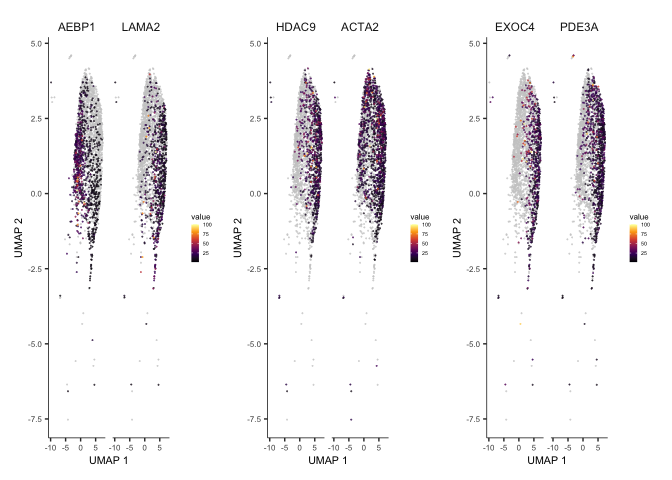<!-- -->

```
## quartz_off_screen 
##                 2
```

######################################
### VSMC Differential Expression (Dissection vs. Control)
######################################


```
## quartz_off_screen 
##                 2
```

```
## quartz_off_screen 
##                 2
```

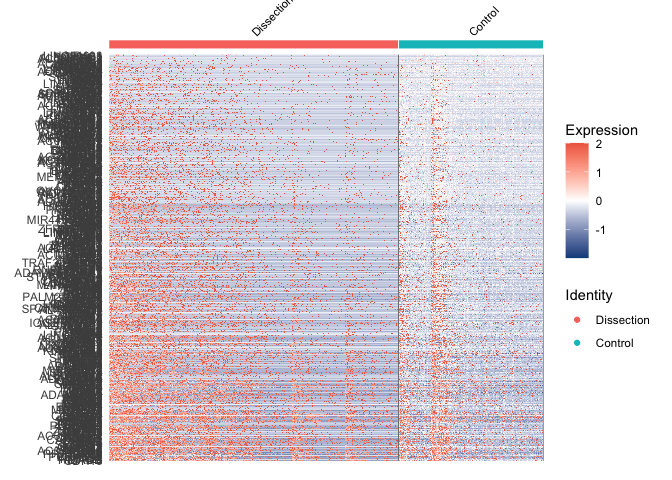<!-- -->

```
## [[1]]
```

```
## 
## [[2]]
```

```
## quartz_off_screen 
##                 2
```

```
## [1] 707.3396
```

```
## [1] 1.164184
```

```
## [1] -0.8923921
```

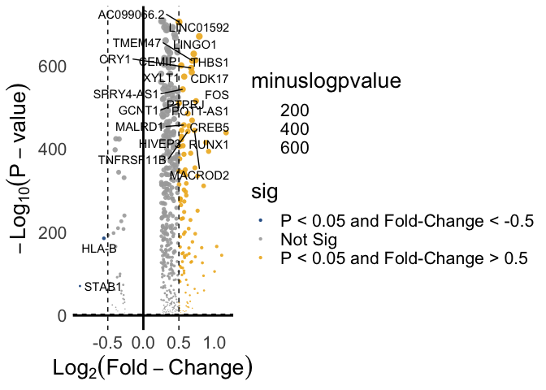<!-- -->

```
## quartz_off_screen 
##                 2
```

```
## [[1]]
```

```
## 
## [[2]]
```

```
## quartz_off_screen 
##                 2
```

# Supplemental Table: R Session Information
All packages and setting are acquired using the following command:


```r
sinfo<-devtools::session_info()
sinfo$platform
```

```
##  setting  value
##  version  R version 4.2.2 (2022-10-31)
##  os       macOS Big Sur ... 10.16
##  system   x86_64, darwin17.0
##  ui       X11
##  language (EN)
##  collate  en_US.UTF-8
##  ctype    en_US.UTF-8
##  tz       America/New_York
##  date     2023-01-14
##  pandoc   2.19.2 @ /Applications/RStudio.app/Contents/Resources/app/quarto/bin/tools/ (via rmarkdown)
```

```r
sinfo$packages %>% kable( 
                         align="c", 
                         longtable=T, 
                         booktabs=T,
                         caption="Packages and Required Dependencies") %>% 
    kable_styling(latex_options=c("striped", "repeat_header", "condensed"))
```

<table class="table" style="margin-left: auto; margin-right: auto;">
<caption>Packages and Required Dependencies</caption>
 <thead>
  <tr>
   <th style="text-align:left;">   </th>
   <th style="text-align:center;"> package </th>
   <th style="text-align:center;"> ondiskversion </th>
   <th style="text-align:center;"> loadedversion </th>
   <th style="text-align:center;"> path </th>
   <th style="text-align:center;"> loadedpath </th>
   <th style="text-align:center;"> attached </th>
   <th style="text-align:center;"> is_base </th>
   <th style="text-align:center;"> date </th>
   <th style="text-align:center;"> source </th>
   <th style="text-align:center;"> md5ok </th>
   <th style="text-align:center;"> library </th>
  </tr>
 </thead>
<tbody>
  <tr>
   <td style="text-align:left;"> abind </td>
   <td style="text-align:center;"> abind </td>
   <td style="text-align:center;"> 1.4.5 </td>
   <td style="text-align:center;"> 1.4-5 </td>
   <td style="text-align:center;"> /Library/Frameworks/R.framework/Versions/4.2/Resources/library/abind </td>
   <td style="text-align:center;"> /Library/Frameworks/R.framework/Versions/4.2/Resources/library/abind </td>
   <td style="text-align:center;"> FALSE </td>
   <td style="text-align:center;"> FALSE </td>
   <td style="text-align:center;"> 2016-07-21 </td>
   <td style="text-align:center;"> CRAN (R 4.2.0) </td>
   <td style="text-align:center;">  </td>
   <td style="text-align:center;"> /Library/Frameworks/R.framework/Versions/4.2/Resources/library </td>
  </tr>
  <tr>
   <td style="text-align:left;"> assertthat </td>
   <td style="text-align:center;"> assertthat </td>
   <td style="text-align:center;"> 0.2.1 </td>
   <td style="text-align:center;"> 0.2.1 </td>
   <td style="text-align:center;"> /Library/Frameworks/R.framework/Versions/4.2/Resources/library/assertthat </td>
   <td style="text-align:center;"> /Library/Frameworks/R.framework/Versions/4.2/Resources/library/assertthat </td>
   <td style="text-align:center;"> FALSE </td>
   <td style="text-align:center;"> FALSE </td>
   <td style="text-align:center;"> 2019-03-21 </td>
   <td style="text-align:center;"> CRAN (R 4.2.0) </td>
   <td style="text-align:center;">  </td>
   <td style="text-align:center;"> /Library/Frameworks/R.framework/Versions/4.2/Resources/library </td>
  </tr>
  <tr>
   <td style="text-align:left;"> bslib </td>
   <td style="text-align:center;"> bslib </td>
   <td style="text-align:center;"> 0.4.2 </td>
   <td style="text-align:center;"> 0.4.2 </td>
   <td style="text-align:center;"> /Library/Frameworks/R.framework/Versions/4.2/Resources/library/bslib </td>
   <td style="text-align:center;"> /Library/Frameworks/R.framework/Versions/4.2/Resources/library/bslib </td>
   <td style="text-align:center;"> FALSE </td>
   <td style="text-align:center;"> FALSE </td>
   <td style="text-align:center;"> 2022-12-16 </td>
   <td style="text-align:center;"> CRAN (R 4.2.0) </td>
   <td style="text-align:center;">  </td>
   <td style="text-align:center;"> /Library/Frameworks/R.framework/Versions/4.2/Resources/library </td>
  </tr>
  <tr>
   <td style="text-align:left;"> cachem </td>
   <td style="text-align:center;"> cachem </td>
   <td style="text-align:center;"> 1.0.6 </td>
   <td style="text-align:center;"> 1.0.6 </td>
   <td style="text-align:center;"> /Library/Frameworks/R.framework/Versions/4.2/Resources/library/cachem </td>
   <td style="text-align:center;"> /Library/Frameworks/R.framework/Versions/4.2/Resources/library/cachem </td>
   <td style="text-align:center;"> FALSE </td>
   <td style="text-align:center;"> FALSE </td>
   <td style="text-align:center;"> 2021-08-19 </td>
   <td style="text-align:center;"> CRAN (R 4.2.0) </td>
   <td style="text-align:center;">  </td>
   <td style="text-align:center;"> /Library/Frameworks/R.framework/Versions/4.2/Resources/library </td>
  </tr>
  <tr>
   <td style="text-align:left;"> callr </td>
   <td style="text-align:center;"> callr </td>
   <td style="text-align:center;"> 3.7.3 </td>
   <td style="text-align:center;"> 3.7.3 </td>
   <td style="text-align:center;"> /Library/Frameworks/R.framework/Versions/4.2/Resources/library/callr </td>
   <td style="text-align:center;"> /Library/Frameworks/R.framework/Versions/4.2/Resources/library/callr </td>
   <td style="text-align:center;"> FALSE </td>
   <td style="text-align:center;"> FALSE </td>
   <td style="text-align:center;"> 2022-11-02 </td>
   <td style="text-align:center;"> CRAN (R 4.2.0) </td>
   <td style="text-align:center;">  </td>
   <td style="text-align:center;"> /Library/Frameworks/R.framework/Versions/4.2/Resources/library </td>
  </tr>
  <tr>
   <td style="text-align:left;"> cli </td>
   <td style="text-align:center;"> cli </td>
   <td style="text-align:center;"> 3.5.0 </td>
   <td style="text-align:center;"> 3.5.0 </td>
   <td style="text-align:center;"> /Library/Frameworks/R.framework/Versions/4.2/Resources/library/cli </td>
   <td style="text-align:center;"> /Library/Frameworks/R.framework/Versions/4.2/Resources/library/cli </td>
   <td style="text-align:center;"> FALSE </td>
   <td style="text-align:center;"> FALSE </td>
   <td style="text-align:center;"> 2022-12-20 </td>
   <td style="text-align:center;"> CRAN (R 4.2.0) </td>
   <td style="text-align:center;">  </td>
   <td style="text-align:center;"> /Library/Frameworks/R.framework/Versions/4.2/Resources/library </td>
  </tr>
  <tr>
   <td style="text-align:left;"> cluster </td>
   <td style="text-align:center;"> cluster </td>
   <td style="text-align:center;"> 2.1.4 </td>
   <td style="text-align:center;"> 2.1.4 </td>
   <td style="text-align:center;"> /Library/Frameworks/R.framework/Versions/4.2/Resources/library/cluster </td>
   <td style="text-align:center;"> /Library/Frameworks/R.framework/Versions/4.2/Resources/library/cluster </td>
   <td style="text-align:center;"> FALSE </td>
   <td style="text-align:center;"> FALSE </td>
   <td style="text-align:center;"> 2022-08-22 </td>
   <td style="text-align:center;"> CRAN (R 4.2.2) </td>
   <td style="text-align:center;">  </td>
   <td style="text-align:center;"> /Library/Frameworks/R.framework/Versions/4.2/Resources/library </td>
  </tr>
  <tr>
   <td style="text-align:left;"> codetools </td>
   <td style="text-align:center;"> codetools </td>
   <td style="text-align:center;"> 0.2.18 </td>
   <td style="text-align:center;"> 0.2-18 </td>
   <td style="text-align:center;"> /Library/Frameworks/R.framework/Versions/4.2/Resources/library/codetools </td>
   <td style="text-align:center;"> /Library/Frameworks/R.framework/Versions/4.2/Resources/library/codetools </td>
   <td style="text-align:center;"> FALSE </td>
   <td style="text-align:center;"> FALSE </td>
   <td style="text-align:center;"> 2020-11-04 </td>
   <td style="text-align:center;"> CRAN (R 4.2.2) </td>
   <td style="text-align:center;">  </td>
   <td style="text-align:center;"> /Library/Frameworks/R.framework/Versions/4.2/Resources/library </td>
  </tr>
  <tr>
   <td style="text-align:left;"> colorspace </td>
   <td style="text-align:center;"> colorspace </td>
   <td style="text-align:center;"> 2.0.3 </td>
   <td style="text-align:center;"> 2.0-3 </td>
   <td style="text-align:center;"> /Library/Frameworks/R.framework/Versions/4.2/Resources/library/colorspace </td>
   <td style="text-align:center;"> /Library/Frameworks/R.framework/Versions/4.2/Resources/library/colorspace </td>
   <td style="text-align:center;"> FALSE </td>
   <td style="text-align:center;"> FALSE </td>
   <td style="text-align:center;"> 2022-02-21 </td>
   <td style="text-align:center;"> CRAN (R 4.2.0) </td>
   <td style="text-align:center;">  </td>
   <td style="text-align:center;"> /Library/Frameworks/R.framework/Versions/4.2/Resources/library </td>
  </tr>
  <tr>
   <td style="text-align:left;"> cowplot </td>
   <td style="text-align:center;"> cowplot </td>
   <td style="text-align:center;"> 1.1.1 </td>
   <td style="text-align:center;"> 1.1.1 </td>
   <td style="text-align:center;"> /Library/Frameworks/R.framework/Versions/4.2/Resources/library/cowplot </td>
   <td style="text-align:center;"> /Library/Frameworks/R.framework/Versions/4.2/Resources/library/cowplot </td>
   <td style="text-align:center;"> FALSE </td>
   <td style="text-align:center;"> FALSE </td>
   <td style="text-align:center;"> 2020-12-30 </td>
   <td style="text-align:center;"> CRAN (R 4.2.0) </td>
   <td style="text-align:center;">  </td>
   <td style="text-align:center;"> /Library/Frameworks/R.framework/Versions/4.2/Resources/library </td>
  </tr>
  <tr>
   <td style="text-align:left;"> crayon </td>
   <td style="text-align:center;"> crayon </td>
   <td style="text-align:center;"> 1.5.2 </td>
   <td style="text-align:center;"> 1.5.2 </td>
   <td style="text-align:center;"> /Library/Frameworks/R.framework/Versions/4.2/Resources/library/crayon </td>
   <td style="text-align:center;"> /Library/Frameworks/R.framework/Versions/4.2/Resources/library/crayon </td>
   <td style="text-align:center;"> FALSE </td>
   <td style="text-align:center;"> FALSE </td>
   <td style="text-align:center;"> 2022-09-29 </td>
   <td style="text-align:center;"> CRAN (R 4.2.0) </td>
   <td style="text-align:center;">  </td>
   <td style="text-align:center;"> /Library/Frameworks/R.framework/Versions/4.2/Resources/library </td>
  </tr>
  <tr>
   <td style="text-align:left;"> data.table </td>
   <td style="text-align:center;"> data.table </td>
   <td style="text-align:center;"> 1.14.6 </td>
   <td style="text-align:center;"> 1.14.6 </td>
   <td style="text-align:center;"> /Library/Frameworks/R.framework/Versions/4.2/Resources/library/data.table </td>
   <td style="text-align:center;"> /Library/Frameworks/R.framework/Versions/4.2/Resources/library/data.table </td>
   <td style="text-align:center;"> FALSE </td>
   <td style="text-align:center;"> FALSE </td>
   <td style="text-align:center;"> 2022-11-16 </td>
   <td style="text-align:center;"> CRAN (R 4.2.0) </td>
   <td style="text-align:center;">  </td>
   <td style="text-align:center;"> /Library/Frameworks/R.framework/Versions/4.2/Resources/library </td>
  </tr>
  <tr>
   <td style="text-align:left;"> DBI </td>
   <td style="text-align:center;"> DBI </td>
   <td style="text-align:center;"> 1.1.3 </td>
   <td style="text-align:center;"> 1.1.3 </td>
   <td style="text-align:center;"> /Library/Frameworks/R.framework/Versions/4.2/Resources/library/DBI </td>
   <td style="text-align:center;"> /Library/Frameworks/R.framework/Versions/4.2/Resources/library/DBI </td>
   <td style="text-align:center;"> FALSE </td>
   <td style="text-align:center;"> FALSE </td>
   <td style="text-align:center;"> 2022-06-18 </td>
   <td style="text-align:center;"> CRAN (R 4.2.0) </td>
   <td style="text-align:center;">  </td>
   <td style="text-align:center;"> /Library/Frameworks/R.framework/Versions/4.2/Resources/library </td>
  </tr>
  <tr>
   <td style="text-align:left;"> deldir </td>
   <td style="text-align:center;"> deldir </td>
   <td style="text-align:center;"> 1.0.6 </td>
   <td style="text-align:center;"> 1.0-6 </td>
   <td style="text-align:center;"> /Library/Frameworks/R.framework/Versions/4.2/Resources/library/deldir </td>
   <td style="text-align:center;"> /Library/Frameworks/R.framework/Versions/4.2/Resources/library/deldir </td>
   <td style="text-align:center;"> FALSE </td>
   <td style="text-align:center;"> FALSE </td>
   <td style="text-align:center;"> 2021-10-23 </td>
   <td style="text-align:center;"> CRAN (R 4.2.0) </td>
   <td style="text-align:center;">  </td>
   <td style="text-align:center;"> /Library/Frameworks/R.framework/Versions/4.2/Resources/library </td>
  </tr>
  <tr>
   <td style="text-align:left;"> devtools </td>
   <td style="text-align:center;"> devtools </td>
   <td style="text-align:center;"> 2.4.5 </td>
   <td style="text-align:center;"> 2.4.5 </td>
   <td style="text-align:center;"> /Library/Frameworks/R.framework/Versions/4.2/Resources/library/devtools </td>
   <td style="text-align:center;"> /Library/Frameworks/R.framework/Versions/4.2/Resources/library/devtools </td>
   <td style="text-align:center;"> FALSE </td>
   <td style="text-align:center;"> FALSE </td>
   <td style="text-align:center;"> 2022-10-11 </td>
   <td style="text-align:center;"> CRAN (R 4.2.0) </td>
   <td style="text-align:center;">  </td>
   <td style="text-align:center;"> /Library/Frameworks/R.framework/Versions/4.2/Resources/library </td>
  </tr>
  <tr>
   <td style="text-align:left;"> digest </td>
   <td style="text-align:center;"> digest </td>
   <td style="text-align:center;"> 0.6.31 </td>
   <td style="text-align:center;"> 0.6.31 </td>
   <td style="text-align:center;"> /Library/Frameworks/R.framework/Versions/4.2/Resources/library/digest </td>
   <td style="text-align:center;"> /Library/Frameworks/R.framework/Versions/4.2/Resources/library/digest </td>
   <td style="text-align:center;"> FALSE </td>
   <td style="text-align:center;"> FALSE </td>
   <td style="text-align:center;"> 2022-12-11 </td>
   <td style="text-align:center;"> CRAN (R 4.2.0) </td>
   <td style="text-align:center;">  </td>
   <td style="text-align:center;"> /Library/Frameworks/R.framework/Versions/4.2/Resources/library </td>
  </tr>
  <tr>
   <td style="text-align:left;"> dplyr </td>
   <td style="text-align:center;"> dplyr </td>
   <td style="text-align:center;"> 1.0.10 </td>
   <td style="text-align:center;"> 1.0.10 </td>
   <td style="text-align:center;"> /Library/Frameworks/R.framework/Versions/4.2/Resources/library/dplyr </td>
   <td style="text-align:center;"> /Library/Frameworks/R.framework/Versions/4.2/Resources/library/dplyr </td>
   <td style="text-align:center;"> TRUE </td>
   <td style="text-align:center;"> FALSE </td>
   <td style="text-align:center;"> 2022-09-01 </td>
   <td style="text-align:center;"> CRAN (R 4.2.0) </td>
   <td style="text-align:center;">  </td>
   <td style="text-align:center;"> /Library/Frameworks/R.framework/Versions/4.2/Resources/library </td>
  </tr>
  <tr>
   <td style="text-align:left;"> ellipsis </td>
   <td style="text-align:center;"> ellipsis </td>
   <td style="text-align:center;"> 0.3.2 </td>
   <td style="text-align:center;"> 0.3.2 </td>
   <td style="text-align:center;"> /Library/Frameworks/R.framework/Versions/4.2/Resources/library/ellipsis </td>
   <td style="text-align:center;"> /Library/Frameworks/R.framework/Versions/4.2/Resources/library/ellipsis </td>
   <td style="text-align:center;"> FALSE </td>
   <td style="text-align:center;"> FALSE </td>
   <td style="text-align:center;"> 2021-04-29 </td>
   <td style="text-align:center;"> CRAN (R 4.2.0) </td>
   <td style="text-align:center;">  </td>
   <td style="text-align:center;"> /Library/Frameworks/R.framework/Versions/4.2/Resources/library </td>
  </tr>
  <tr>
   <td style="text-align:left;"> evaluate </td>
   <td style="text-align:center;"> evaluate </td>
   <td style="text-align:center;"> 0.19 </td>
   <td style="text-align:center;"> 0.19 </td>
   <td style="text-align:center;"> /Library/Frameworks/R.framework/Versions/4.2/Resources/library/evaluate </td>
   <td style="text-align:center;"> /Library/Frameworks/R.framework/Versions/4.2/Resources/library/evaluate </td>
   <td style="text-align:center;"> FALSE </td>
   <td style="text-align:center;"> FALSE </td>
   <td style="text-align:center;"> 2022-12-13 </td>
   <td style="text-align:center;"> CRAN (R 4.2.0) </td>
   <td style="text-align:center;">  </td>
   <td style="text-align:center;"> /Library/Frameworks/R.framework/Versions/4.2/Resources/library </td>
  </tr>
  <tr>
   <td style="text-align:left;"> fansi </td>
   <td style="text-align:center;"> fansi </td>
   <td style="text-align:center;"> 1.0.3 </td>
   <td style="text-align:center;"> 1.0.3 </td>
   <td style="text-align:center;"> /Library/Frameworks/R.framework/Versions/4.2/Resources/library/fansi </td>
   <td style="text-align:center;"> /Library/Frameworks/R.framework/Versions/4.2/Resources/library/fansi </td>
   <td style="text-align:center;"> FALSE </td>
   <td style="text-align:center;"> FALSE </td>
   <td style="text-align:center;"> 2022-03-24 </td>
   <td style="text-align:center;"> CRAN (R 4.2.0) </td>
   <td style="text-align:center;">  </td>
   <td style="text-align:center;"> /Library/Frameworks/R.framework/Versions/4.2/Resources/library </td>
  </tr>
  <tr>
   <td style="text-align:left;"> farver </td>
   <td style="text-align:center;"> farver </td>
   <td style="text-align:center;"> 2.1.1 </td>
   <td style="text-align:center;"> 2.1.1 </td>
   <td style="text-align:center;"> /Library/Frameworks/R.framework/Versions/4.2/Resources/library/farver </td>
   <td style="text-align:center;"> /Library/Frameworks/R.framework/Versions/4.2/Resources/library/farver </td>
   <td style="text-align:center;"> FALSE </td>
   <td style="text-align:center;"> FALSE </td>
   <td style="text-align:center;"> 2022-07-06 </td>
   <td style="text-align:center;"> CRAN (R 4.2.0) </td>
   <td style="text-align:center;">  </td>
   <td style="text-align:center;"> /Library/Frameworks/R.framework/Versions/4.2/Resources/library </td>
  </tr>
  <tr>
   <td style="text-align:left;"> fastmap </td>
   <td style="text-align:center;"> fastmap </td>
   <td style="text-align:center;"> 1.1.0 </td>
   <td style="text-align:center;"> 1.1.0 </td>
   <td style="text-align:center;"> /Library/Frameworks/R.framework/Versions/4.2/Resources/library/fastmap </td>
   <td style="text-align:center;"> /Library/Frameworks/R.framework/Versions/4.2/Resources/library/fastmap </td>
   <td style="text-align:center;"> FALSE </td>
   <td style="text-align:center;"> FALSE </td>
   <td style="text-align:center;"> 2021-01-25 </td>
   <td style="text-align:center;"> CRAN (R 4.2.0) </td>
   <td style="text-align:center;">  </td>
   <td style="text-align:center;"> /Library/Frameworks/R.framework/Versions/4.2/Resources/library </td>
  </tr>
  <tr>
   <td style="text-align:left;"> fitdistrplus </td>
   <td style="text-align:center;"> fitdistrplus </td>
   <td style="text-align:center;"> 1.1.8 </td>
   <td style="text-align:center;"> 1.1-8 </td>
   <td style="text-align:center;"> /Library/Frameworks/R.framework/Versions/4.2/Resources/library/fitdistrplus </td>
   <td style="text-align:center;"> /Library/Frameworks/R.framework/Versions/4.2/Resources/library/fitdistrplus </td>
   <td style="text-align:center;"> FALSE </td>
   <td style="text-align:center;"> FALSE </td>
   <td style="text-align:center;"> 2022-03-10 </td>
   <td style="text-align:center;"> CRAN (R 4.2.0) </td>
   <td style="text-align:center;">  </td>
   <td style="text-align:center;"> /Library/Frameworks/R.framework/Versions/4.2/Resources/library </td>
  </tr>
  <tr>
   <td style="text-align:left;"> fs </td>
   <td style="text-align:center;"> fs </td>
   <td style="text-align:center;"> 1.5.2 </td>
   <td style="text-align:center;"> 1.5.2 </td>
   <td style="text-align:center;"> /Library/Frameworks/R.framework/Versions/4.2/Resources/library/fs </td>
   <td style="text-align:center;"> /Library/Frameworks/R.framework/Versions/4.2/Resources/library/fs </td>
   <td style="text-align:center;"> FALSE </td>
   <td style="text-align:center;"> FALSE </td>
   <td style="text-align:center;"> 2021-12-08 </td>
   <td style="text-align:center;"> CRAN (R 4.2.0) </td>
   <td style="text-align:center;">  </td>
   <td style="text-align:center;"> /Library/Frameworks/R.framework/Versions/4.2/Resources/library </td>
  </tr>
  <tr>
   <td style="text-align:left;"> future </td>
   <td style="text-align:center;"> future </td>
   <td style="text-align:center;"> 1.30.0 </td>
   <td style="text-align:center;"> 1.30.0 </td>
   <td style="text-align:center;"> /Library/Frameworks/R.framework/Versions/4.2/Resources/library/future </td>
   <td style="text-align:center;"> /Library/Frameworks/R.framework/Versions/4.2/Resources/library/future </td>
   <td style="text-align:center;"> FALSE </td>
   <td style="text-align:center;"> FALSE </td>
   <td style="text-align:center;"> 2022-12-16 </td>
   <td style="text-align:center;"> CRAN (R 4.2.0) </td>
   <td style="text-align:center;">  </td>
   <td style="text-align:center;"> /Library/Frameworks/R.framework/Versions/4.2/Resources/library </td>
  </tr>
  <tr>
   <td style="text-align:left;"> future.apply </td>
   <td style="text-align:center;"> future.apply </td>
   <td style="text-align:center;"> 1.10.0 </td>
   <td style="text-align:center;"> 1.10.0 </td>
   <td style="text-align:center;"> /Library/Frameworks/R.framework/Versions/4.2/Resources/library/future.apply </td>
   <td style="text-align:center;"> /Library/Frameworks/R.framework/Versions/4.2/Resources/library/future.apply </td>
   <td style="text-align:center;"> FALSE </td>
   <td style="text-align:center;"> FALSE </td>
   <td style="text-align:center;"> 2022-11-05 </td>
   <td style="text-align:center;"> CRAN (R 4.2.0) </td>
   <td style="text-align:center;">  </td>
   <td style="text-align:center;"> /Library/Frameworks/R.framework/Versions/4.2/Resources/library </td>
  </tr>
  <tr>
   <td style="text-align:left;"> generics </td>
   <td style="text-align:center;"> generics </td>
   <td style="text-align:center;"> 0.1.3 </td>
   <td style="text-align:center;"> 0.1.3 </td>
   <td style="text-align:center;"> /Library/Frameworks/R.framework/Versions/4.2/Resources/library/generics </td>
   <td style="text-align:center;"> /Library/Frameworks/R.framework/Versions/4.2/Resources/library/generics </td>
   <td style="text-align:center;"> FALSE </td>
   <td style="text-align:center;"> FALSE </td>
   <td style="text-align:center;"> 2022-07-05 </td>
   <td style="text-align:center;"> CRAN (R 4.2.0) </td>
   <td style="text-align:center;">  </td>
   <td style="text-align:center;"> /Library/Frameworks/R.framework/Versions/4.2/Resources/library </td>
  </tr>
  <tr>
   <td style="text-align:left;"> ggplot2 </td>
   <td style="text-align:center;"> ggplot2 </td>
   <td style="text-align:center;"> 3.4.0 </td>
   <td style="text-align:center;"> 3.4.0 </td>
   <td style="text-align:center;"> /Library/Frameworks/R.framework/Versions/4.2/Resources/library/ggplot2 </td>
   <td style="text-align:center;"> /Library/Frameworks/R.framework/Versions/4.2/Resources/library/ggplot2 </td>
   <td style="text-align:center;"> TRUE </td>
   <td style="text-align:center;"> FALSE </td>
   <td style="text-align:center;"> 2022-11-04 </td>
   <td style="text-align:center;"> CRAN (R 4.2.0) </td>
   <td style="text-align:center;">  </td>
   <td style="text-align:center;"> /Library/Frameworks/R.framework/Versions/4.2/Resources/library </td>
  </tr>
  <tr>
   <td style="text-align:left;"> ggrepel </td>
   <td style="text-align:center;"> ggrepel </td>
   <td style="text-align:center;"> 0.9.2 </td>
   <td style="text-align:center;"> 0.9.2 </td>
   <td style="text-align:center;"> /Library/Frameworks/R.framework/Versions/4.2/Resources/library/ggrepel </td>
   <td style="text-align:center;"> /Library/Frameworks/R.framework/Versions/4.2/Resources/library/ggrepel </td>
   <td style="text-align:center;"> FALSE </td>
   <td style="text-align:center;"> FALSE </td>
   <td style="text-align:center;"> 2022-11-06 </td>
   <td style="text-align:center;"> CRAN (R 4.2.0) </td>
   <td style="text-align:center;">  </td>
   <td style="text-align:center;"> /Library/Frameworks/R.framework/Versions/4.2/Resources/library </td>
  </tr>
  <tr>
   <td style="text-align:left;"> ggridges </td>
   <td style="text-align:center;"> ggridges </td>
   <td style="text-align:center;"> 0.5.4 </td>
   <td style="text-align:center;"> 0.5.4 </td>
   <td style="text-align:center;"> /Library/Frameworks/R.framework/Versions/4.2/Resources/library/ggridges </td>
   <td style="text-align:center;"> /Library/Frameworks/R.framework/Versions/4.2/Resources/library/ggridges </td>
   <td style="text-align:center;"> FALSE </td>
   <td style="text-align:center;"> FALSE </td>
   <td style="text-align:center;"> 2022-09-26 </td>
   <td style="text-align:center;"> CRAN (R 4.2.0) </td>
   <td style="text-align:center;">  </td>
   <td style="text-align:center;"> /Library/Frameworks/R.framework/Versions/4.2/Resources/library </td>
  </tr>
  <tr>
   <td style="text-align:left;"> globals </td>
   <td style="text-align:center;"> globals </td>
   <td style="text-align:center;"> 0.16.2 </td>
   <td style="text-align:center;"> 0.16.2 </td>
   <td style="text-align:center;"> /Library/Frameworks/R.framework/Versions/4.2/Resources/library/globals </td>
   <td style="text-align:center;"> /Library/Frameworks/R.framework/Versions/4.2/Resources/library/globals </td>
   <td style="text-align:center;"> FALSE </td>
   <td style="text-align:center;"> FALSE </td>
   <td style="text-align:center;"> 2022-11-21 </td>
   <td style="text-align:center;"> CRAN (R 4.2.0) </td>
   <td style="text-align:center;">  </td>
   <td style="text-align:center;"> /Library/Frameworks/R.framework/Versions/4.2/Resources/library </td>
  </tr>
  <tr>
   <td style="text-align:left;"> glue </td>
   <td style="text-align:center;"> glue </td>
   <td style="text-align:center;"> 1.6.2 </td>
   <td style="text-align:center;"> 1.6.2 </td>
   <td style="text-align:center;"> /Library/Frameworks/R.framework/Versions/4.2/Resources/library/glue </td>
   <td style="text-align:center;"> /Library/Frameworks/R.framework/Versions/4.2/Resources/library/glue </td>
   <td style="text-align:center;"> FALSE </td>
   <td style="text-align:center;"> FALSE </td>
   <td style="text-align:center;"> 2022-02-24 </td>
   <td style="text-align:center;"> CRAN (R 4.2.0) </td>
   <td style="text-align:center;">  </td>
   <td style="text-align:center;"> /Library/Frameworks/R.framework/Versions/4.2/Resources/library </td>
  </tr>
  <tr>
   <td style="text-align:left;"> goftest </td>
   <td style="text-align:center;"> goftest </td>
   <td style="text-align:center;"> 1.2.3 </td>
   <td style="text-align:center;"> 1.2-3 </td>
   <td style="text-align:center;"> /Library/Frameworks/R.framework/Versions/4.2/Resources/library/goftest </td>
   <td style="text-align:center;"> /Library/Frameworks/R.framework/Versions/4.2/Resources/library/goftest </td>
   <td style="text-align:center;"> FALSE </td>
   <td style="text-align:center;"> FALSE </td>
   <td style="text-align:center;"> 2021-10-07 </td>
   <td style="text-align:center;"> CRAN (R 4.2.0) </td>
   <td style="text-align:center;">  </td>
   <td style="text-align:center;"> /Library/Frameworks/R.framework/Versions/4.2/Resources/library </td>
  </tr>
  <tr>
   <td style="text-align:left;"> gridExtra </td>
   <td style="text-align:center;"> gridExtra </td>
   <td style="text-align:center;"> 2.3 </td>
   <td style="text-align:center;"> 2.3 </td>
   <td style="text-align:center;"> /Library/Frameworks/R.framework/Versions/4.2/Resources/library/gridExtra </td>
   <td style="text-align:center;"> /Library/Frameworks/R.framework/Versions/4.2/Resources/library/gridExtra </td>
   <td style="text-align:center;"> FALSE </td>
   <td style="text-align:center;"> FALSE </td>
   <td style="text-align:center;"> 2017-09-09 </td>
   <td style="text-align:center;"> CRAN (R 4.2.0) </td>
   <td style="text-align:center;">  </td>
   <td style="text-align:center;"> /Library/Frameworks/R.framework/Versions/4.2/Resources/library </td>
  </tr>
  <tr>
   <td style="text-align:left;"> gtable </td>
   <td style="text-align:center;"> gtable </td>
   <td style="text-align:center;"> 0.3.1 </td>
   <td style="text-align:center;"> 0.3.1 </td>
   <td style="text-align:center;"> /Library/Frameworks/R.framework/Versions/4.2/Resources/library/gtable </td>
   <td style="text-align:center;"> /Library/Frameworks/R.framework/Versions/4.2/Resources/library/gtable </td>
   <td style="text-align:center;"> FALSE </td>
   <td style="text-align:center;"> FALSE </td>
   <td style="text-align:center;"> 2022-09-01 </td>
   <td style="text-align:center;"> CRAN (R 4.2.0) </td>
   <td style="text-align:center;">  </td>
   <td style="text-align:center;"> /Library/Frameworks/R.framework/Versions/4.2/Resources/library </td>
  </tr>
  <tr>
   <td style="text-align:left;"> highr </td>
   <td style="text-align:center;"> highr </td>
   <td style="text-align:center;"> 0.10 </td>
   <td style="text-align:center;"> 0.10 </td>
   <td style="text-align:center;"> /Library/Frameworks/R.framework/Versions/4.2/Resources/library/highr </td>
   <td style="text-align:center;"> /Library/Frameworks/R.framework/Versions/4.2/Resources/library/highr </td>
   <td style="text-align:center;"> FALSE </td>
   <td style="text-align:center;"> FALSE </td>
   <td style="text-align:center;"> 2022-12-22 </td>
   <td style="text-align:center;"> CRAN (R 4.2.0) </td>
   <td style="text-align:center;">  </td>
   <td style="text-align:center;"> /Library/Frameworks/R.framework/Versions/4.2/Resources/library </td>
  </tr>
  <tr>
   <td style="text-align:left;"> htmltools </td>
   <td style="text-align:center;"> htmltools </td>
   <td style="text-align:center;"> 0.5.4 </td>
   <td style="text-align:center;"> 0.5.4 </td>
   <td style="text-align:center;"> /Library/Frameworks/R.framework/Versions/4.2/Resources/library/htmltools </td>
   <td style="text-align:center;"> /Library/Frameworks/R.framework/Versions/4.2/Resources/library/htmltools </td>
   <td style="text-align:center;"> FALSE </td>
   <td style="text-align:center;"> FALSE </td>
   <td style="text-align:center;"> 2022-12-07 </td>
   <td style="text-align:center;"> CRAN (R 4.2.0) </td>
   <td style="text-align:center;">  </td>
   <td style="text-align:center;"> /Library/Frameworks/R.framework/Versions/4.2/Resources/library </td>
  </tr>
  <tr>
   <td style="text-align:left;"> htmlwidgets </td>
   <td style="text-align:center;"> htmlwidgets </td>
   <td style="text-align:center;"> 1.6.1 </td>
   <td style="text-align:center;"> 1.6.1 </td>
   <td style="text-align:center;"> /Library/Frameworks/R.framework/Versions/4.2/Resources/library/htmlwidgets </td>
   <td style="text-align:center;"> /Library/Frameworks/R.framework/Versions/4.2/Resources/library/htmlwidgets </td>
   <td style="text-align:center;"> FALSE </td>
   <td style="text-align:center;"> FALSE </td>
   <td style="text-align:center;"> 2023-01-07 </td>
   <td style="text-align:center;"> CRAN (R 4.2.0) </td>
   <td style="text-align:center;">  </td>
   <td style="text-align:center;"> /Library/Frameworks/R.framework/Versions/4.2/Resources/library </td>
  </tr>
  <tr>
   <td style="text-align:left;"> httpuv </td>
   <td style="text-align:center;"> httpuv </td>
   <td style="text-align:center;"> 1.6.7 </td>
   <td style="text-align:center;"> 1.6.7 </td>
   <td style="text-align:center;"> /Library/Frameworks/R.framework/Versions/4.2/Resources/library/httpuv </td>
   <td style="text-align:center;"> /Library/Frameworks/R.framework/Versions/4.2/Resources/library/httpuv </td>
   <td style="text-align:center;"> FALSE </td>
   <td style="text-align:center;"> FALSE </td>
   <td style="text-align:center;"> 2022-12-14 </td>
   <td style="text-align:center;"> CRAN (R 4.2.0) </td>
   <td style="text-align:center;">  </td>
   <td style="text-align:center;"> /Library/Frameworks/R.framework/Versions/4.2/Resources/library </td>
  </tr>
  <tr>
   <td style="text-align:left;"> httr </td>
   <td style="text-align:center;"> httr </td>
   <td style="text-align:center;"> 1.4.4 </td>
   <td style="text-align:center;"> 1.4.4 </td>
   <td style="text-align:center;"> /Library/Frameworks/R.framework/Versions/4.2/Resources/library/httr </td>
   <td style="text-align:center;"> /Library/Frameworks/R.framework/Versions/4.2/Resources/library/httr </td>
   <td style="text-align:center;"> FALSE </td>
   <td style="text-align:center;"> FALSE </td>
   <td style="text-align:center;"> 2022-08-17 </td>
   <td style="text-align:center;"> CRAN (R 4.2.0) </td>
   <td style="text-align:center;">  </td>
   <td style="text-align:center;"> /Library/Frameworks/R.framework/Versions/4.2/Resources/library </td>
  </tr>
  <tr>
   <td style="text-align:left;"> ica </td>
   <td style="text-align:center;"> ica </td>
   <td style="text-align:center;"> 1.0.3 </td>
   <td style="text-align:center;"> 1.0-3 </td>
   <td style="text-align:center;"> /Library/Frameworks/R.framework/Versions/4.2/Resources/library/ica </td>
   <td style="text-align:center;"> /Library/Frameworks/R.framework/Versions/4.2/Resources/library/ica </td>
   <td style="text-align:center;"> FALSE </td>
   <td style="text-align:center;"> FALSE </td>
   <td style="text-align:center;"> 2022-07-08 </td>
   <td style="text-align:center;"> CRAN (R 4.2.0) </td>
   <td style="text-align:center;">  </td>
   <td style="text-align:center;"> /Library/Frameworks/R.framework/Versions/4.2/Resources/library </td>
  </tr>
  <tr>
   <td style="text-align:left;"> igraph </td>
   <td style="text-align:center;"> igraph </td>
   <td style="text-align:center;"> 1.3.5 </td>
   <td style="text-align:center;"> 1.3.5 </td>
   <td style="text-align:center;"> /Library/Frameworks/R.framework/Versions/4.2/Resources/library/igraph </td>
   <td style="text-align:center;"> /Library/Frameworks/R.framework/Versions/4.2/Resources/library/igraph </td>
   <td style="text-align:center;"> FALSE </td>
   <td style="text-align:center;"> FALSE </td>
   <td style="text-align:center;"> 2022-09-22 </td>
   <td style="text-align:center;"> CRAN (R 4.2.0) </td>
   <td style="text-align:center;">  </td>
   <td style="text-align:center;"> /Library/Frameworks/R.framework/Versions/4.2/Resources/library </td>
  </tr>
  <tr>
   <td style="text-align:left;"> irlba </td>
   <td style="text-align:center;"> irlba </td>
   <td style="text-align:center;"> 2.3.5.1 </td>
   <td style="text-align:center;"> 2.3.5.1 </td>
   <td style="text-align:center;"> /Library/Frameworks/R.framework/Versions/4.2/Resources/library/irlba </td>
   <td style="text-align:center;"> /Library/Frameworks/R.framework/Versions/4.2/Resources/library/irlba </td>
   <td style="text-align:center;"> FALSE </td>
   <td style="text-align:center;"> FALSE </td>
   <td style="text-align:center;"> 2022-10-03 </td>
   <td style="text-align:center;"> CRAN (R 4.2.0) </td>
   <td style="text-align:center;">  </td>
   <td style="text-align:center;"> /Library/Frameworks/R.framework/Versions/4.2/Resources/library </td>
  </tr>
  <tr>
   <td style="text-align:left;"> jquerylib </td>
   <td style="text-align:center;"> jquerylib </td>
   <td style="text-align:center;"> 0.1.4 </td>
   <td style="text-align:center;"> 0.1.4 </td>
   <td style="text-align:center;"> /Library/Frameworks/R.framework/Versions/4.2/Resources/library/jquerylib </td>
   <td style="text-align:center;"> /Library/Frameworks/R.framework/Versions/4.2/Resources/library/jquerylib </td>
   <td style="text-align:center;"> FALSE </td>
   <td style="text-align:center;"> FALSE </td>
   <td style="text-align:center;"> 2021-04-26 </td>
   <td style="text-align:center;"> CRAN (R 4.2.0) </td>
   <td style="text-align:center;">  </td>
   <td style="text-align:center;"> /Library/Frameworks/R.framework/Versions/4.2/Resources/library </td>
  </tr>
  <tr>
   <td style="text-align:left;"> jsonlite </td>
   <td style="text-align:center;"> jsonlite </td>
   <td style="text-align:center;"> 1.8.4 </td>
   <td style="text-align:center;"> 1.8.4 </td>
   <td style="text-align:center;"> /Library/Frameworks/R.framework/Versions/4.2/Resources/library/jsonlite </td>
   <td style="text-align:center;"> /Library/Frameworks/R.framework/Versions/4.2/Resources/library/jsonlite </td>
   <td style="text-align:center;"> FALSE </td>
   <td style="text-align:center;"> FALSE </td>
   <td style="text-align:center;"> 2022-12-06 </td>
   <td style="text-align:center;"> CRAN (R 4.2.0) </td>
   <td style="text-align:center;">  </td>
   <td style="text-align:center;"> /Library/Frameworks/R.framework/Versions/4.2/Resources/library </td>
  </tr>
  <tr>
   <td style="text-align:left;"> kableExtra </td>
   <td style="text-align:center;"> kableExtra </td>
   <td style="text-align:center;"> 1.3.4 </td>
   <td style="text-align:center;"> 1.3.4 </td>
   <td style="text-align:center;"> /Library/Frameworks/R.framework/Versions/4.2/Resources/library/kableExtra </td>
   <td style="text-align:center;"> /Library/Frameworks/R.framework/Versions/4.2/Resources/library/kableExtra </td>
   <td style="text-align:center;"> TRUE </td>
   <td style="text-align:center;"> FALSE </td>
   <td style="text-align:center;"> 2021-02-20 </td>
   <td style="text-align:center;"> CRAN (R 4.2.0) </td>
   <td style="text-align:center;">  </td>
   <td style="text-align:center;"> /Library/Frameworks/R.framework/Versions/4.2/Resources/library </td>
  </tr>
  <tr>
   <td style="text-align:left;"> KernSmooth </td>
   <td style="text-align:center;"> KernSmooth </td>
   <td style="text-align:center;"> 2.23.20 </td>
   <td style="text-align:center;"> 2.23-20 </td>
   <td style="text-align:center;"> /Library/Frameworks/R.framework/Versions/4.2/Resources/library/KernSmooth </td>
   <td style="text-align:center;"> /Library/Frameworks/R.framework/Versions/4.2/Resources/library/KernSmooth </td>
   <td style="text-align:center;"> FALSE </td>
   <td style="text-align:center;"> FALSE </td>
   <td style="text-align:center;"> 2021-05-03 </td>
   <td style="text-align:center;"> CRAN (R 4.2.2) </td>
   <td style="text-align:center;">  </td>
   <td style="text-align:center;"> /Library/Frameworks/R.framework/Versions/4.2/Resources/library </td>
  </tr>
  <tr>
   <td style="text-align:left;"> knitr </td>
   <td style="text-align:center;"> knitr </td>
   <td style="text-align:center;"> 1.41 </td>
   <td style="text-align:center;"> 1.41 </td>
   <td style="text-align:center;"> /Library/Frameworks/R.framework/Versions/4.2/Resources/library/knitr </td>
   <td style="text-align:center;"> /Library/Frameworks/R.framework/Versions/4.2/Resources/library/knitr </td>
   <td style="text-align:center;"> TRUE </td>
   <td style="text-align:center;"> FALSE </td>
   <td style="text-align:center;"> 2022-11-18 </td>
   <td style="text-align:center;"> CRAN (R 4.2.0) </td>
   <td style="text-align:center;">  </td>
   <td style="text-align:center;"> /Library/Frameworks/R.framework/Versions/4.2/Resources/library </td>
  </tr>
  <tr>
   <td style="text-align:left;"> labeling </td>
   <td style="text-align:center;"> labeling </td>
   <td style="text-align:center;"> 0.4.2 </td>
   <td style="text-align:center;"> 0.4.2 </td>
   <td style="text-align:center;"> /Library/Frameworks/R.framework/Versions/4.2/Resources/library/labeling </td>
   <td style="text-align:center;"> /Library/Frameworks/R.framework/Versions/4.2/Resources/library/labeling </td>
   <td style="text-align:center;"> FALSE </td>
   <td style="text-align:center;"> FALSE </td>
   <td style="text-align:center;"> 2020-10-20 </td>
   <td style="text-align:center;"> CRAN (R 4.2.0) </td>
   <td style="text-align:center;">  </td>
   <td style="text-align:center;"> /Library/Frameworks/R.framework/Versions/4.2/Resources/library </td>
  </tr>
  <tr>
   <td style="text-align:left;"> later </td>
   <td style="text-align:center;"> later </td>
   <td style="text-align:center;"> 1.3.0 </td>
   <td style="text-align:center;"> 1.3.0 </td>
   <td style="text-align:center;"> /Library/Frameworks/R.framework/Versions/4.2/Resources/library/later </td>
   <td style="text-align:center;"> /Library/Frameworks/R.framework/Versions/4.2/Resources/library/later </td>
   <td style="text-align:center;"> FALSE </td>
   <td style="text-align:center;"> FALSE </td>
   <td style="text-align:center;"> 2021-08-18 </td>
   <td style="text-align:center;"> CRAN (R 4.2.0) </td>
   <td style="text-align:center;">  </td>
   <td style="text-align:center;"> /Library/Frameworks/R.framework/Versions/4.2/Resources/library </td>
  </tr>
  <tr>
   <td style="text-align:left;"> lattice </td>
   <td style="text-align:center;"> lattice </td>
   <td style="text-align:center;"> 0.20.45 </td>
   <td style="text-align:center;"> 0.20-45 </td>
   <td style="text-align:center;"> /Library/Frameworks/R.framework/Versions/4.2/Resources/library/lattice </td>
   <td style="text-align:center;"> /Library/Frameworks/R.framework/Versions/4.2/Resources/library/lattice </td>
   <td style="text-align:center;"> FALSE </td>
   <td style="text-align:center;"> FALSE </td>
   <td style="text-align:center;"> 2021-09-22 </td>
   <td style="text-align:center;"> CRAN (R 4.2.2) </td>
   <td style="text-align:center;">  </td>
   <td style="text-align:center;"> /Library/Frameworks/R.framework/Versions/4.2/Resources/library </td>
  </tr>
  <tr>
   <td style="text-align:left;"> lazyeval </td>
   <td style="text-align:center;"> lazyeval </td>
   <td style="text-align:center;"> 0.2.2 </td>
   <td style="text-align:center;"> 0.2.2 </td>
   <td style="text-align:center;"> /Library/Frameworks/R.framework/Versions/4.2/Resources/library/lazyeval </td>
   <td style="text-align:center;"> /Library/Frameworks/R.framework/Versions/4.2/Resources/library/lazyeval </td>
   <td style="text-align:center;"> FALSE </td>
   <td style="text-align:center;"> FALSE </td>
   <td style="text-align:center;"> 2019-03-15 </td>
   <td style="text-align:center;"> CRAN (R 4.2.0) </td>
   <td style="text-align:center;">  </td>
   <td style="text-align:center;"> /Library/Frameworks/R.framework/Versions/4.2/Resources/library </td>
  </tr>
  <tr>
   <td style="text-align:left;"> leiden </td>
   <td style="text-align:center;"> leiden </td>
   <td style="text-align:center;"> 0.4.3 </td>
   <td style="text-align:center;"> 0.4.3 </td>
   <td style="text-align:center;"> /Library/Frameworks/R.framework/Versions/4.2/Resources/library/leiden </td>
   <td style="text-align:center;"> /Library/Frameworks/R.framework/Versions/4.2/Resources/library/leiden </td>
   <td style="text-align:center;"> FALSE </td>
   <td style="text-align:center;"> FALSE </td>
   <td style="text-align:center;"> 2022-09-10 </td>
   <td style="text-align:center;"> CRAN (R 4.2.0) </td>
   <td style="text-align:center;">  </td>
   <td style="text-align:center;"> /Library/Frameworks/R.framework/Versions/4.2/Resources/library </td>
  </tr>
  <tr>
   <td style="text-align:left;"> lifecycle </td>
   <td style="text-align:center;"> lifecycle </td>
   <td style="text-align:center;"> 1.0.3 </td>
   <td style="text-align:center;"> 1.0.3 </td>
   <td style="text-align:center;"> /Library/Frameworks/R.framework/Versions/4.2/Resources/library/lifecycle </td>
   <td style="text-align:center;"> /Library/Frameworks/R.framework/Versions/4.2/Resources/library/lifecycle </td>
   <td style="text-align:center;"> FALSE </td>
   <td style="text-align:center;"> FALSE </td>
   <td style="text-align:center;"> 2022-10-07 </td>
   <td style="text-align:center;"> CRAN (R 4.2.0) </td>
   <td style="text-align:center;">  </td>
   <td style="text-align:center;"> /Library/Frameworks/R.framework/Versions/4.2/Resources/library </td>
  </tr>
  <tr>
   <td style="text-align:left;"> limma </td>
   <td style="text-align:center;"> limma </td>
   <td style="text-align:center;"> 3.54.0 </td>
   <td style="text-align:center;"> 3.54.0 </td>
   <td style="text-align:center;"> /Library/Frameworks/R.framework/Versions/4.2/Resources/library/limma </td>
   <td style="text-align:center;"> /Library/Frameworks/R.framework/Versions/4.2/Resources/library/limma </td>
   <td style="text-align:center;"> FALSE </td>
   <td style="text-align:center;"> FALSE </td>
   <td style="text-align:center;"> 2022-11-01 </td>
   <td style="text-align:center;"> Bioconductor </td>
   <td style="text-align:center;">  </td>
   <td style="text-align:center;"> /Library/Frameworks/R.framework/Versions/4.2/Resources/library </td>
  </tr>
  <tr>
   <td style="text-align:left;"> listenv </td>
   <td style="text-align:center;"> listenv </td>
   <td style="text-align:center;"> 0.9.0 </td>
   <td style="text-align:center;"> 0.9.0 </td>
   <td style="text-align:center;"> /Library/Frameworks/R.framework/Versions/4.2/Resources/library/listenv </td>
   <td style="text-align:center;"> /Library/Frameworks/R.framework/Versions/4.2/Resources/library/listenv </td>
   <td style="text-align:center;"> FALSE </td>
   <td style="text-align:center;"> FALSE </td>
   <td style="text-align:center;"> 2022-12-16 </td>
   <td style="text-align:center;"> CRAN (R 4.2.0) </td>
   <td style="text-align:center;">  </td>
   <td style="text-align:center;"> /Library/Frameworks/R.framework/Versions/4.2/Resources/library </td>
  </tr>
  <tr>
   <td style="text-align:left;"> lmtest </td>
   <td style="text-align:center;"> lmtest </td>
   <td style="text-align:center;"> 0.9.40 </td>
   <td style="text-align:center;"> 0.9-40 </td>
   <td style="text-align:center;"> /Library/Frameworks/R.framework/Versions/4.2/Resources/library/lmtest </td>
   <td style="text-align:center;"> /Library/Frameworks/R.framework/Versions/4.2/Resources/library/lmtest </td>
   <td style="text-align:center;"> FALSE </td>
   <td style="text-align:center;"> FALSE </td>
   <td style="text-align:center;"> 2022-03-21 </td>
   <td style="text-align:center;"> CRAN (R 4.2.0) </td>
   <td style="text-align:center;">  </td>
   <td style="text-align:center;"> /Library/Frameworks/R.framework/Versions/4.2/Resources/library </td>
  </tr>
  <tr>
   <td style="text-align:left;"> magrittr </td>
   <td style="text-align:center;"> magrittr </td>
   <td style="text-align:center;"> 2.0.3 </td>
   <td style="text-align:center;"> 2.0.3 </td>
   <td style="text-align:center;"> /Library/Frameworks/R.framework/Versions/4.2/Resources/library/magrittr </td>
   <td style="text-align:center;"> /Library/Frameworks/R.framework/Versions/4.2/Resources/library/magrittr </td>
   <td style="text-align:center;"> FALSE </td>
   <td style="text-align:center;"> FALSE </td>
   <td style="text-align:center;"> 2022-03-30 </td>
   <td style="text-align:center;"> CRAN (R 4.2.0) </td>
   <td style="text-align:center;">  </td>
   <td style="text-align:center;"> /Library/Frameworks/R.framework/Versions/4.2/Resources/library </td>
  </tr>
  <tr>
   <td style="text-align:left;"> MASS </td>
   <td style="text-align:center;"> MASS </td>
   <td style="text-align:center;"> 7.3.58.1 </td>
   <td style="text-align:center;"> 7.3-58.1 </td>
   <td style="text-align:center;"> /Library/Frameworks/R.framework/Versions/4.2/Resources/library/MASS </td>
   <td style="text-align:center;"> /Library/Frameworks/R.framework/Versions/4.2/Resources/library/MASS </td>
   <td style="text-align:center;"> FALSE </td>
   <td style="text-align:center;"> FALSE </td>
   <td style="text-align:center;"> 2022-08-03 </td>
   <td style="text-align:center;"> CRAN (R 4.2.2) </td>
   <td style="text-align:center;">  </td>
   <td style="text-align:center;"> /Library/Frameworks/R.framework/Versions/4.2/Resources/library </td>
  </tr>
  <tr>
   <td style="text-align:left;"> Matrix </td>
   <td style="text-align:center;"> Matrix </td>
   <td style="text-align:center;"> 1.5.3 </td>
   <td style="text-align:center;"> 1.5-3 </td>
   <td style="text-align:center;"> /Library/Frameworks/R.framework/Versions/4.2/Resources/library/Matrix </td>
   <td style="text-align:center;"> /Library/Frameworks/R.framework/Versions/4.2/Resources/library/Matrix </td>
   <td style="text-align:center;"> FALSE </td>
   <td style="text-align:center;"> FALSE </td>
   <td style="text-align:center;"> 2022-11-11 </td>
   <td style="text-align:center;"> CRAN (R 4.2.0) </td>
   <td style="text-align:center;">  </td>
   <td style="text-align:center;"> /Library/Frameworks/R.framework/Versions/4.2/Resources/library </td>
  </tr>
  <tr>
   <td style="text-align:left;"> matrixStats </td>
   <td style="text-align:center;"> matrixStats </td>
   <td style="text-align:center;"> 0.63.0 </td>
   <td style="text-align:center;"> 0.63.0 </td>
   <td style="text-align:center;"> /Library/Frameworks/R.framework/Versions/4.2/Resources/library/matrixStats </td>
   <td style="text-align:center;"> /Library/Frameworks/R.framework/Versions/4.2/Resources/library/matrixStats </td>
   <td style="text-align:center;"> FALSE </td>
   <td style="text-align:center;"> FALSE </td>
   <td style="text-align:center;"> 2022-11-18 </td>
   <td style="text-align:center;"> CRAN (R 4.2.0) </td>
   <td style="text-align:center;">  </td>
   <td style="text-align:center;"> /Library/Frameworks/R.framework/Versions/4.2/Resources/library </td>
  </tr>
  <tr>
   <td style="text-align:left;"> memoise </td>
   <td style="text-align:center;"> memoise </td>
   <td style="text-align:center;"> 2.0.1 </td>
   <td style="text-align:center;"> 2.0.1 </td>
   <td style="text-align:center;"> /Library/Frameworks/R.framework/Versions/4.2/Resources/library/memoise </td>
   <td style="text-align:center;"> /Library/Frameworks/R.framework/Versions/4.2/Resources/library/memoise </td>
   <td style="text-align:center;"> FALSE </td>
   <td style="text-align:center;"> FALSE </td>
   <td style="text-align:center;"> 2021-11-26 </td>
   <td style="text-align:center;"> CRAN (R 4.2.0) </td>
   <td style="text-align:center;">  </td>
   <td style="text-align:center;"> /Library/Frameworks/R.framework/Versions/4.2/Resources/library </td>
  </tr>
  <tr>
   <td style="text-align:left;"> mime </td>
   <td style="text-align:center;"> mime </td>
   <td style="text-align:center;"> 0.12 </td>
   <td style="text-align:center;"> 0.12 </td>
   <td style="text-align:center;"> /Library/Frameworks/R.framework/Versions/4.2/Resources/library/mime </td>
   <td style="text-align:center;"> /Library/Frameworks/R.framework/Versions/4.2/Resources/library/mime </td>
   <td style="text-align:center;"> FALSE </td>
   <td style="text-align:center;"> FALSE </td>
   <td style="text-align:center;"> 2021-09-28 </td>
   <td style="text-align:center;"> CRAN (R 4.2.0) </td>
   <td style="text-align:center;">  </td>
   <td style="text-align:center;"> /Library/Frameworks/R.framework/Versions/4.2/Resources/library </td>
  </tr>
  <tr>
   <td style="text-align:left;"> miniUI </td>
   <td style="text-align:center;"> miniUI </td>
   <td style="text-align:center;"> 0.1.1.1 </td>
   <td style="text-align:center;"> 0.1.1.1 </td>
   <td style="text-align:center;"> /Library/Frameworks/R.framework/Versions/4.2/Resources/library/miniUI </td>
   <td style="text-align:center;"> /Library/Frameworks/R.framework/Versions/4.2/Resources/library/miniUI </td>
   <td style="text-align:center;"> FALSE </td>
   <td style="text-align:center;"> FALSE </td>
   <td style="text-align:center;"> 2018-05-18 </td>
   <td style="text-align:center;"> CRAN (R 4.2.0) </td>
   <td style="text-align:center;">  </td>
   <td style="text-align:center;"> /Library/Frameworks/R.framework/Versions/4.2/Resources/library </td>
  </tr>
  <tr>
   <td style="text-align:left;"> munsell </td>
   <td style="text-align:center;"> munsell </td>
   <td style="text-align:center;"> 0.5.0 </td>
   <td style="text-align:center;"> 0.5.0 </td>
   <td style="text-align:center;"> /Library/Frameworks/R.framework/Versions/4.2/Resources/library/munsell </td>
   <td style="text-align:center;"> /Library/Frameworks/R.framework/Versions/4.2/Resources/library/munsell </td>
   <td style="text-align:center;"> FALSE </td>
   <td style="text-align:center;"> FALSE </td>
   <td style="text-align:center;"> 2018-06-12 </td>
   <td style="text-align:center;"> CRAN (R 4.2.0) </td>
   <td style="text-align:center;">  </td>
   <td style="text-align:center;"> /Library/Frameworks/R.framework/Versions/4.2/Resources/library </td>
  </tr>
  <tr>
   <td style="text-align:left;"> nlme </td>
   <td style="text-align:center;"> nlme </td>
   <td style="text-align:center;"> 3.1.161 </td>
   <td style="text-align:center;"> 3.1-161 </td>
   <td style="text-align:center;"> /Library/Frameworks/R.framework/Versions/4.2/Resources/library/nlme </td>
   <td style="text-align:center;"> /Library/Frameworks/R.framework/Versions/4.2/Resources/library/nlme </td>
   <td style="text-align:center;"> FALSE </td>
   <td style="text-align:center;"> FALSE </td>
   <td style="text-align:center;"> 2022-12-15 </td>
   <td style="text-align:center;"> CRAN (R 4.2.0) </td>
   <td style="text-align:center;">  </td>
   <td style="text-align:center;"> /Library/Frameworks/R.framework/Versions/4.2/Resources/library </td>
  </tr>
  <tr>
   <td style="text-align:left;"> parallelly </td>
   <td style="text-align:center;"> parallelly </td>
   <td style="text-align:center;"> 1.33.0 </td>
   <td style="text-align:center;"> 1.33.0 </td>
   <td style="text-align:center;"> /Library/Frameworks/R.framework/Versions/4.2/Resources/library/parallelly </td>
   <td style="text-align:center;"> /Library/Frameworks/R.framework/Versions/4.2/Resources/library/parallelly </td>
   <td style="text-align:center;"> FALSE </td>
   <td style="text-align:center;"> FALSE </td>
   <td style="text-align:center;"> 2022-12-14 </td>
   <td style="text-align:center;"> CRAN (R 4.2.0) </td>
   <td style="text-align:center;">  </td>
   <td style="text-align:center;"> /Library/Frameworks/R.framework/Versions/4.2/Resources/library </td>
  </tr>
  <tr>
   <td style="text-align:left;"> patchwork </td>
   <td style="text-align:center;"> patchwork </td>
   <td style="text-align:center;"> 1.1.2 </td>
   <td style="text-align:center;"> 1.1.2 </td>
   <td style="text-align:center;"> /Library/Frameworks/R.framework/Versions/4.2/Resources/library/patchwork </td>
   <td style="text-align:center;"> /Library/Frameworks/R.framework/Versions/4.2/Resources/library/patchwork </td>
   <td style="text-align:center;"> TRUE </td>
   <td style="text-align:center;"> FALSE </td>
   <td style="text-align:center;"> 2022-08-19 </td>
   <td style="text-align:center;"> CRAN (R 4.2.0) </td>
   <td style="text-align:center;">  </td>
   <td style="text-align:center;"> /Library/Frameworks/R.framework/Versions/4.2/Resources/library </td>
  </tr>
  <tr>
   <td style="text-align:left;"> pbapply </td>
   <td style="text-align:center;"> pbapply </td>
   <td style="text-align:center;"> 1.6.0 </td>
   <td style="text-align:center;"> 1.6-0 </td>
   <td style="text-align:center;"> /Library/Frameworks/R.framework/Versions/4.2/Resources/library/pbapply </td>
   <td style="text-align:center;"> /Library/Frameworks/R.framework/Versions/4.2/Resources/library/pbapply </td>
   <td style="text-align:center;"> FALSE </td>
   <td style="text-align:center;"> FALSE </td>
   <td style="text-align:center;"> 2022-11-16 </td>
   <td style="text-align:center;"> CRAN (R 4.2.0) </td>
   <td style="text-align:center;">  </td>
   <td style="text-align:center;"> /Library/Frameworks/R.framework/Versions/4.2/Resources/library </td>
  </tr>
  <tr>
   <td style="text-align:left;"> pillar </td>
   <td style="text-align:center;"> pillar </td>
   <td style="text-align:center;"> 1.8.1 </td>
   <td style="text-align:center;"> 1.8.1 </td>
   <td style="text-align:center;"> /Library/Frameworks/R.framework/Versions/4.2/Resources/library/pillar </td>
   <td style="text-align:center;"> /Library/Frameworks/R.framework/Versions/4.2/Resources/library/pillar </td>
   <td style="text-align:center;"> FALSE </td>
   <td style="text-align:center;"> FALSE </td>
   <td style="text-align:center;"> 2022-08-19 </td>
   <td style="text-align:center;"> CRAN (R 4.2.0) </td>
   <td style="text-align:center;">  </td>
   <td style="text-align:center;"> /Library/Frameworks/R.framework/Versions/4.2/Resources/library </td>
  </tr>
  <tr>
   <td style="text-align:left;"> pkgbuild </td>
   <td style="text-align:center;"> pkgbuild </td>
   <td style="text-align:center;"> 1.4.0 </td>
   <td style="text-align:center;"> 1.4.0 </td>
   <td style="text-align:center;"> /Library/Frameworks/R.framework/Versions/4.2/Resources/library/pkgbuild </td>
   <td style="text-align:center;"> /Library/Frameworks/R.framework/Versions/4.2/Resources/library/pkgbuild </td>
   <td style="text-align:center;"> FALSE </td>
   <td style="text-align:center;"> FALSE </td>
   <td style="text-align:center;"> 2022-11-27 </td>
   <td style="text-align:center;"> CRAN (R 4.2.0) </td>
   <td style="text-align:center;">  </td>
   <td style="text-align:center;"> /Library/Frameworks/R.framework/Versions/4.2/Resources/library </td>
  </tr>
  <tr>
   <td style="text-align:left;"> pkgconfig </td>
   <td style="text-align:center;"> pkgconfig </td>
   <td style="text-align:center;"> 2.0.3 </td>
   <td style="text-align:center;"> 2.0.3 </td>
   <td style="text-align:center;"> /Library/Frameworks/R.framework/Versions/4.2/Resources/library/pkgconfig </td>
   <td style="text-align:center;"> /Library/Frameworks/R.framework/Versions/4.2/Resources/library/pkgconfig </td>
   <td style="text-align:center;"> FALSE </td>
   <td style="text-align:center;"> FALSE </td>
   <td style="text-align:center;"> 2019-09-22 </td>
   <td style="text-align:center;"> CRAN (R 4.2.0) </td>
   <td style="text-align:center;">  </td>
   <td style="text-align:center;"> /Library/Frameworks/R.framework/Versions/4.2/Resources/library </td>
  </tr>
  <tr>
   <td style="text-align:left;"> pkgload </td>
   <td style="text-align:center;"> pkgload </td>
   <td style="text-align:center;"> 1.3.2 </td>
   <td style="text-align:center;"> 1.3.2 </td>
   <td style="text-align:center;"> /Library/Frameworks/R.framework/Versions/4.2/Resources/library/pkgload </td>
   <td style="text-align:center;"> /Library/Frameworks/R.framework/Versions/4.2/Resources/library/pkgload </td>
   <td style="text-align:center;"> FALSE </td>
   <td style="text-align:center;"> FALSE </td>
   <td style="text-align:center;"> 2022-11-16 </td>
   <td style="text-align:center;"> CRAN (R 4.2.0) </td>
   <td style="text-align:center;">  </td>
   <td style="text-align:center;"> /Library/Frameworks/R.framework/Versions/4.2/Resources/library </td>
  </tr>
  <tr>
   <td style="text-align:left;"> plotly </td>
   <td style="text-align:center;"> plotly </td>
   <td style="text-align:center;"> 4.10.1 </td>
   <td style="text-align:center;"> 4.10.1 </td>
   <td style="text-align:center;"> /Library/Frameworks/R.framework/Versions/4.2/Resources/library/plotly </td>
   <td style="text-align:center;"> /Library/Frameworks/R.framework/Versions/4.2/Resources/library/plotly </td>
   <td style="text-align:center;"> FALSE </td>
   <td style="text-align:center;"> FALSE </td>
   <td style="text-align:center;"> 2022-11-07 </td>
   <td style="text-align:center;"> CRAN (R 4.2.0) </td>
   <td style="text-align:center;">  </td>
   <td style="text-align:center;"> /Library/Frameworks/R.framework/Versions/4.2/Resources/library </td>
  </tr>
  <tr>
   <td style="text-align:left;"> plyr </td>
   <td style="text-align:center;"> plyr </td>
   <td style="text-align:center;"> 1.8.8 </td>
   <td style="text-align:center;"> 1.8.8 </td>
   <td style="text-align:center;"> /Library/Frameworks/R.framework/Versions/4.2/Resources/library/plyr </td>
   <td style="text-align:center;"> /Library/Frameworks/R.framework/Versions/4.2/Resources/library/plyr </td>
   <td style="text-align:center;"> FALSE </td>
   <td style="text-align:center;"> FALSE </td>
   <td style="text-align:center;"> 2022-11-11 </td>
   <td style="text-align:center;"> CRAN (R 4.2.0) </td>
   <td style="text-align:center;">  </td>
   <td style="text-align:center;"> /Library/Frameworks/R.framework/Versions/4.2/Resources/library </td>
  </tr>
  <tr>
   <td style="text-align:left;"> png </td>
   <td style="text-align:center;"> png </td>
   <td style="text-align:center;"> 0.1.8 </td>
   <td style="text-align:center;"> 0.1-8 </td>
   <td style="text-align:center;"> /Library/Frameworks/R.framework/Versions/4.2/Resources/library/png </td>
   <td style="text-align:center;"> /Library/Frameworks/R.framework/Versions/4.2/Resources/library/png </td>
   <td style="text-align:center;"> FALSE </td>
   <td style="text-align:center;"> FALSE </td>
   <td style="text-align:center;"> 2022-11-29 </td>
   <td style="text-align:center;"> CRAN (R 4.2.0) </td>
   <td style="text-align:center;">  </td>
   <td style="text-align:center;"> /Library/Frameworks/R.framework/Versions/4.2/Resources/library </td>
  </tr>
  <tr>
   <td style="text-align:left;"> polyclip </td>
   <td style="text-align:center;"> polyclip </td>
   <td style="text-align:center;"> 1.10.4 </td>
   <td style="text-align:center;"> 1.10-4 </td>
   <td style="text-align:center;"> /Library/Frameworks/R.framework/Versions/4.2/Resources/library/polyclip </td>
   <td style="text-align:center;"> /Library/Frameworks/R.framework/Versions/4.2/Resources/library/polyclip </td>
   <td style="text-align:center;"> FALSE </td>
   <td style="text-align:center;"> FALSE </td>
   <td style="text-align:center;"> 2022-10-20 </td>
   <td style="text-align:center;"> CRAN (R 4.2.0) </td>
   <td style="text-align:center;">  </td>
   <td style="text-align:center;"> /Library/Frameworks/R.framework/Versions/4.2/Resources/library </td>
  </tr>
  <tr>
   <td style="text-align:left;"> prettyunits </td>
   <td style="text-align:center;"> prettyunits </td>
   <td style="text-align:center;"> 1.1.1 </td>
   <td style="text-align:center;"> 1.1.1 </td>
   <td style="text-align:center;"> /Library/Frameworks/R.framework/Versions/4.2/Resources/library/prettyunits </td>
   <td style="text-align:center;"> /Library/Frameworks/R.framework/Versions/4.2/Resources/library/prettyunits </td>
   <td style="text-align:center;"> FALSE </td>
   <td style="text-align:center;"> FALSE </td>
   <td style="text-align:center;"> 2020-01-24 </td>
   <td style="text-align:center;"> CRAN (R 4.2.0) </td>
   <td style="text-align:center;">  </td>
   <td style="text-align:center;"> /Library/Frameworks/R.framework/Versions/4.2/Resources/library </td>
  </tr>
  <tr>
   <td style="text-align:left;"> processx </td>
   <td style="text-align:center;"> processx </td>
   <td style="text-align:center;"> 3.8.0 </td>
   <td style="text-align:center;"> 3.8.0 </td>
   <td style="text-align:center;"> /Library/Frameworks/R.framework/Versions/4.2/Resources/library/processx </td>
   <td style="text-align:center;"> /Library/Frameworks/R.framework/Versions/4.2/Resources/library/processx </td>
   <td style="text-align:center;"> FALSE </td>
   <td style="text-align:center;"> FALSE </td>
   <td style="text-align:center;"> 2022-10-26 </td>
   <td style="text-align:center;"> CRAN (R 4.2.0) </td>
   <td style="text-align:center;">  </td>
   <td style="text-align:center;"> /Library/Frameworks/R.framework/Versions/4.2/Resources/library </td>
  </tr>
  <tr>
   <td style="text-align:left;"> profvis </td>
   <td style="text-align:center;"> profvis </td>
   <td style="text-align:center;"> 0.3.7 </td>
   <td style="text-align:center;"> 0.3.7 </td>
   <td style="text-align:center;"> /Library/Frameworks/R.framework/Versions/4.2/Resources/library/profvis </td>
   <td style="text-align:center;"> /Library/Frameworks/R.framework/Versions/4.2/Resources/library/profvis </td>
   <td style="text-align:center;"> FALSE </td>
   <td style="text-align:center;"> FALSE </td>
   <td style="text-align:center;"> 2020-11-02 </td>
   <td style="text-align:center;"> CRAN (R 4.2.0) </td>
   <td style="text-align:center;">  </td>
   <td style="text-align:center;"> /Library/Frameworks/R.framework/Versions/4.2/Resources/library </td>
  </tr>
  <tr>
   <td style="text-align:left;"> progressr </td>
   <td style="text-align:center;"> progressr </td>
   <td style="text-align:center;"> 0.12.0 </td>
   <td style="text-align:center;"> 0.12.0 </td>
   <td style="text-align:center;"> /Library/Frameworks/R.framework/Versions/4.2/Resources/library/progressr </td>
   <td style="text-align:center;"> /Library/Frameworks/R.framework/Versions/4.2/Resources/library/progressr </td>
   <td style="text-align:center;"> FALSE </td>
   <td style="text-align:center;"> FALSE </td>
   <td style="text-align:center;"> 2022-12-13 </td>
   <td style="text-align:center;"> CRAN (R 4.2.0) </td>
   <td style="text-align:center;">  </td>
   <td style="text-align:center;"> /Library/Frameworks/R.framework/Versions/4.2/Resources/library </td>
  </tr>
  <tr>
   <td style="text-align:left;"> promises </td>
   <td style="text-align:center;"> promises </td>
   <td style="text-align:center;"> 1.2.0.1 </td>
   <td style="text-align:center;"> 1.2.0.1 </td>
   <td style="text-align:center;"> /Library/Frameworks/R.framework/Versions/4.2/Resources/library/promises </td>
   <td style="text-align:center;"> /Library/Frameworks/R.framework/Versions/4.2/Resources/library/promises </td>
   <td style="text-align:center;"> FALSE </td>
   <td style="text-align:center;"> FALSE </td>
   <td style="text-align:center;"> 2021-02-11 </td>
   <td style="text-align:center;"> CRAN (R 4.2.0) </td>
   <td style="text-align:center;">  </td>
   <td style="text-align:center;"> /Library/Frameworks/R.framework/Versions/4.2/Resources/library </td>
  </tr>
  <tr>
   <td style="text-align:left;"> ps </td>
   <td style="text-align:center;"> ps </td>
   <td style="text-align:center;"> 1.7.2 </td>
   <td style="text-align:center;"> 1.7.2 </td>
   <td style="text-align:center;"> /Library/Frameworks/R.framework/Versions/4.2/Resources/library/ps </td>
   <td style="text-align:center;"> /Library/Frameworks/R.framework/Versions/4.2/Resources/library/ps </td>
   <td style="text-align:center;"> FALSE </td>
   <td style="text-align:center;"> FALSE </td>
   <td style="text-align:center;"> 2022-10-26 </td>
   <td style="text-align:center;"> CRAN (R 4.2.0) </td>
   <td style="text-align:center;">  </td>
   <td style="text-align:center;"> /Library/Frameworks/R.framework/Versions/4.2/Resources/library </td>
  </tr>
  <tr>
   <td style="text-align:left;"> purrr </td>
   <td style="text-align:center;"> purrr </td>
   <td style="text-align:center;"> 1.0.0 </td>
   <td style="text-align:center;"> 1.0.0 </td>
   <td style="text-align:center;"> /Library/Frameworks/R.framework/Versions/4.2/Resources/library/purrr </td>
   <td style="text-align:center;"> /Library/Frameworks/R.framework/Versions/4.2/Resources/library/purrr </td>
   <td style="text-align:center;"> FALSE </td>
   <td style="text-align:center;"> FALSE </td>
   <td style="text-align:center;"> 2022-12-20 </td>
   <td style="text-align:center;"> CRAN (R 4.2.0) </td>
   <td style="text-align:center;">  </td>
   <td style="text-align:center;"> /Library/Frameworks/R.framework/Versions/4.2/Resources/library </td>
  </tr>
  <tr>
   <td style="text-align:left;"> R6 </td>
   <td style="text-align:center;"> R6 </td>
   <td style="text-align:center;"> 2.5.1 </td>
   <td style="text-align:center;"> 2.5.1 </td>
   <td style="text-align:center;"> /Library/Frameworks/R.framework/Versions/4.2/Resources/library/R6 </td>
   <td style="text-align:center;"> /Library/Frameworks/R.framework/Versions/4.2/Resources/library/R6 </td>
   <td style="text-align:center;"> FALSE </td>
   <td style="text-align:center;"> FALSE </td>
   <td style="text-align:center;"> 2021-08-19 </td>
   <td style="text-align:center;"> CRAN (R 4.2.0) </td>
   <td style="text-align:center;">  </td>
   <td style="text-align:center;"> /Library/Frameworks/R.framework/Versions/4.2/Resources/library </td>
  </tr>
  <tr>
   <td style="text-align:left;"> RANN </td>
   <td style="text-align:center;"> RANN </td>
   <td style="text-align:center;"> 2.6.1 </td>
   <td style="text-align:center;"> 2.6.1 </td>
   <td style="text-align:center;"> /Library/Frameworks/R.framework/Versions/4.2/Resources/library/RANN </td>
   <td style="text-align:center;"> /Library/Frameworks/R.framework/Versions/4.2/Resources/library/RANN </td>
   <td style="text-align:center;"> FALSE </td>
   <td style="text-align:center;"> FALSE </td>
   <td style="text-align:center;"> 2019-01-08 </td>
   <td style="text-align:center;"> CRAN (R 4.2.0) </td>
   <td style="text-align:center;">  </td>
   <td style="text-align:center;"> /Library/Frameworks/R.framework/Versions/4.2/Resources/library </td>
  </tr>
  <tr>
   <td style="text-align:left;"> RColorBrewer </td>
   <td style="text-align:center;"> RColorBrewer </td>
   <td style="text-align:center;"> 1.1.3 </td>
   <td style="text-align:center;"> 1.1-3 </td>
   <td style="text-align:center;"> /Library/Frameworks/R.framework/Versions/4.2/Resources/library/RColorBrewer </td>
   <td style="text-align:center;"> /Library/Frameworks/R.framework/Versions/4.2/Resources/library/RColorBrewer </td>
   <td style="text-align:center;"> FALSE </td>
   <td style="text-align:center;"> FALSE </td>
   <td style="text-align:center;"> 2022-04-03 </td>
   <td style="text-align:center;"> CRAN (R 4.2.0) </td>
   <td style="text-align:center;">  </td>
   <td style="text-align:center;"> /Library/Frameworks/R.framework/Versions/4.2/Resources/library </td>
  </tr>
  <tr>
   <td style="text-align:left;"> Rcpp </td>
   <td style="text-align:center;"> Rcpp </td>
   <td style="text-align:center;"> 1.0.9 </td>
   <td style="text-align:center;"> 1.0.9 </td>
   <td style="text-align:center;"> /Library/Frameworks/R.framework/Versions/4.2/Resources/library/Rcpp </td>
   <td style="text-align:center;"> /Library/Frameworks/R.framework/Versions/4.2/Resources/library/Rcpp </td>
   <td style="text-align:center;"> FALSE </td>
   <td style="text-align:center;"> FALSE </td>
   <td style="text-align:center;"> 2022-07-08 </td>
   <td style="text-align:center;"> CRAN (R 4.2.0) </td>
   <td style="text-align:center;">  </td>
   <td style="text-align:center;"> /Library/Frameworks/R.framework/Versions/4.2/Resources/library </td>
  </tr>
  <tr>
   <td style="text-align:left;"> RcppAnnoy </td>
   <td style="text-align:center;"> RcppAnnoy </td>
   <td style="text-align:center;"> 0.0.20 </td>
   <td style="text-align:center;"> 0.0.20 </td>
   <td style="text-align:center;"> /Library/Frameworks/R.framework/Versions/4.2/Resources/library/RcppAnnoy </td>
   <td style="text-align:center;"> /Library/Frameworks/R.framework/Versions/4.2/Resources/library/RcppAnnoy </td>
   <td style="text-align:center;"> FALSE </td>
   <td style="text-align:center;"> FALSE </td>
   <td style="text-align:center;"> 2022-10-27 </td>
   <td style="text-align:center;"> CRAN (R 4.2.0) </td>
   <td style="text-align:center;">  </td>
   <td style="text-align:center;"> /Library/Frameworks/R.framework/Versions/4.2/Resources/library </td>
  </tr>
  <tr>
   <td style="text-align:left;"> remotes </td>
   <td style="text-align:center;"> remotes </td>
   <td style="text-align:center;"> 2.4.2 </td>
   <td style="text-align:center;"> 2.4.2 </td>
   <td style="text-align:center;"> /Library/Frameworks/R.framework/Versions/4.2/Resources/library/remotes </td>
   <td style="text-align:center;"> /Library/Frameworks/R.framework/Versions/4.2/Resources/library/remotes </td>
   <td style="text-align:center;"> FALSE </td>
   <td style="text-align:center;"> FALSE </td>
   <td style="text-align:center;"> 2021-11-30 </td>
   <td style="text-align:center;"> CRAN (R 4.2.0) </td>
   <td style="text-align:center;">  </td>
   <td style="text-align:center;"> /Library/Frameworks/R.framework/Versions/4.2/Resources/library </td>
  </tr>
  <tr>
   <td style="text-align:left;"> reshape2 </td>
   <td style="text-align:center;"> reshape2 </td>
   <td style="text-align:center;"> 1.4.4 </td>
   <td style="text-align:center;"> 1.4.4 </td>
   <td style="text-align:center;"> /Library/Frameworks/R.framework/Versions/4.2/Resources/library/reshape2 </td>
   <td style="text-align:center;"> /Library/Frameworks/R.framework/Versions/4.2/Resources/library/reshape2 </td>
   <td style="text-align:center;"> FALSE </td>
   <td style="text-align:center;"> FALSE </td>
   <td style="text-align:center;"> 2020-04-09 </td>
   <td style="text-align:center;"> CRAN (R 4.2.0) </td>
   <td style="text-align:center;">  </td>
   <td style="text-align:center;"> /Library/Frameworks/R.framework/Versions/4.2/Resources/library </td>
  </tr>
  <tr>
   <td style="text-align:left;"> reticulate </td>
   <td style="text-align:center;"> reticulate </td>
   <td style="text-align:center;"> 1.27 </td>
   <td style="text-align:center;"> 1.27 </td>
   <td style="text-align:center;"> /Library/Frameworks/R.framework/Versions/4.2/Resources/library/reticulate </td>
   <td style="text-align:center;"> /Library/Frameworks/R.framework/Versions/4.2/Resources/library/reticulate </td>
   <td style="text-align:center;"> FALSE </td>
   <td style="text-align:center;"> FALSE </td>
   <td style="text-align:center;"> 2023-01-07 </td>
   <td style="text-align:center;"> CRAN (R 4.2.0) </td>
   <td style="text-align:center;">  </td>
   <td style="text-align:center;"> /Library/Frameworks/R.framework/Versions/4.2/Resources/library </td>
  </tr>
  <tr>
   <td style="text-align:left;"> rlang </td>
   <td style="text-align:center;"> rlang </td>
   <td style="text-align:center;"> 1.0.6 </td>
   <td style="text-align:center;"> 1.0.6 </td>
   <td style="text-align:center;"> /Library/Frameworks/R.framework/Versions/4.2/Resources/library/rlang </td>
   <td style="text-align:center;"> /Library/Frameworks/R.framework/Versions/4.2/Resources/library/rlang </td>
   <td style="text-align:center;"> FALSE </td>
   <td style="text-align:center;"> FALSE </td>
   <td style="text-align:center;"> 2022-09-24 </td>
   <td style="text-align:center;"> CRAN (R 4.2.0) </td>
   <td style="text-align:center;">  </td>
   <td style="text-align:center;"> /Library/Frameworks/R.framework/Versions/4.2/Resources/library </td>
  </tr>
  <tr>
   <td style="text-align:left;"> rmarkdown </td>
   <td style="text-align:center;"> rmarkdown </td>
   <td style="text-align:center;"> 2.19 </td>
   <td style="text-align:center;"> 2.19 </td>
   <td style="text-align:center;"> /Library/Frameworks/R.framework/Versions/4.2/Resources/library/rmarkdown </td>
   <td style="text-align:center;"> /Library/Frameworks/R.framework/Versions/4.2/Resources/library/rmarkdown </td>
   <td style="text-align:center;"> FALSE </td>
   <td style="text-align:center;"> FALSE </td>
   <td style="text-align:center;"> 2022-12-15 </td>
   <td style="text-align:center;"> CRAN (R 4.2.2) </td>
   <td style="text-align:center;">  </td>
   <td style="text-align:center;"> /Library/Frameworks/R.framework/Versions/4.2/Resources/library </td>
  </tr>
  <tr>
   <td style="text-align:left;"> ROCR </td>
   <td style="text-align:center;"> ROCR </td>
   <td style="text-align:center;"> 1.0.11 </td>
   <td style="text-align:center;"> 1.0-11 </td>
   <td style="text-align:center;"> /Library/Frameworks/R.framework/Versions/4.2/Resources/library/ROCR </td>
   <td style="text-align:center;"> /Library/Frameworks/R.framework/Versions/4.2/Resources/library/ROCR </td>
   <td style="text-align:center;"> FALSE </td>
   <td style="text-align:center;"> FALSE </td>
   <td style="text-align:center;"> 2020-05-02 </td>
   <td style="text-align:center;"> CRAN (R 4.2.0) </td>
   <td style="text-align:center;">  </td>
   <td style="text-align:center;"> /Library/Frameworks/R.framework/Versions/4.2/Resources/library </td>
  </tr>
  <tr>
   <td style="text-align:left;"> rstudioapi </td>
   <td style="text-align:center;"> rstudioapi </td>
   <td style="text-align:center;"> 0.14 </td>
   <td style="text-align:center;"> 0.14 </td>
   <td style="text-align:center;"> /Library/Frameworks/R.framework/Versions/4.2/Resources/library/rstudioapi </td>
   <td style="text-align:center;"> /Library/Frameworks/R.framework/Versions/4.2/Resources/library/rstudioapi </td>
   <td style="text-align:center;"> FALSE </td>
   <td style="text-align:center;"> FALSE </td>
   <td style="text-align:center;"> 2022-08-22 </td>
   <td style="text-align:center;"> CRAN (R 4.2.0) </td>
   <td style="text-align:center;">  </td>
   <td style="text-align:center;"> /Library/Frameworks/R.framework/Versions/4.2/Resources/library </td>
  </tr>
  <tr>
   <td style="text-align:left;"> Rtsne </td>
   <td style="text-align:center;"> Rtsne </td>
   <td style="text-align:center;"> 0.16 </td>
   <td style="text-align:center;"> 0.16 </td>
   <td style="text-align:center;"> /Library/Frameworks/R.framework/Versions/4.2/Resources/library/Rtsne </td>
   <td style="text-align:center;"> /Library/Frameworks/R.framework/Versions/4.2/Resources/library/Rtsne </td>
   <td style="text-align:center;"> FALSE </td>
   <td style="text-align:center;"> FALSE </td>
   <td style="text-align:center;"> 2022-04-17 </td>
   <td style="text-align:center;"> CRAN (R 4.2.0) </td>
   <td style="text-align:center;">  </td>
   <td style="text-align:center;"> /Library/Frameworks/R.framework/Versions/4.2/Resources/library </td>
  </tr>
  <tr>
   <td style="text-align:left;"> rvest </td>
   <td style="text-align:center;"> rvest </td>
   <td style="text-align:center;"> 1.0.3 </td>
   <td style="text-align:center;"> 1.0.3 </td>
   <td style="text-align:center;"> /Library/Frameworks/R.framework/Versions/4.2/Resources/library/rvest </td>
   <td style="text-align:center;"> /Library/Frameworks/R.framework/Versions/4.2/Resources/library/rvest </td>
   <td style="text-align:center;"> FALSE </td>
   <td style="text-align:center;"> FALSE </td>
   <td style="text-align:center;"> 2022-08-19 </td>
   <td style="text-align:center;"> CRAN (R 4.2.0) </td>
   <td style="text-align:center;">  </td>
   <td style="text-align:center;"> /Library/Frameworks/R.framework/Versions/4.2/Resources/library </td>
  </tr>
  <tr>
   <td style="text-align:left;"> sass </td>
   <td style="text-align:center;"> sass </td>
   <td style="text-align:center;"> 0.4.4 </td>
   <td style="text-align:center;"> 0.4.4 </td>
   <td style="text-align:center;"> /Library/Frameworks/R.framework/Versions/4.2/Resources/library/sass </td>
   <td style="text-align:center;"> /Library/Frameworks/R.framework/Versions/4.2/Resources/library/sass </td>
   <td style="text-align:center;"> FALSE </td>
   <td style="text-align:center;"> FALSE </td>
   <td style="text-align:center;"> 2022-11-24 </td>
   <td style="text-align:center;"> CRAN (R 4.2.0) </td>
   <td style="text-align:center;">  </td>
   <td style="text-align:center;"> /Library/Frameworks/R.framework/Versions/4.2/Resources/library </td>
  </tr>
  <tr>
   <td style="text-align:left;"> scales </td>
   <td style="text-align:center;"> scales </td>
   <td style="text-align:center;"> 1.2.1 </td>
   <td style="text-align:center;"> 1.2.1 </td>
   <td style="text-align:center;"> /Library/Frameworks/R.framework/Versions/4.2/Resources/library/scales </td>
   <td style="text-align:center;"> /Library/Frameworks/R.framework/Versions/4.2/Resources/library/scales </td>
   <td style="text-align:center;"> FALSE </td>
   <td style="text-align:center;"> FALSE </td>
   <td style="text-align:center;"> 2022-08-20 </td>
   <td style="text-align:center;"> CRAN (R 4.2.0) </td>
   <td style="text-align:center;">  </td>
   <td style="text-align:center;"> /Library/Frameworks/R.framework/Versions/4.2/Resources/library </td>
  </tr>
  <tr>
   <td style="text-align:left;"> scattermore </td>
   <td style="text-align:center;"> scattermore </td>
   <td style="text-align:center;"> 0.8 </td>
   <td style="text-align:center;"> 0.8 </td>
   <td style="text-align:center;"> /Library/Frameworks/R.framework/Versions/4.2/Resources/library/scattermore </td>
   <td style="text-align:center;"> /Library/Frameworks/R.framework/Versions/4.2/Resources/library/scattermore </td>
   <td style="text-align:center;"> FALSE </td>
   <td style="text-align:center;"> FALSE </td>
   <td style="text-align:center;"> 2022-02-14 </td>
   <td style="text-align:center;"> CRAN (R 4.2.0) </td>
   <td style="text-align:center;">  </td>
   <td style="text-align:center;"> /Library/Frameworks/R.framework/Versions/4.2/Resources/library </td>
  </tr>
  <tr>
   <td style="text-align:left;"> sctransform </td>
   <td style="text-align:center;"> sctransform </td>
   <td style="text-align:center;"> 0.3.5 </td>
   <td style="text-align:center;"> 0.3.5 </td>
   <td style="text-align:center;"> /Library/Frameworks/R.framework/Versions/4.2/Resources/library/sctransform </td>
   <td style="text-align:center;"> /Library/Frameworks/R.framework/Versions/4.2/Resources/library/sctransform </td>
   <td style="text-align:center;"> FALSE </td>
   <td style="text-align:center;"> FALSE </td>
   <td style="text-align:center;"> 2022-09-21 </td>
   <td style="text-align:center;"> CRAN (R 4.2.0) </td>
   <td style="text-align:center;">  </td>
   <td style="text-align:center;"> /Library/Frameworks/R.framework/Versions/4.2/Resources/library </td>
  </tr>
  <tr>
   <td style="text-align:left;"> sessioninfo </td>
   <td style="text-align:center;"> sessioninfo </td>
   <td style="text-align:center;"> 1.2.2 </td>
   <td style="text-align:center;"> 1.2.2 </td>
   <td style="text-align:center;"> /Library/Frameworks/R.framework/Versions/4.2/Resources/library/sessioninfo </td>
   <td style="text-align:center;"> /Library/Frameworks/R.framework/Versions/4.2/Resources/library/sessioninfo </td>
   <td style="text-align:center;"> FALSE </td>
   <td style="text-align:center;"> FALSE </td>
   <td style="text-align:center;"> 2021-12-06 </td>
   <td style="text-align:center;"> CRAN (R 4.2.0) </td>
   <td style="text-align:center;">  </td>
   <td style="text-align:center;"> /Library/Frameworks/R.framework/Versions/4.2/Resources/library </td>
  </tr>
  <tr>
   <td style="text-align:left;"> Seurat </td>
   <td style="text-align:center;"> Seurat </td>
   <td style="text-align:center;"> 4.3.0 </td>
   <td style="text-align:center;"> 4.3.0 </td>
   <td style="text-align:center;"> /Library/Frameworks/R.framework/Versions/4.2/Resources/library/Seurat </td>
   <td style="text-align:center;"> /Library/Frameworks/R.framework/Versions/4.2/Resources/library/Seurat </td>
   <td style="text-align:center;"> TRUE </td>
   <td style="text-align:center;"> FALSE </td>
   <td style="text-align:center;"> 2022-11-18 </td>
   <td style="text-align:center;"> CRAN (R 4.2.0) </td>
   <td style="text-align:center;">  </td>
   <td style="text-align:center;"> /Library/Frameworks/R.framework/Versions/4.2/Resources/library </td>
  </tr>
  <tr>
   <td style="text-align:left;"> SeuratObject </td>
   <td style="text-align:center;"> SeuratObject </td>
   <td style="text-align:center;"> 4.1.3 </td>
   <td style="text-align:center;"> 4.1.3 </td>
   <td style="text-align:center;"> /Library/Frameworks/R.framework/Versions/4.2/Resources/library/SeuratObject </td>
   <td style="text-align:center;"> /Library/Frameworks/R.framework/Versions/4.2/Resources/library/SeuratObject </td>
   <td style="text-align:center;"> TRUE </td>
   <td style="text-align:center;"> FALSE </td>
   <td style="text-align:center;"> 2022-11-07 </td>
   <td style="text-align:center;"> CRAN (R 4.2.0) </td>
   <td style="text-align:center;">  </td>
   <td style="text-align:center;"> /Library/Frameworks/R.framework/Versions/4.2/Resources/library </td>
  </tr>
  <tr>
   <td style="text-align:left;"> shiny </td>
   <td style="text-align:center;"> shiny </td>
   <td style="text-align:center;"> 1.7.4 </td>
   <td style="text-align:center;"> 1.7.4 </td>
   <td style="text-align:center;"> /Library/Frameworks/R.framework/Versions/4.2/Resources/library/shiny </td>
   <td style="text-align:center;"> /Library/Frameworks/R.framework/Versions/4.2/Resources/library/shiny </td>
   <td style="text-align:center;"> FALSE </td>
   <td style="text-align:center;"> FALSE </td>
   <td style="text-align:center;"> 2022-12-15 </td>
   <td style="text-align:center;"> CRAN (R 4.2.2) </td>
   <td style="text-align:center;">  </td>
   <td style="text-align:center;"> /Library/Frameworks/R.framework/Versions/4.2/Resources/library </td>
  </tr>
  <tr>
   <td style="text-align:left;"> sp </td>
   <td style="text-align:center;"> sp </td>
   <td style="text-align:center;"> 1.5.1 </td>
   <td style="text-align:center;"> 1.5-1 </td>
   <td style="text-align:center;"> /Library/Frameworks/R.framework/Versions/4.2/Resources/library/sp </td>
   <td style="text-align:center;"> /Library/Frameworks/R.framework/Versions/4.2/Resources/library/sp </td>
   <td style="text-align:center;"> FALSE </td>
   <td style="text-align:center;"> FALSE </td>
   <td style="text-align:center;"> 2022-11-07 </td>
   <td style="text-align:center;"> CRAN (R 4.2.0) </td>
   <td style="text-align:center;">  </td>
   <td style="text-align:center;"> /Library/Frameworks/R.framework/Versions/4.2/Resources/library </td>
  </tr>
  <tr>
   <td style="text-align:left;"> spatstat.data </td>
   <td style="text-align:center;"> spatstat.data </td>
   <td style="text-align:center;"> 3.0.0 </td>
   <td style="text-align:center;"> 3.0-0 </td>
   <td style="text-align:center;"> /Library/Frameworks/R.framework/Versions/4.2/Resources/library/spatstat.data </td>
   <td style="text-align:center;"> /Library/Frameworks/R.framework/Versions/4.2/Resources/library/spatstat.data </td>
   <td style="text-align:center;"> FALSE </td>
   <td style="text-align:center;"> FALSE </td>
   <td style="text-align:center;"> 2022-10-21 </td>
   <td style="text-align:center;"> CRAN (R 4.2.0) </td>
   <td style="text-align:center;">  </td>
   <td style="text-align:center;"> /Library/Frameworks/R.framework/Versions/4.2/Resources/library </td>
  </tr>
  <tr>
   <td style="text-align:left;"> spatstat.explore </td>
   <td style="text-align:center;"> spatstat.explore </td>
   <td style="text-align:center;"> 3.0.5 </td>
   <td style="text-align:center;"> 3.0-5 </td>
   <td style="text-align:center;"> /Library/Frameworks/R.framework/Versions/4.2/Resources/library/spatstat.explore </td>
   <td style="text-align:center;"> /Library/Frameworks/R.framework/Versions/4.2/Resources/library/spatstat.explore </td>
   <td style="text-align:center;"> FALSE </td>
   <td style="text-align:center;"> FALSE </td>
   <td style="text-align:center;"> 2022-11-10 </td>
   <td style="text-align:center;"> CRAN (R 4.2.0) </td>
   <td style="text-align:center;">  </td>
   <td style="text-align:center;"> /Library/Frameworks/R.framework/Versions/4.2/Resources/library </td>
  </tr>
  <tr>
   <td style="text-align:left;"> spatstat.geom </td>
   <td style="text-align:center;"> spatstat.geom </td>
   <td style="text-align:center;"> 3.0.3 </td>
   <td style="text-align:center;"> 3.0-3 </td>
   <td style="text-align:center;"> /Library/Frameworks/R.framework/Versions/4.2/Resources/library/spatstat.geom </td>
   <td style="text-align:center;"> /Library/Frameworks/R.framework/Versions/4.2/Resources/library/spatstat.geom </td>
   <td style="text-align:center;"> FALSE </td>
   <td style="text-align:center;"> FALSE </td>
   <td style="text-align:center;"> 2022-10-25 </td>
   <td style="text-align:center;"> CRAN (R 4.2.0) </td>
   <td style="text-align:center;">  </td>
   <td style="text-align:center;"> /Library/Frameworks/R.framework/Versions/4.2/Resources/library </td>
  </tr>
  <tr>
   <td style="text-align:left;"> spatstat.random </td>
   <td style="text-align:center;"> spatstat.random </td>
   <td style="text-align:center;"> 3.0.1 </td>
   <td style="text-align:center;"> 3.0-1 </td>
   <td style="text-align:center;"> /Library/Frameworks/R.framework/Versions/4.2/Resources/library/spatstat.random </td>
   <td style="text-align:center;"> /Library/Frameworks/R.framework/Versions/4.2/Resources/library/spatstat.random </td>
   <td style="text-align:center;"> FALSE </td>
   <td style="text-align:center;"> FALSE </td>
   <td style="text-align:center;"> 2022-11-03 </td>
   <td style="text-align:center;"> CRAN (R 4.2.0) </td>
   <td style="text-align:center;">  </td>
   <td style="text-align:center;"> /Library/Frameworks/R.framework/Versions/4.2/Resources/library </td>
  </tr>
  <tr>
   <td style="text-align:left;"> spatstat.sparse </td>
   <td style="text-align:center;"> spatstat.sparse </td>
   <td style="text-align:center;"> 3.0.0 </td>
   <td style="text-align:center;"> 3.0-0 </td>
   <td style="text-align:center;"> /Library/Frameworks/R.framework/Versions/4.2/Resources/library/spatstat.sparse </td>
   <td style="text-align:center;"> /Library/Frameworks/R.framework/Versions/4.2/Resources/library/spatstat.sparse </td>
   <td style="text-align:center;"> FALSE </td>
   <td style="text-align:center;"> FALSE </td>
   <td style="text-align:center;"> 2022-10-21 </td>
   <td style="text-align:center;"> CRAN (R 4.2.0) </td>
   <td style="text-align:center;">  </td>
   <td style="text-align:center;"> /Library/Frameworks/R.framework/Versions/4.2/Resources/library </td>
  </tr>
  <tr>
   <td style="text-align:left;"> spatstat.utils </td>
   <td style="text-align:center;"> spatstat.utils </td>
   <td style="text-align:center;"> 3.0.1 </td>
   <td style="text-align:center;"> 3.0-1 </td>
   <td style="text-align:center;"> /Library/Frameworks/R.framework/Versions/4.2/Resources/library/spatstat.utils </td>
   <td style="text-align:center;"> /Library/Frameworks/R.framework/Versions/4.2/Resources/library/spatstat.utils </td>
   <td style="text-align:center;"> FALSE </td>
   <td style="text-align:center;"> FALSE </td>
   <td style="text-align:center;"> 2022-10-19 </td>
   <td style="text-align:center;"> CRAN (R 4.2.0) </td>
   <td style="text-align:center;">  </td>
   <td style="text-align:center;"> /Library/Frameworks/R.framework/Versions/4.2/Resources/library </td>
  </tr>
  <tr>
   <td style="text-align:left;"> stringi </td>
   <td style="text-align:center;"> stringi </td>
   <td style="text-align:center;"> 1.7.8 </td>
   <td style="text-align:center;"> 1.7.8 </td>
   <td style="text-align:center;"> /Library/Frameworks/R.framework/Versions/4.2/Resources/library/stringi </td>
   <td style="text-align:center;"> /Library/Frameworks/R.framework/Versions/4.2/Resources/library/stringi </td>
   <td style="text-align:center;"> FALSE </td>
   <td style="text-align:center;"> FALSE </td>
   <td style="text-align:center;"> 2022-07-11 </td>
   <td style="text-align:center;"> CRAN (R 4.2.0) </td>
   <td style="text-align:center;">  </td>
   <td style="text-align:center;"> /Library/Frameworks/R.framework/Versions/4.2/Resources/library </td>
  </tr>
  <tr>
   <td style="text-align:left;"> stringr </td>
   <td style="text-align:center;"> stringr </td>
   <td style="text-align:center;"> 1.5.0 </td>
   <td style="text-align:center;"> 1.5.0 </td>
   <td style="text-align:center;"> /Library/Frameworks/R.framework/Versions/4.2/Resources/library/stringr </td>
   <td style="text-align:center;"> /Library/Frameworks/R.framework/Versions/4.2/Resources/library/stringr </td>
   <td style="text-align:center;"> FALSE </td>
   <td style="text-align:center;"> FALSE </td>
   <td style="text-align:center;"> 2022-12-02 </td>
   <td style="text-align:center;"> CRAN (R 4.2.0) </td>
   <td style="text-align:center;">  </td>
   <td style="text-align:center;"> /Library/Frameworks/R.framework/Versions/4.2/Resources/library </td>
  </tr>
  <tr>
   <td style="text-align:left;"> survival </td>
   <td style="text-align:center;"> survival </td>
   <td style="text-align:center;"> 3.4.0 </td>
   <td style="text-align:center;"> 3.4-0 </td>
   <td style="text-align:center;"> /Library/Frameworks/R.framework/Versions/4.2/Resources/library/survival </td>
   <td style="text-align:center;"> /Library/Frameworks/R.framework/Versions/4.2/Resources/library/survival </td>
   <td style="text-align:center;"> FALSE </td>
   <td style="text-align:center;"> FALSE </td>
   <td style="text-align:center;"> 2022-08-09 </td>
   <td style="text-align:center;"> CRAN (R 4.2.0) </td>
   <td style="text-align:center;">  </td>
   <td style="text-align:center;"> /Library/Frameworks/R.framework/Versions/4.2/Resources/library </td>
  </tr>
  <tr>
   <td style="text-align:left;"> svglite </td>
   <td style="text-align:center;"> svglite </td>
   <td style="text-align:center;"> 2.1.0 </td>
   <td style="text-align:center;"> 2.1.0 </td>
   <td style="text-align:center;"> /Library/Frameworks/R.framework/Versions/4.2/Resources/library/svglite </td>
   <td style="text-align:center;"> /Library/Frameworks/R.framework/Versions/4.2/Resources/library/svglite </td>
   <td style="text-align:center;"> FALSE </td>
   <td style="text-align:center;"> FALSE </td>
   <td style="text-align:center;"> 2022-02-03 </td>
   <td style="text-align:center;"> CRAN (R 4.2.0) </td>
   <td style="text-align:center;">  </td>
   <td style="text-align:center;"> /Library/Frameworks/R.framework/Versions/4.2/Resources/library </td>
  </tr>
  <tr>
   <td style="text-align:left;"> systemfonts </td>
   <td style="text-align:center;"> systemfonts </td>
   <td style="text-align:center;"> 1.0.4 </td>
   <td style="text-align:center;"> 1.0.4 </td>
   <td style="text-align:center;"> /Library/Frameworks/R.framework/Versions/4.2/Resources/library/systemfonts </td>
   <td style="text-align:center;"> /Library/Frameworks/R.framework/Versions/4.2/Resources/library/systemfonts </td>
   <td style="text-align:center;"> FALSE </td>
   <td style="text-align:center;"> FALSE </td>
   <td style="text-align:center;"> 2022-02-11 </td>
   <td style="text-align:center;"> CRAN (R 4.2.0) </td>
   <td style="text-align:center;">  </td>
   <td style="text-align:center;"> /Library/Frameworks/R.framework/Versions/4.2/Resources/library </td>
  </tr>
  <tr>
   <td style="text-align:left;"> tensor </td>
   <td style="text-align:center;"> tensor </td>
   <td style="text-align:center;"> 1.5 </td>
   <td style="text-align:center;"> 1.5 </td>
   <td style="text-align:center;"> /Library/Frameworks/R.framework/Versions/4.2/Resources/library/tensor </td>
   <td style="text-align:center;"> /Library/Frameworks/R.framework/Versions/4.2/Resources/library/tensor </td>
   <td style="text-align:center;"> FALSE </td>
   <td style="text-align:center;"> FALSE </td>
   <td style="text-align:center;"> 2012-05-05 </td>
   <td style="text-align:center;"> CRAN (R 4.2.0) </td>
   <td style="text-align:center;">  </td>
   <td style="text-align:center;"> /Library/Frameworks/R.framework/Versions/4.2/Resources/library </td>
  </tr>
  <tr>
   <td style="text-align:left;"> tibble </td>
   <td style="text-align:center;"> tibble </td>
   <td style="text-align:center;"> 3.1.8 </td>
   <td style="text-align:center;"> 3.1.8 </td>
   <td style="text-align:center;"> /Library/Frameworks/R.framework/Versions/4.2/Resources/library/tibble </td>
   <td style="text-align:center;"> /Library/Frameworks/R.framework/Versions/4.2/Resources/library/tibble </td>
   <td style="text-align:center;"> FALSE </td>
   <td style="text-align:center;"> FALSE </td>
   <td style="text-align:center;"> 2022-07-22 </td>
   <td style="text-align:center;"> CRAN (R 4.2.0) </td>
   <td style="text-align:center;">  </td>
   <td style="text-align:center;"> /Library/Frameworks/R.framework/Versions/4.2/Resources/library </td>
  </tr>
  <tr>
   <td style="text-align:left;"> tidyr </td>
   <td style="text-align:center;"> tidyr </td>
   <td style="text-align:center;"> 1.2.1 </td>
   <td style="text-align:center;"> 1.2.1 </td>
   <td style="text-align:center;"> /Library/Frameworks/R.framework/Versions/4.2/Resources/library/tidyr </td>
   <td style="text-align:center;"> /Library/Frameworks/R.framework/Versions/4.2/Resources/library/tidyr </td>
   <td style="text-align:center;"> FALSE </td>
   <td style="text-align:center;"> FALSE </td>
   <td style="text-align:center;"> 2022-09-08 </td>
   <td style="text-align:center;"> CRAN (R 4.2.0) </td>
   <td style="text-align:center;">  </td>
   <td style="text-align:center;"> /Library/Frameworks/R.framework/Versions/4.2/Resources/library </td>
  </tr>
  <tr>
   <td style="text-align:left;"> tidyselect </td>
   <td style="text-align:center;"> tidyselect </td>
   <td style="text-align:center;"> 1.2.0 </td>
   <td style="text-align:center;"> 1.2.0 </td>
   <td style="text-align:center;"> /Library/Frameworks/R.framework/Versions/4.2/Resources/library/tidyselect </td>
   <td style="text-align:center;"> /Library/Frameworks/R.framework/Versions/4.2/Resources/library/tidyselect </td>
   <td style="text-align:center;"> FALSE </td>
   <td style="text-align:center;"> FALSE </td>
   <td style="text-align:center;"> 2022-10-10 </td>
   <td style="text-align:center;"> CRAN (R 4.2.0) </td>
   <td style="text-align:center;">  </td>
   <td style="text-align:center;"> /Library/Frameworks/R.framework/Versions/4.2/Resources/library </td>
  </tr>
  <tr>
   <td style="text-align:left;"> urlchecker </td>
   <td style="text-align:center;"> urlchecker </td>
   <td style="text-align:center;"> 1.0.1 </td>
   <td style="text-align:center;"> 1.0.1 </td>
   <td style="text-align:center;"> /Library/Frameworks/R.framework/Versions/4.2/Resources/library/urlchecker </td>
   <td style="text-align:center;"> /Library/Frameworks/R.framework/Versions/4.2/Resources/library/urlchecker </td>
   <td style="text-align:center;"> FALSE </td>
   <td style="text-align:center;"> FALSE </td>
   <td style="text-align:center;"> 2021-11-30 </td>
   <td style="text-align:center;"> CRAN (R 4.2.0) </td>
   <td style="text-align:center;">  </td>
   <td style="text-align:center;"> /Library/Frameworks/R.framework/Versions/4.2/Resources/library </td>
  </tr>
  <tr>
   <td style="text-align:left;"> usethis </td>
   <td style="text-align:center;"> usethis </td>
   <td style="text-align:center;"> 2.1.6 </td>
   <td style="text-align:center;"> 2.1.6 </td>
   <td style="text-align:center;"> /Library/Frameworks/R.framework/Versions/4.2/Resources/library/usethis </td>
   <td style="text-align:center;"> /Library/Frameworks/R.framework/Versions/4.2/Resources/library/usethis </td>
   <td style="text-align:center;"> FALSE </td>
   <td style="text-align:center;"> FALSE </td>
   <td style="text-align:center;"> 2022-05-25 </td>
   <td style="text-align:center;"> CRAN (R 4.2.0) </td>
   <td style="text-align:center;">  </td>
   <td style="text-align:center;"> /Library/Frameworks/R.framework/Versions/4.2/Resources/library </td>
  </tr>
  <tr>
   <td style="text-align:left;"> utf8 </td>
   <td style="text-align:center;"> utf8 </td>
   <td style="text-align:center;"> 1.2.2 </td>
   <td style="text-align:center;"> 1.2.2 </td>
   <td style="text-align:center;"> /Library/Frameworks/R.framework/Versions/4.2/Resources/library/utf8 </td>
   <td style="text-align:center;"> /Library/Frameworks/R.framework/Versions/4.2/Resources/library/utf8 </td>
   <td style="text-align:center;"> FALSE </td>
   <td style="text-align:center;"> FALSE </td>
   <td style="text-align:center;"> 2021-07-24 </td>
   <td style="text-align:center;"> CRAN (R 4.2.0) </td>
   <td style="text-align:center;">  </td>
   <td style="text-align:center;"> /Library/Frameworks/R.framework/Versions/4.2/Resources/library </td>
  </tr>
  <tr>
   <td style="text-align:left;"> uwot </td>
   <td style="text-align:center;"> uwot </td>
   <td style="text-align:center;"> 0.1.14 </td>
   <td style="text-align:center;"> 0.1.14 </td>
   <td style="text-align:center;"> /Library/Frameworks/R.framework/Versions/4.2/Resources/library/uwot </td>
   <td style="text-align:center;"> /Library/Frameworks/R.framework/Versions/4.2/Resources/library/uwot </td>
   <td style="text-align:center;"> FALSE </td>
   <td style="text-align:center;"> FALSE </td>
   <td style="text-align:center;"> 2022-08-22 </td>
   <td style="text-align:center;"> CRAN (R 4.2.0) </td>
   <td style="text-align:center;">  </td>
   <td style="text-align:center;"> /Library/Frameworks/R.framework/Versions/4.2/Resources/library </td>
  </tr>
  <tr>
   <td style="text-align:left;"> vctrs </td>
   <td style="text-align:center;"> vctrs </td>
   <td style="text-align:center;"> 0.5.1 </td>
   <td style="text-align:center;"> 0.5.1 </td>
   <td style="text-align:center;"> /Library/Frameworks/R.framework/Versions/4.2/Resources/library/vctrs </td>
   <td style="text-align:center;"> /Library/Frameworks/R.framework/Versions/4.2/Resources/library/vctrs </td>
   <td style="text-align:center;"> FALSE </td>
   <td style="text-align:center;"> FALSE </td>
   <td style="text-align:center;"> 2022-11-16 </td>
   <td style="text-align:center;"> CRAN (R 4.2.0) </td>
   <td style="text-align:center;">  </td>
   <td style="text-align:center;"> /Library/Frameworks/R.framework/Versions/4.2/Resources/library </td>
  </tr>
  <tr>
   <td style="text-align:left;"> viridisLite </td>
   <td style="text-align:center;"> viridisLite </td>
   <td style="text-align:center;"> 0.4.1 </td>
   <td style="text-align:center;"> 0.4.1 </td>
   <td style="text-align:center;"> /Library/Frameworks/R.framework/Versions/4.2/Resources/library/viridisLite </td>
   <td style="text-align:center;"> /Library/Frameworks/R.framework/Versions/4.2/Resources/library/viridisLite </td>
   <td style="text-align:center;"> FALSE </td>
   <td style="text-align:center;"> FALSE </td>
   <td style="text-align:center;"> 2022-08-22 </td>
   <td style="text-align:center;"> CRAN (R 4.2.0) </td>
   <td style="text-align:center;">  </td>
   <td style="text-align:center;"> /Library/Frameworks/R.framework/Versions/4.2/Resources/library </td>
  </tr>
  <tr>
   <td style="text-align:left;"> webshot </td>
   <td style="text-align:center;"> webshot </td>
   <td style="text-align:center;"> 0.5.4 </td>
   <td style="text-align:center;"> 0.5.4 </td>
   <td style="text-align:center;"> /Library/Frameworks/R.framework/Versions/4.2/Resources/library/webshot </td>
   <td style="text-align:center;"> /Library/Frameworks/R.framework/Versions/4.2/Resources/library/webshot </td>
   <td style="text-align:center;"> FALSE </td>
   <td style="text-align:center;"> FALSE </td>
   <td style="text-align:center;"> 2022-09-26 </td>
   <td style="text-align:center;"> CRAN (R 4.2.0) </td>
   <td style="text-align:center;">  </td>
   <td style="text-align:center;"> /Library/Frameworks/R.framework/Versions/4.2/Resources/library </td>
  </tr>
  <tr>
   <td style="text-align:left;"> withr </td>
   <td style="text-align:center;"> withr </td>
   <td style="text-align:center;"> 2.5.0 </td>
   <td style="text-align:center;"> 2.5.0 </td>
   <td style="text-align:center;"> /Library/Frameworks/R.framework/Versions/4.2/Resources/library/withr </td>
   <td style="text-align:center;"> /Library/Frameworks/R.framework/Versions/4.2/Resources/library/withr </td>
   <td style="text-align:center;"> FALSE </td>
   <td style="text-align:center;"> FALSE </td>
   <td style="text-align:center;"> 2022-03-03 </td>
   <td style="text-align:center;"> CRAN (R 4.2.0) </td>
   <td style="text-align:center;">  </td>
   <td style="text-align:center;"> /Library/Frameworks/R.framework/Versions/4.2/Resources/library </td>
  </tr>
  <tr>
   <td style="text-align:left;"> xfun </td>
   <td style="text-align:center;"> xfun </td>
   <td style="text-align:center;"> 0.36 </td>
   <td style="text-align:center;"> 0.36 </td>
   <td style="text-align:center;"> /Library/Frameworks/R.framework/Versions/4.2/Resources/library/xfun </td>
   <td style="text-align:center;"> /Library/Frameworks/R.framework/Versions/4.2/Resources/library/xfun </td>
   <td style="text-align:center;"> FALSE </td>
   <td style="text-align:center;"> FALSE </td>
   <td style="text-align:center;"> 2022-12-21 </td>
   <td style="text-align:center;"> CRAN (R 4.2.0) </td>
   <td style="text-align:center;">  </td>
   <td style="text-align:center;"> /Library/Frameworks/R.framework/Versions/4.2/Resources/library </td>
  </tr>
  <tr>
   <td style="text-align:left;"> xml2 </td>
   <td style="text-align:center;"> xml2 </td>
   <td style="text-align:center;"> 1.3.3 </td>
   <td style="text-align:center;"> 1.3.3 </td>
   <td style="text-align:center;"> /Library/Frameworks/R.framework/Versions/4.2/Resources/library/xml2 </td>
   <td style="text-align:center;"> /Library/Frameworks/R.framework/Versions/4.2/Resources/library/xml2 </td>
   <td style="text-align:center;"> FALSE </td>
   <td style="text-align:center;"> FALSE </td>
   <td style="text-align:center;"> 2021-11-30 </td>
   <td style="text-align:center;"> CRAN (R 4.2.0) </td>
   <td style="text-align:center;">  </td>
   <td style="text-align:center;"> /Library/Frameworks/R.framework/Versions/4.2/Resources/library </td>
  </tr>
  <tr>
   <td style="text-align:left;"> xtable </td>
   <td style="text-align:center;"> xtable </td>
   <td style="text-align:center;"> 1.8.4 </td>
   <td style="text-align:center;"> 1.8-4 </td>
   <td style="text-align:center;"> /Library/Frameworks/R.framework/Versions/4.2/Resources/library/xtable </td>
   <td style="text-align:center;"> /Library/Frameworks/R.framework/Versions/4.2/Resources/library/xtable </td>
   <td style="text-align:center;"> FALSE </td>
   <td style="text-align:center;"> FALSE </td>
   <td style="text-align:center;"> 2019-04-21 </td>
   <td style="text-align:center;"> CRAN (R 4.2.0) </td>
   <td style="text-align:center;">  </td>
   <td style="text-align:center;"> /Library/Frameworks/R.framework/Versions/4.2/Resources/library </td>
  </tr>
  <tr>
   <td style="text-align:left;"> yaml </td>
   <td style="text-align:center;"> yaml </td>
   <td style="text-align:center;"> 2.3.6 </td>
   <td style="text-align:center;"> 2.3.6 </td>
   <td style="text-align:center;"> /Library/Frameworks/R.framework/Versions/4.2/Resources/library/yaml </td>
   <td style="text-align:center;"> /Library/Frameworks/R.framework/Versions/4.2/Resources/library/yaml </td>
   <td style="text-align:center;"> FALSE </td>
   <td style="text-align:center;"> FALSE </td>
   <td style="text-align:center;"> 2022-10-18 </td>
   <td style="text-align:center;"> CRAN (R 4.2.0) </td>
   <td style="text-align:center;">  </td>
   <td style="text-align:center;"> /Library/Frameworks/R.framework/Versions/4.2/Resources/library </td>
  </tr>
  <tr>
   <td style="text-align:left;"> zoo </td>
   <td style="text-align:center;"> zoo </td>
   <td style="text-align:center;"> 1.8.11 </td>
   <td style="text-align:center;"> 1.8-11 </td>
   <td style="text-align:center;"> /Library/Frameworks/R.framework/Versions/4.2/Resources/library/zoo </td>
   <td style="text-align:center;"> /Library/Frameworks/R.framework/Versions/4.2/Resources/library/zoo </td>
   <td style="text-align:center;"> FALSE </td>
   <td style="text-align:center;"> FALSE </td>
   <td style="text-align:center;"> 2022-09-17 </td>
   <td style="text-align:center;"> CRAN (R 4.2.0) </td>
   <td style="text-align:center;">  </td>
   <td style="text-align:center;"> /Library/Frameworks/R.framework/Versions/4.2/Resources/library </td>
  </tr>
</tbody>
</table>
